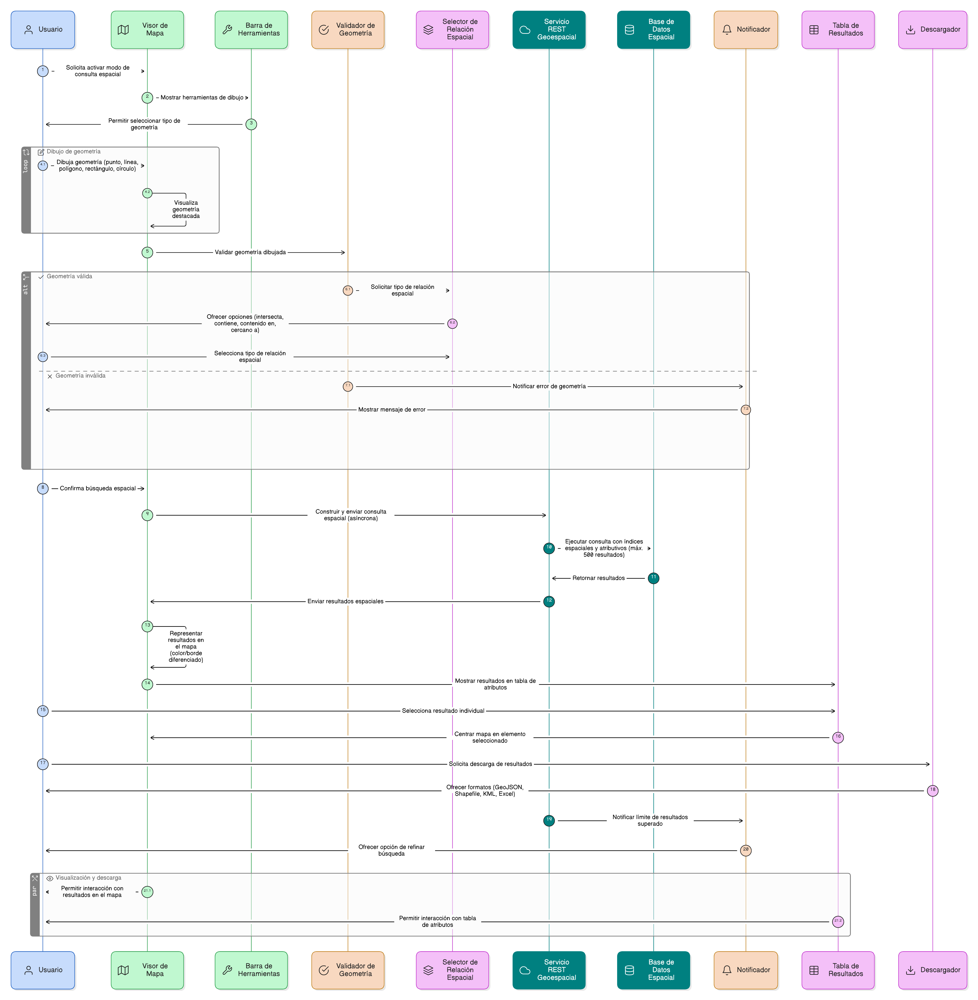

## HU-IDEAM-SNIF-REST-001

> **Identificador Historia de Usuario:** hu-ideam-snif-rest-001 \
> **Nombre Historia de Usuario:** Módulo de restauración - Consulta espacial

> **Área Proyecto:** Subdirección de Ecosistemas e Información Ambiental \
> **Nombre proyecto:** Realizar la construcción temática, mejoras informáticas y optimización del Módulo de restauración del SNIF del IDEAM. \
> **Líder funcional:** Wilmer Espitia Muñoz\
> **Analista de requerimiento de TI:** Sergio Alonso Anaya Estévez

## DESCRIPCIÓN HISTORIA DE USUARIO

> **Como:** usuario solicitante. \
> **Quiero:** realizar una consulta espacial dibujando una geometría sobre el mapa (punto, línea o polígono). \
> **Para:** identificar y visualizar los elementos geográficos almacenados en la base de datos que intersecten, contengan o estén contenidos dentro de dicha geometría.

## CRITERIOS DE ACEPTACIÓN

1. **Activación del modo de consulta espacial**  
   1.1 El sistema debe contar con una opción en el menú que active el modo de dibujo sobre el mapa.  
   1.2 Una vez activado, se despliega una barra de herramientas que permite seleccionar el tipo de geometría a usar: punto, línea, polígono, rectángulo o círculo.

2. **Captura y validación de la geometría**  
   2.1 El sistema debe permitir al usuario dibujar directamente sobre el mapa.  
   2.2 La geometría resultante se visualizará con un estilo destacado (borde o color).  
   2.3 Al finalizar el dibujo, el sistema valida que la geometría no esté vacía ni sea inválida.

3. **Tipos de relación espacial**  
   3.1 El sistema debe ofrecer opciones para elegir el tipo de relación espacial a aplicar:

   - Intersecta (por defecto)
   - Contiene
   - Está contenido en
   - Cercano a (usando un buffer configurable por el usuario).

4. **Ejecución de la consulta**  
   4.1 Al confirmar la búsqueda, el sistema debe construir una consulta espacial sobre la base de datos y ejecutarla mediante una petición asíncrona (REST) al servicio geoespacial.  
   4.2 La consulta debe hacer uso de índices espaciales y atributivos para optimizar el rendimiento.  
   4.3 Se debe limitar la cantidad de resultados devueltos, por ejemplo, a un máximo de 500 registros por solicitud.  
   4.4 Si se supera el límite, el sistema debe notificar al usuario y ofrecer la opción de refinar la búsqueda.

5. **Visualización de resultados**  
   5.1 Los resultados se deben representar en el mapa con un color o borde diferenciado.  
   5.2 Los resultados deben mostrarse también en una tabla de atributos ubicada debajo o al costado del visor.  
   5.3 Cada resultado incluirá atributos básicos y una opción para centrar el mapa en el elemento seleccionado.  
   5.4 El usuario debe poder seleccionar un resultado individual para ver su detalle.  
   5.5 El sistema debe permitir descargar el listado de coincidencias en formatos geográficos (GeoJSON, Shapefile, KML) y en Excel (ver numeral **Descargar capas**).

## DIAGRAMA DE SECUENCIA

## DIAGRAMA DE FLUJO DEL PROCESO

## PROTOTIPO PRELIMINAR

## ANEXOS

- Ejemplo de consulta espacial mediante API REST.  
- Ejemplo de respuesta en formato **GeoJSON**.  
- Referencia al numeral **Descargar capas** del visor geográfico.  
- Especificación técnica del servicio geoespacial utilizado (endpoints, parámetros, formato de salida).  
- Ejemplo de representación visual de los resultados en el visor. 
