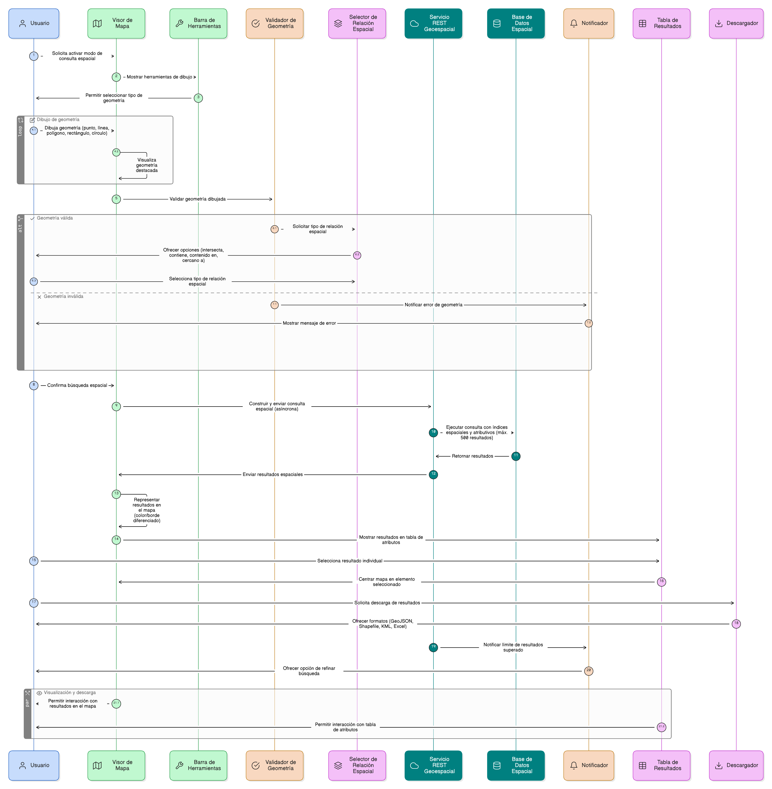
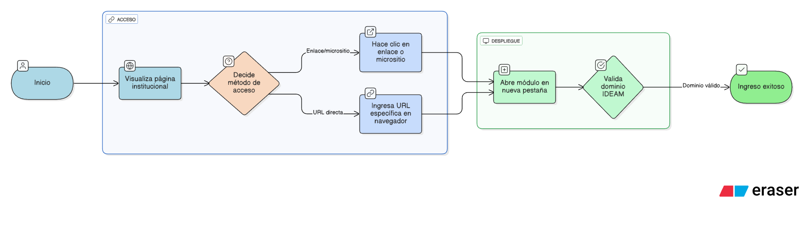
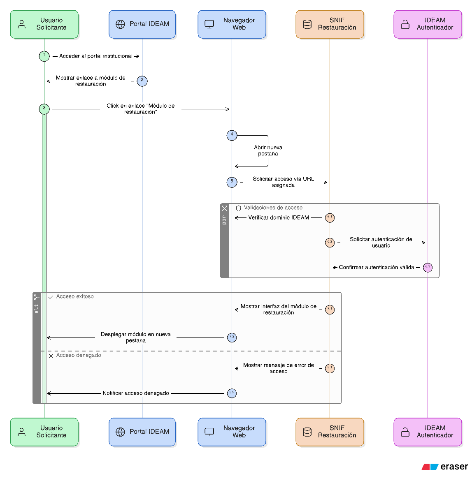

## HU-IDEAM-SNIF-REST-001

> **Identificador Historia de Usuario:** hu-ideam-snif-rest-001 \
> **Nombre Historia de Usuario:** Módulo de restauración - Ingreso al módulo

> **Área Proyecto:** Subdirección de Ecosistemas e Información Ambiental \
> **Nombre proyecto:** Realizar la construcción temática, mejoras informáticas y optimización del Módulo de restauración del SNIF del IDEAM. \
> **Líder funcional:** Wilmer Espitia Muñoz\
> **Analista de requerimiento de TI:** Sergio Alonso Anaya Estévez

## DESCRIPCIÓN HISTORIA DE USUARIO

> **Como:** usuario solicitante. \
> **Quiero:** acceder al módulo de restauración del SNIF desde un enlace o micrositio dentro de la página web institucional. \
> **Para:** para ingresar fácilmente al sistema desde el portal oficial.

## CRITERIOS DE ACEPTACIÓN

1. **Despliegue de nueva pestaña de navegador**  
   1.1 Al hacer click en el enlace referido se debe desplegar el aplicativo en una nueva pestaña del navegador.  
   
2. **Acceso directo a traves de acceso**  
   2.1 El sistema debe permitir al usuario acceder al aplicativo, a traves de URL asignada, con el dominio especifico de IDEAM.  
 

## DIAGRAMA DE SECUENCIA

## DIAGRAMA DE FLUJO DEL PROCESO

## PROTOTIPO PRELIMINAR

## ANEXOS

