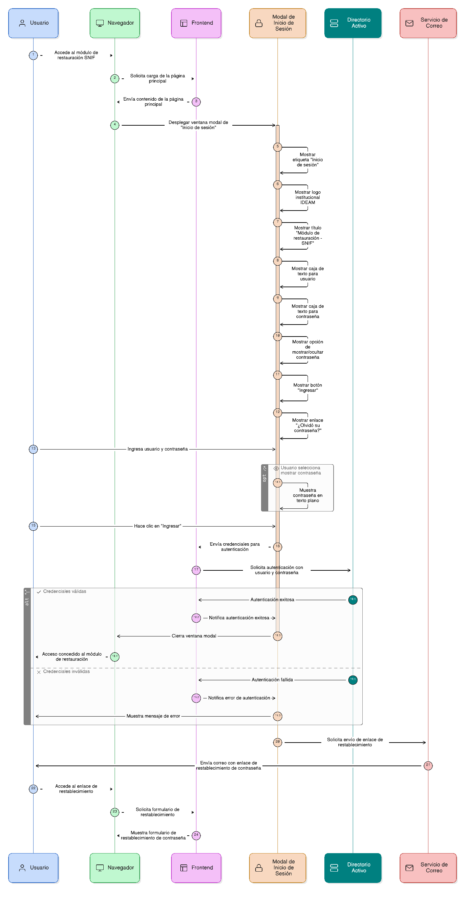
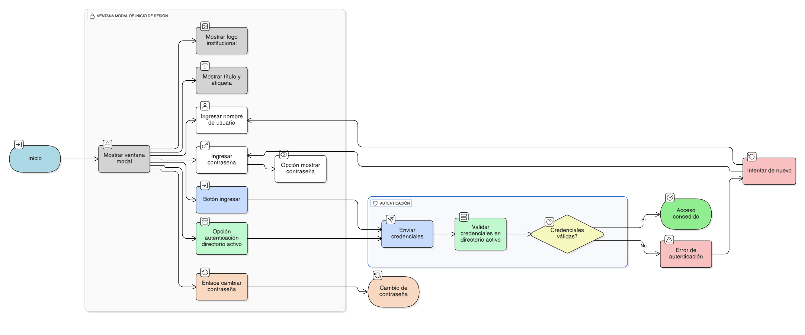
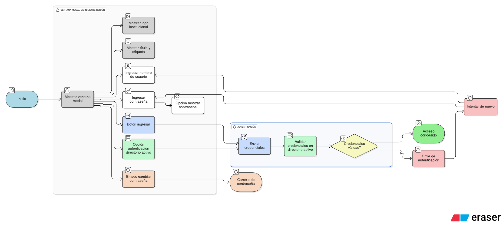

## HU-IDEAM-SNIF-REST-002

> **Identificador Historia de Usuario:** hu-ideam-snif-rest-002 \
> **Nombre Historia de Usuario:** Módulo de restauración - Ventana modal de inicio de sesión

> **Área Proyecto:** Subdirección de Ecosistemas e Información Ambiental \
> **Nombre proyecto:** Realizar la construcción temática, mejoras informáticas y optimización del Módulo de restauración del SNIF del IDEAM. \
> **Líder funcional:** Wilmer Espitia Muñoz\
> **Analista de requerimiento de TI:** Sergio Alonso Anaya Estévez

## DESCRIPCIÓN HISTORIA DE USUARIO

> **Como:** usuario solicitante. \
> **Quiero:** que al ingresar al módulo se despliegue automáticamente una ventana modal de “Inicio de sesión”. \
> **Para:** autenticarme antes de acceder a las funcionalidades.

## CRITERIOS DE ACEPTACIÓN

1. **Identificación ventana modal**  
   1.1 La ventana de inicio de sesión muestre claramente la etiqueta "Inicio de sesión", el logo institucional del IDEAM y el titulo "Modulo de restauración - SNIF".  
   
2. **Cajas de texto**  
   2.1 La ventana de inicio de sesión debe contar con una caja de texto con icono identificador y placeholder para ingresar mi nombre de usuario.  \
   2.2 La ventana de inicio de sesión debe contar con una caja de text con identificador, máscara de seguridad y opción de mostrar la contraseña digitada.

3. **Autenticación por directorio activo**  
   3.1 La ventana de inicio de sesión debe contar con la opçión de autenticación mediante directorio activo, usando credenciales institucionales del IDEAM.

4. **Boton de ingreso**
   4.1 La ventana de incio de sesión debe contar con un botón identificado como "Ingresar", que enviara las credenciales y autenticar.

5. **Enlace de cambio de contraseña**
   5.1 La ventana de inicio de sesión debe tener un enlace para cambiar contraseña, para restablecerla en caso de olvido o expiración

 

## DIAGRAMA DE SECUENCIA

## DIAGRAMA DE FLUJO DEL PROCESO

## PROTOTIPO PRELIMINAR

## ANEXOS

