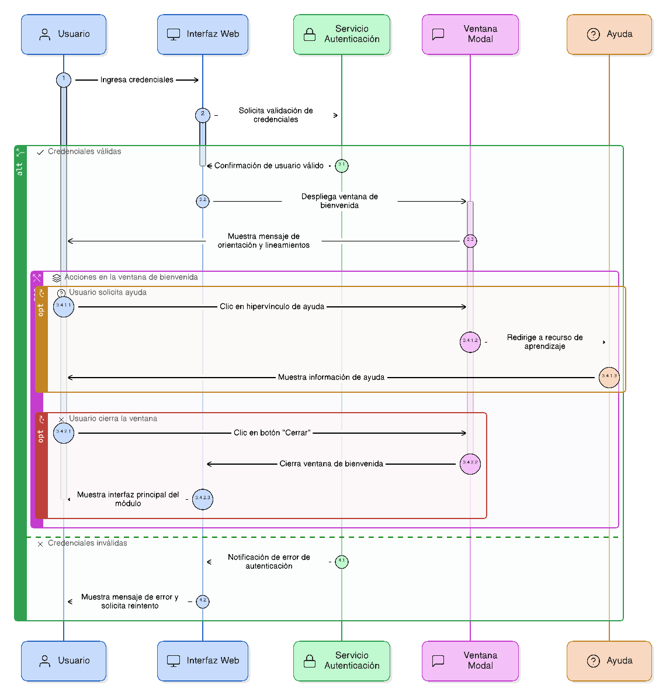
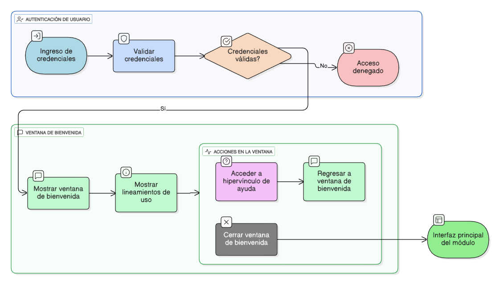

## HU-IDEAM-SNIF-REST-003

> **Identificador Historia de Usuario:** hu-ideam-snif-rest-003 \
> **Nombre Historia de Usuario:** Módulo de restauración - Ventana modal de validación y bienvenida

> **Área Proyecto:** Subdirección de Ecosistemas e Información Ambiental \
> **Nombre proyecto:** Realizar la construcción temática, mejoras informáticas y optimización del Módulo de restauración del SNIF del IDEAM. \
> **Líder funcional:** Wilmer Espitia Muñoz\
> **Analista de requerimiento de TI:** Sergio Alonso Anaya Estévez

## DESCRIPCIÓN HISTORIA DE USUARIO

> **Como:** usuario solicitante. \
> **Quiero:** validar las credenciales ingresadas contra el servicio de autenticación. \
> **Para:** permitir el acceso unicamente a usuarios válidados.

## CRITERIOS DE ACEPTACIÓN

1. **Despliegue de ventana modal de bienvenida**  
   1.1 Una vez validado el acceso se despliega la ventana de bienvenida con un texto que describa los lineamientos del uso del modulo que sirva como  orientación sobre su funcionamiento.  
   
2. **Hypervinculo de ayuda o apropiación**  
   2.1 Desde la ventana de bienvenida se debe acceder a un hypervinculo de ayuda o apropiación para conocer el proceso de aprendizaje de la herramienta.

3. **Cerrar ventana de bienvenida mediante botón "Cerrar"**  
   3.1 Poder cerrar la ventada de bienvenida mediante un botón "Cerrar" visible en la esquina superior y continuar hacia la interfaz principal del modulo.

## DIAGRAMA DE SECUENCIA

## DIAGRAMA DE FLUJO DEL PROCESO

## PROTOTIPO PRELIMINAR

## ANEXOS

