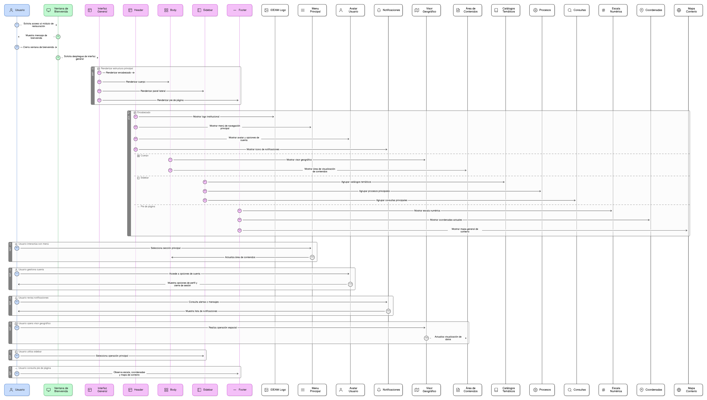

## HU-IDEAM-SNIF-REST-004

> **Identificador Historia de Usuario:** hu-ideam-snif-rest-004 \
> **Nombre Historia de Usuario:** Módulo de restauración - Interfaz general de navegación (estructura visual)

> **Área Proyecto:** Subdirección de Ecosistemas e Información Ambiental \
> **Nombre proyecto:** Realizar la construcción temática, mejoras informáticas y optimización del Módulo de restauración del SNIF del IDEAM. \
> **Líder funcional:** Wilmer Espitia Muñoz\
> **Analista de requerimiento de TI:** Sergio Alonso Anaya Estévez

## DESCRIPCIÓN HISTORIA DE USUARIO

> **Como:** usuario solicitante. \
> **Quiero:** que al cerrar la ventana de bienvenida, se despliegue la interfaz general del modulo con encabezado, cuerpo y pie de página. \
> **Para:** navegar por las funcionalidades disponibles.

## CRITERIOS DE ACEPTACIÓN

1. **Encabezado (Header)**  
   1.1 El encabezado debe mostar el logo institucional del IDEAM y la identidad visual del modulo, esto para permitir el origen del sistema. \
   1.2 El encabezado debe disponer de un menú de navegación principal, que permita acceder rápidamente a las secciones principales. \
   1.3 El encabezado debe mostrar el avatar del usuario autenticado con opciones de cuenta y cierre de sesión, permitiendo gestionar el perfil del mencionado usuario. \
   1.4 El encabezado debe contar con un icono de notificaciones, informando sobre alertas o mensajes del sistema.
   
2. **Cuerpo (Body)**  
   2.1 El cuerpo de la interfaz debe estar dividido en una zona de trabajo del visor geográfico y un área de visualización de contenidos, que permita operar las funciones espaciales del modulo. \
   
3. **Sidebar de gestión**
   3.1 Debe tener un panel lateral izquierdo (sidebar) que agrupe las operacioones principales: catálogos temáticos, procesos y consultas.

4. **Pie de página (Footer)**  
   4.1 Debe contar con una franja inferior con escala numérica, las coordenadas actuales y un mapa general de contexto.

## DIAGRAMA DE SECUENCIA

## DIAGRAMA DE FLUJO DEL PROCESO

## PROTOTIPO PRELIMINAR

## ANEXOS

