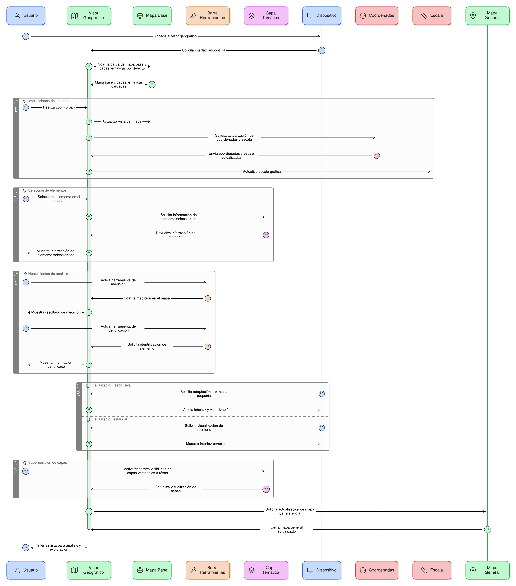
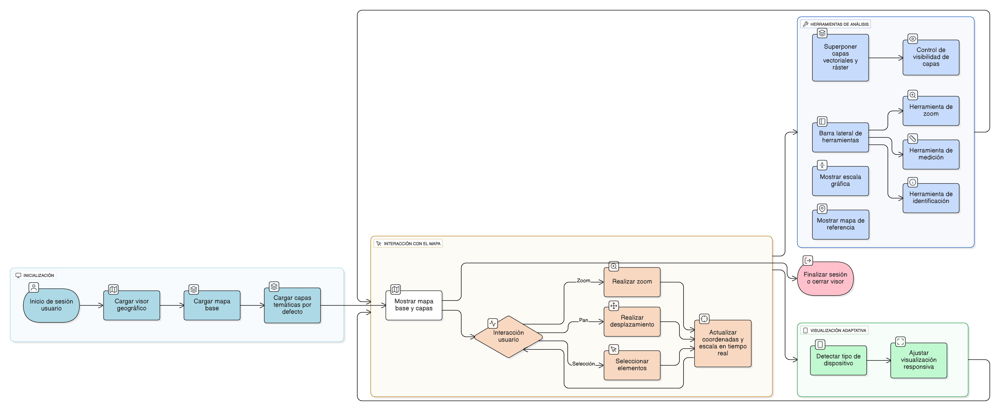

## HU-IDEAM-SNIF-REST-005

> **Identificador Historia de Usuario:** hu-ideam-snif-rest-005 \
> **Nombre Historia de Usuario:** Módulo de restauración - Zona de trabajo del visor geográfico

> **Área Proyecto:** Subdirección de Ecosistemas e Información Ambiental \
> **Nombre proyecto:** Realizar la construcción temática, mejoras informáticas y optimización del Módulo de restauración del SNIF del IDEAM. \
> **Líder funcional:** Wilmer Espitia Muñoz\
> **Analista de requerimiento de TI:** Sergio Alonso Anaya Estévez

## DESCRIPCIÓN HISTORIA DE USUARIO

> **Como:** usuario solicitante. \
> **Quiero:** contar con una zona principal de trabajo. \
> **Para:** visualizar e interactuar con el mapa base y las capas temáticas del SNIF.

## CRITERIOS DE ACEPTACIÓN

1. **Mapa Base**  
   1.1 Debe contar con un mapa base con las capas temáticas habilitadas por defecto o seleccionadas y poder explorar la información geográfica relevante. \
   1.2 Poder interactuar con el mapa realizando zoom, desplazamiento (pan) y selección de elementos permitiendo analizar zonas especificas. \
   1.3 El visor debe actualizar en tiempo real las coordenadas y la escala al mover el cursor permitiendo conocer la posición exacta. \

2. **Visualización**   
   2.1 Debe permitir trabajar desde diferentes dispositivos por tal razón, la visualización debe ser responsiva y adaptarse a distintos tamaños de pantalla. \
   
3. **Herramientas de análisis**   
   3.1 Permitir la superposición de diferentes capas vectoriales y ráster con control de visibilidad posibilitando la personalización del análisis visual. \
   3.2 Debe contar con una barra lateral de herramientas (zoom, medición, identificación, etc.) junto al mapa. \
   3.3 Debe tener una escala gráfica y un mapa general de referencia que permita mantener el contexto geográfico.

## DIAGRAMA DE SECUENCIA

## DIAGRAMA DE FLUJO DEL PROCESO

## PROTOTIPO PRELIMINAR

## ANEXOS

