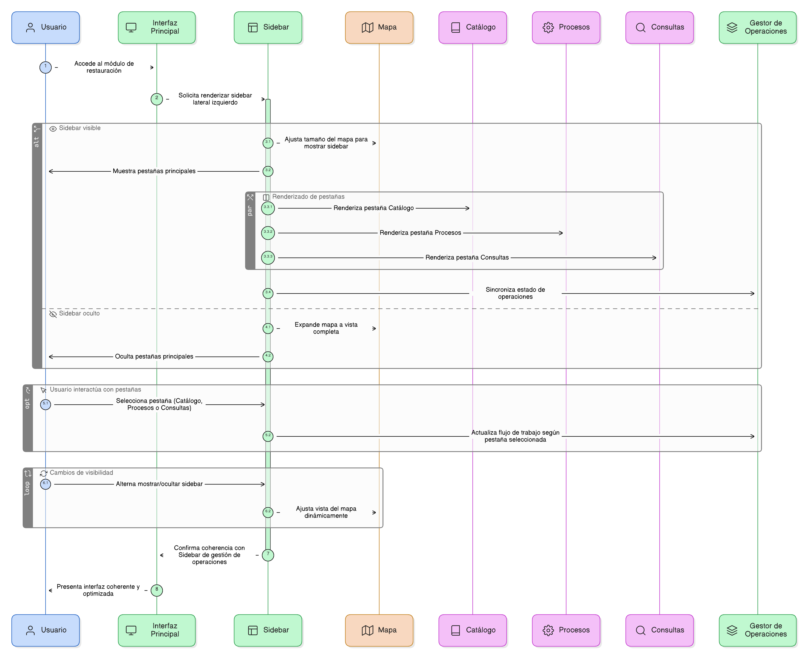
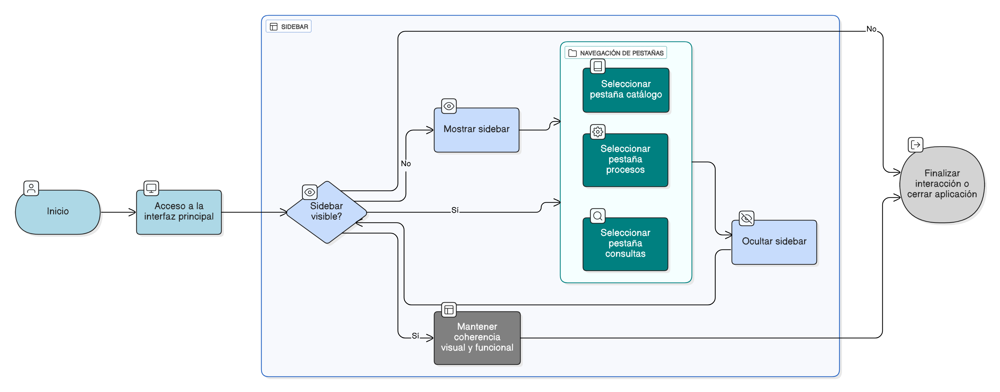

## HU-IDEAM-SNIF-REST-006

> **Identificador Historia de Usuario:** hu-ideam-snif-rest-006 \
> **Nombre Historia de Usuario:** Módulo de restauración - Sidebar de gestión de operaciones (referencia funcional inicial)

> **Área Proyecto:** Subdirección de Ecosistemas e Información Ambiental \
> **Nombre proyecto:** Realizar la construcción temática, mejoras informáticas y optimización del Módulo de restauración del SNIF del IDEAM. \
> **Líder funcional:** Wilmer Espitia Muñoz\
> **Analista de requerimiento de TI:** Sergio Alonso Anaya Estévez

## DESCRIPCIÓN HISTORIA DE USUARIO

> **Como:** usuario solicitante. \
> **Quiero:** acceder a un panel lateral izquierdo (sidebar) que agrupe las operaciones principales: catálogos temáticos, procesos y consultas. \
> **Para:** organizar mi flujo de trabajo geográfico.

## CRITERIOS DE ACEPTACIÓN

1. **Sidebar lateral izquierda**  
   1.1 Debe contar con un sidebar lateral izquierdo en la interfaz principal.
   
2. **Sidebar dinamico**   
   2.1 Debe permitir mostrar y ocultar para optimizar la vista del mapa.
   
3. **Pestañas**   
   3.1 Debe incluir las prestañas: Catálogo, Procesos y consultas.

4. **Coherencia sidebar operaciones** \
   4.1 Debe Mantener coherencia con el componente 'Sidebar de gestión de operaciones'.

## DIAGRAMA DE SECUENCIA

## DIAGRAMA DE FLUJO DEL PROCESO

## PROTOTIPO PRELIMINAR

## ANEXOS

