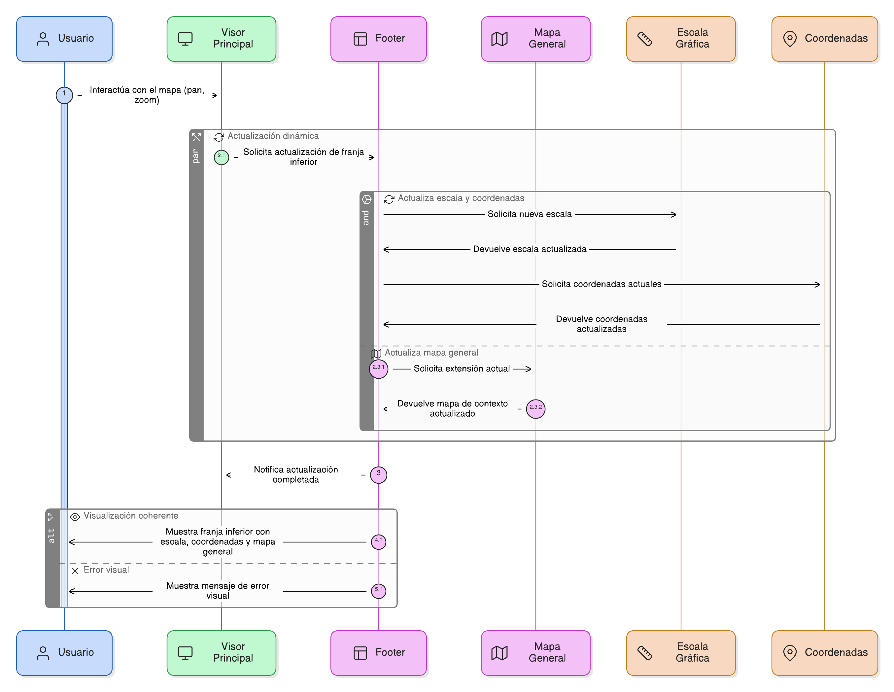
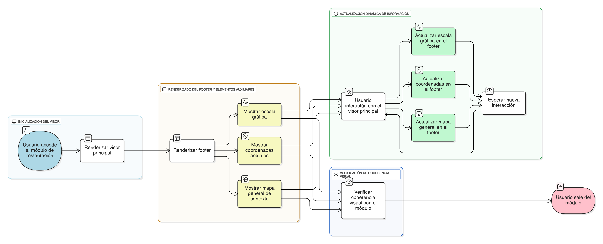

## HU-IDEAM-SNIF-REST-007

> **Identificador Historia de Usuario:** hu-ideam-snif-rest-007 \
> **Nombre Historia de Usuario:** Módulo de restauración - Footer y elementos de navegación auxiliar

> **Área Proyecto:** Subdirección de Ecosistemas e Información Ambiental \
> **Nombre proyecto:** Realizar la construcción temática, mejoras informáticas y optimización del Módulo de restauración del SNIF del IDEAM. \
> **Líder funcional:** Wilmer Espitia Muñoz\
> **Analista de requerimiento de TI:** Sergio Alonso Anaya Estévez

## DESCRIPCIÓN HISTORIA DE USUARIO

> **Como:** usuario solicitante. \
> **Quiero:** visualizar una franja inferior con la escala numérica, las coordenadas actuales y un mapa general de contexto. \
> **Para:** entender la posición espacial en todo momento.

## CRITERIOS DE ACEPTACIÓN

1. **Escala gráfica y coordenadas**  
   1.1 Debe mostrar escala gráfica y las coordenadas actuales en la esquina inferior.
   
2. **Mapa general**   
   2.1 Debe incluir un mapa general de contexto con la extensión actual.
   
3. **Actualización dinámica**   
   3.1 Se debe actualizar la información desplegada conforme a como se mueva el mapa del visor principal.

4. **Coherencia visual** \
   4.1 Debe Mantener coherencia visual con el resto del modulo, asegurando una experiencia uniforme en la navegación.

## DIAGRAMA DE SECUENCIA

## DIAGRAMA DE FLUJO DEL PROCESO

## PROTOTIPO PRELIMINAR

## ANEXOS

