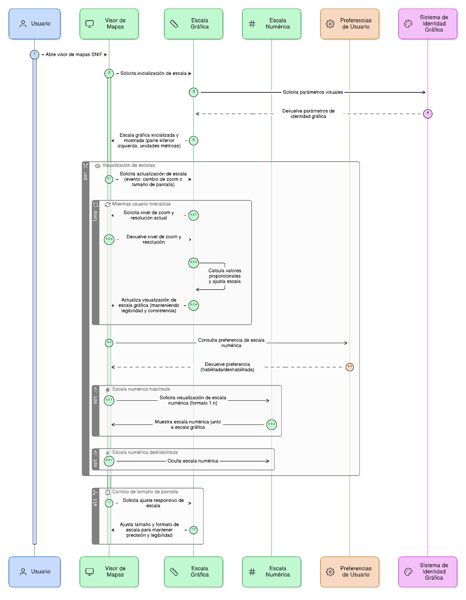
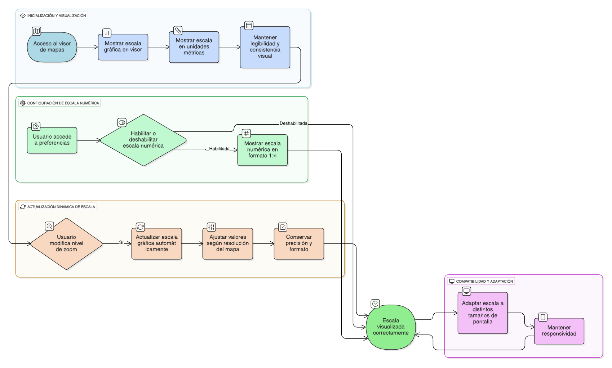

## HU-IDEAM-SNIF-REST-008

> **Identificador Historia de Usuario:** hu-ideam-snif-rest-008 \
> **Nombre Historia de Usuario:** Módulo de restauración - Escala gráfica y numérica del mapa

> **Área Proyecto:** Subdirección de Ecosistemas e Información Ambiental \
> **Nombre proyecto:** Realizar la construcción temática, mejoras informáticas y optimización del Módulo de restauración del SNIF del IDEAM. \
> **Líder funcional:** Wilmer Espitia Muñoz\
> **Analista de requerimiento de TI:** Sergio Alonso Anaya Estévez

## DESCRIPCIÓN HISTORIA DE USUARIO

> **Como:** usuario solicitante. \
> **Quiero:** visualizar de forma permanente una escala gráfica y numérica actualizable. \
> **Para:** interpretar correctamente la relación entre las distancias en el mapa y las verdaderas del terreno.

## CRITERIOS DE ACEPTACIÓN

1. **Visualización de la escala**  
   1.1 El sistema debe mostrar de forma permanente una escala gráfica en la parte inferior izquierda del visor.  \
   1.2 La escala debe expresarse en unidades métricas (metros y kilómetros).\
   1.3 Debe mantener legibilidad y consistencia visual con la identidad gráfica del IDEAM.\

2. **Actualización dinámica**  
   2.1 La escala debe actualizarse automáticamente al modificar el nivel de zoom.  \
   2.2 Los valores deben ajustarse proporcionalmente según la resolución del mapa.\

3. **Escala numérica**  
   3.1 Mostrar escala numérica opcional en formato 1:n (ejemplo: 1:50.000).\
   3.2 Permitir habilitar o deshabilitar su visualización desde las preferencias del usuario.\

4. **Compatibilidad y comportamiento general**  
   4.1 La escala debe adaptarse a distintos tamaños de pantalla (responsiva).\
   4.2 Conservar la precisión y formato en todos los niveles de ampliación.\

## DIAGRAMA DE SECUENCIA

## DIAGRAMA DE FLUJO DEL PROCESO

## PROTOTIPO PRELIMINAR

## ANEXOS

- Ejemplo de consulta espacial mediante API REST.
- Ejemplo de respuesta en formato GeoJSON.
- Referencia a numeral **Descargar capas** del visor geográfico.
