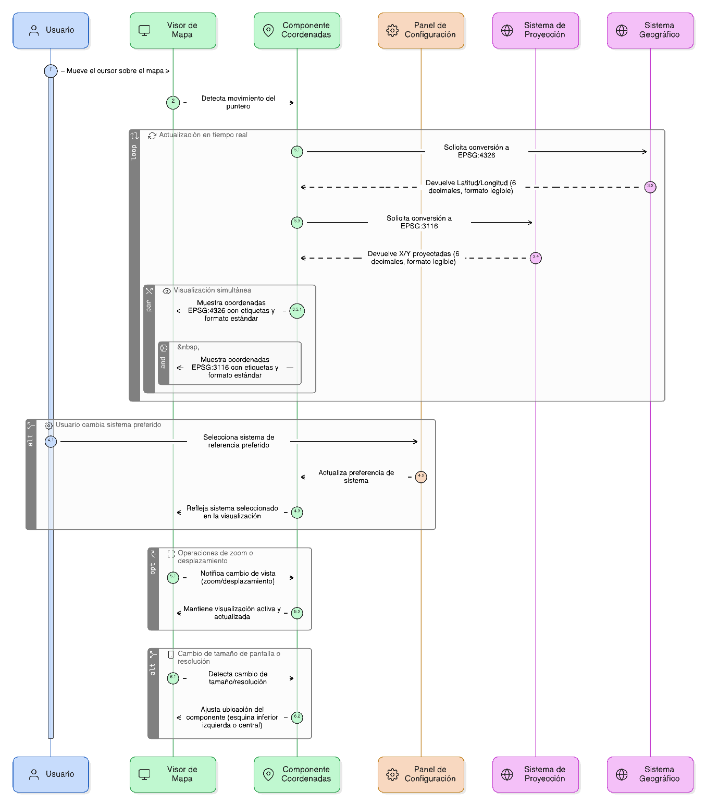
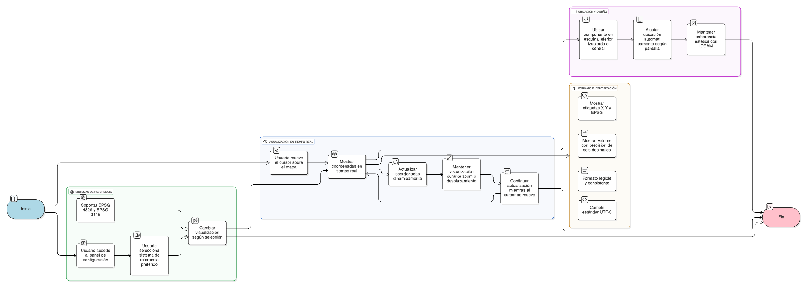

## HU-IDEAM-SNIF-REST-009

> **Identificador Historia de Usuario:** hu-ideam-snif-rest-009 \
> **Nombre Historia de Usuario:** Módulo de restauración - Coordenadas geográficas y proyectadas

> **Área Proyecto:** Subdirección de Ecosistemas e Información Ambiental \
> **Nombre proyecto:** Realizar la construcción temática, mejoras informáticas y optimización del Módulo de restauración del SNIF del IDEAM. \
> **Líder funcional:** Wilmer Espitia Muñoz\
> **Analista de requerimiento de TI:** Sergio Alonso Anaya Estévez

## DESCRIPCIÓN HISTORIA DE USUARIO

> **Como:** usuario solicitante. \
> **Quiero:** ver las coordenadas del puntero en tiempo real en sistemas de referencia geográficos y proyectados. \
> **Para:** ubicar con precisión la posición del cursor sobre el mapa.

## CRITERIOS DE ACEPTACIÓN

1. **Visualización de coordenadas**  
   1.1 El sistema debe mostrar en tiempo real las coordenadas del puntero mientras el usuario mueve el cursor sobre el mapa.  \
   1.2 Los valores deben actualizarse automáticamente sin necesidad de refrescar la vista.  \
   1.3 La visualización debe mantenerse activa incluso durante operaciones de zoom o desplazamiento.

2. **Sistemas de referencia soportados**  
   2.1 El componente debe soportar la visualización simultánea de al menos dos sistemas de referencia:

   - EPSG:4326 (Latitud/Longitud)
   - EPSG:3116 (MAGNA–SIRGAS Origen Nacional)

   2.2 Las coordenadas deben mostrarse con una precisión de hasta seis (6) decimales.  \
   2.3 El usuario podrá seleccionar su sistema preferido desde el panel de configuración del visor.
 

3. **Identificación y formato de los valores**  
   3.1 Cada valor deberá acompañarse de etiquetas visibles para los ejes X y Y y del identificador del sistema de referencia (ej. “EPSG:4326”). \
   3.2 Los valores deben mostrarse con un formato legible y consistente (separador decimal, unidades, espaciado). \
   3.3 El formato de salida debe cumplir con los estándares de codificación UTF-8 para compatibilidad web.
  

4. **Ubicación y diseño del componente**  
   4.1 El componente debe ubicarse en la esquina inferior izquierda o inferior central del visor, según el diseño responsive. \
   4.2 La ubicación debe ajustarse automáticamente según el tamaño de pantalla o resolución del dispositivo. \
   4.3 Mantener coherencia estética con el estilo visual del IDEAM (colores, tipografía y tamaño de fuente institucional).
 
   

## DIAGRAMA DE SECUENCIA

## DIAGRAMA DE FLUJO DEL PROCESO

## PROTOTIPO PRELIMINAR

## ANEXOS

- Ejemplo de consulta espacial mediante API REST.
- Ejemplo de respuesta en formato GeoJSON.
- Referencia a numeral **Descargar capas** del visor geográfico.
