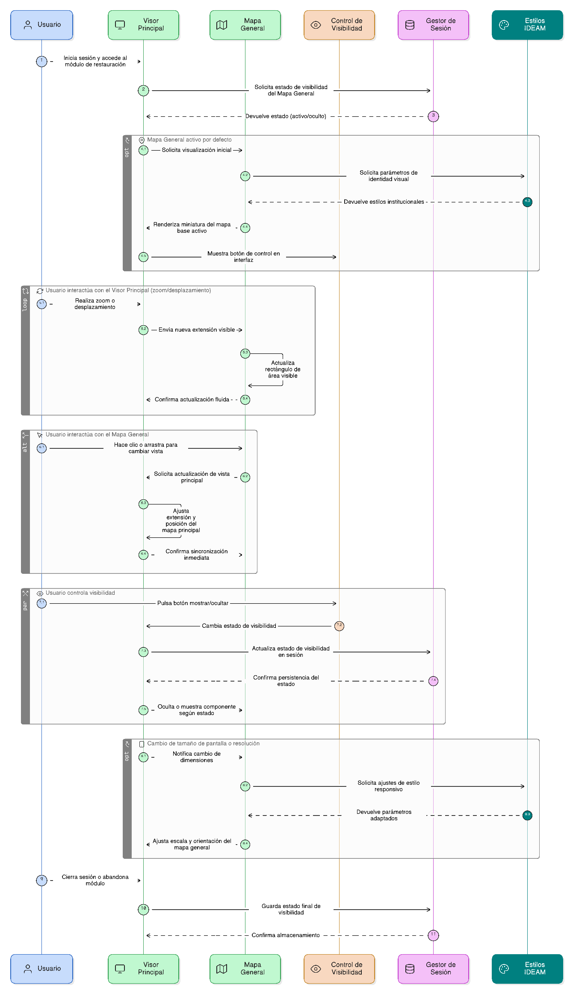
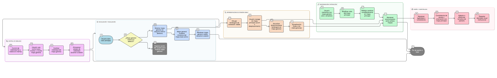

## HU-IDEAM-SNIF-REST-010

> **Identificador Historia de Usuario:** hu-ideam-snif-rest-010 \
> **Nombre Historia de Usuario:** Módulo de restauración - Mapa general (Overview Map)

> **Área Proyecto:** Subdirección de Ecosistemas e Información Ambiental \
> **Nombre proyecto:** Realizar la construcción temática, mejoras informáticas y optimización del Módulo de restauración del SNIF del IDEAM. \
> **Líder funcional:** Wilmer Espitia Muñoz\
> **Analista de requerimiento de TI:** Sergio Alonso Anaya Estévez

## DESCRIPCIÓN HISTORIA DE USUARIO

> **Como:** usuario solicitante. \
> **Quiero:** disponer de un mapa general que muestre el contexto espacial de mi vista actual. \
> **Para:** orientarme dentro del territorio nacional y navegar fácilmente.

## CRITERIOS DE ACEPTACIÓN

1. **Visualización inicial del mapa general**  
   1.1 El sistema debe mostrar por defecto un mapa general en la esquina inferior derecha del visor principal. \
   1.2 El mapa general debe representar una miniatura del mapa base activo en el visor principal. \
   1.3 La visualización debe mantenerse visible durante toda la sesión, salvo que el usuario decida ocultarla.

2. **Representación de la extensión visible**  
   2.1 El mapa general debe incluir un rectángulo o marco que delimite el área visible actual del mapa principal. \
   2.2 El rectángulo debe actualizarse dinámicamente al realizar operaciones de zoom o desplazamiento en el mapa principal. \
   2.3 La actualización debe ser fluida y sin interrupciones perceptibles para el usuario.
 

3. **Interacción entre el mapa principal y el mapa general**  
   3.1 El usuario podrá hacer clic o arrastrar dentro del mapa general para modificar la vista del mapa principal. \
   3.2 Los cambios realizados en el mapa general deben reflejarse inmediatamente en el mapa principal (sin necesidad de recargar la vista). \
   3.3 Mantener la sincronización entre ambos mapas en todo momento.

  
4. **Control de visibilidad del componente**  
   4.1 El sistema debe permitir al usuario mostrar u ocultar el mapa general mediante un botón o control específico. \
   4.2 El estado de visibilidad (activo u oculto) debe conservarse durante la sesión. \
   4.3 La ubicación del control debe ser fija y visible, preferiblemente sobre la interfaz del mapa principal.

5. **Diseño y compatibilidad**  
   5.1 El componente debe respetar la identidad visual institucional del IDEAM (colores, tipografía y estilo gráfico). \
   5.2 Debe adaptarse a diferentes tamaños de pantalla o resoluciones sin perder legibilidad. \ 
   5.3 Asegurar que la escala y orientación del mapa general sean consistentes con el mapa principal.

   

## DIAGRAMA DE SECUENCIA

## DIAGRAMA DE FLUJO DEL PROCESO

## PROTOTIPO PRELIMINAR

## ANEXOS

- Ejemplo de consulta espacial mediante API REST.
- Ejemplo de respuesta en formato GeoJSON.
- Referencia a numeral **Descargar capas** del visor geográfico.
