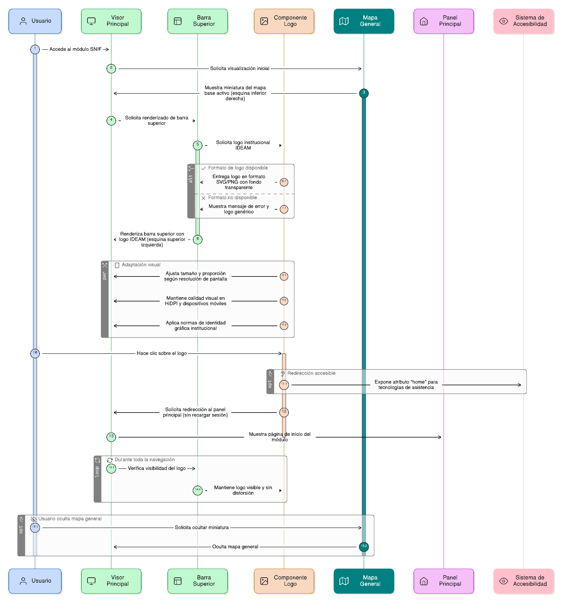

## HU-IDEAM-SNIF-REST-011

> **Identificador Historia de Usuario:** hu-ideam-snif-rest-011 \
> **Nombre Historia de Usuario:** Módulo de restauración - Logo institucional

> **Área Proyecto:** Subdirección de Ecosistemas e Información Ambiental \
> **Nombre proyecto:** Realizar la construcción temática, mejoras informáticas y optimización del Módulo de restauración del SNIF del IDEAM. \
> **Líder funcional:** Wilmer Espitia Muñoz\
> **Analista de requerimiento de TI:** Sergio Alonso Anaya Estévez

## DESCRIPCIÓN HISTORIA DE USUARIO

> **Como:** usuario solicitante. \
> **Quiero:** visualizar el logo institucional del IDEAM en la barra superior. \
> **Para:** identificar la entidad propietaria del módulo y acceder fácilmente al inicio.

## CRITERIOS DE ACEPTACIÓN

1. **Visualización del logo institucional**  
   1.1 El sistema debe mostrar de forma permanente el logo institucional del IDEAM en la barra superior del visor. \
   1.2 La posición por defecto del logo será en la esquina superior izquierda de la interfaz. \
   1.3 El logo debe mantenerse visible durante toda la navegación del usuario.

2. **Funcionalidad de redirección**  
   2.1 Al hacer clic sobre el logo, el sistema debe redirigir al usuario al panel principal o página de inicio del módulo. \
   2.2 La acción de redirección debe realizarse sin pérdida de sesión o recarga completa del visor. \
   2.3 Debe incluir una etiqueta o atributo “home” accesible para tecnologías de asistencia (compatibilidad con accesibilidad web).

3. **Escalabilidad y visibilidad**  
   3.1 El logo debe conservar su proporción original sin distorsión, independientemente de la resolución o tamaño de pantalla. \
   3.2 Mantener legibilidad y calidad visual tanto en pantallas de alta densidad (HiDPI) como en dispositivos móviles. \
   3.3 La interfaz debe ajustarse automáticamente si el espacio disponible cambia (modo responsive).

4. **Formato y calidad gráfica**  
   4.1 El logo debe estar disponible en formatos .SVG o .PNG con fondo transparente para garantizar su correcta visualización. \
   4.2 Asegurar que el logo conserve su resolución nativa (sin pixelación ni recortes). \
   4.3 El componente debe cumplir con las normas de identidad gráfica institucional del IDEAM (colores, proporciones, márgenes).

   

## DIAGRAMA DE SECUENCIA

## DIAGRAMA DE FLUJO DEL PROCESO

## PROTOTIPO PRELIMINAR

## ANEXOS

- Wireframe: Logo IDEAM en esquina superior izquierda del header.
- Especificaciones visuales: Formato SVG o PNG transparente.
- Referencias técnicas: Manual de identidad visual IDEAM.
- Observaciones: Redirige al panel principal al hacer clic.