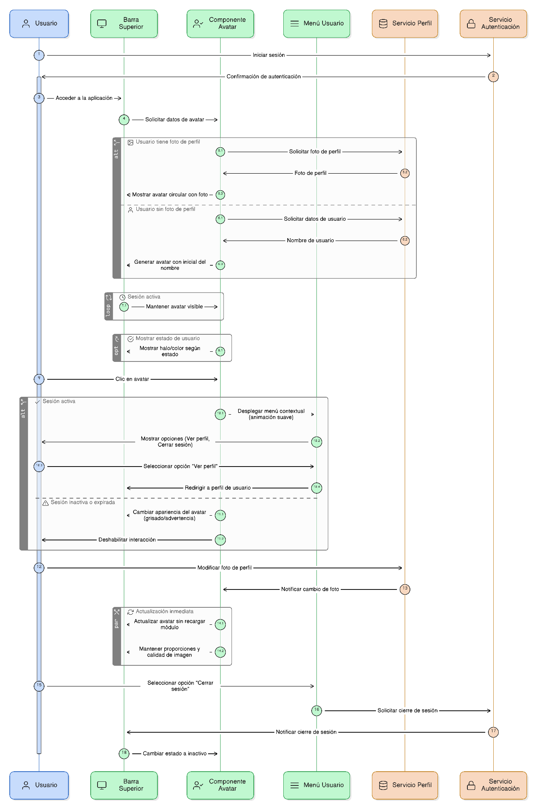
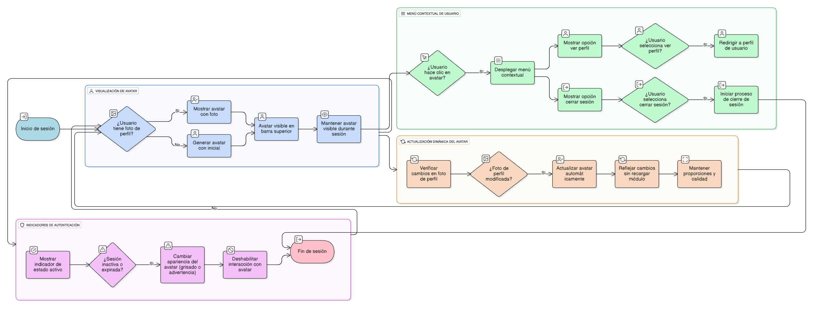
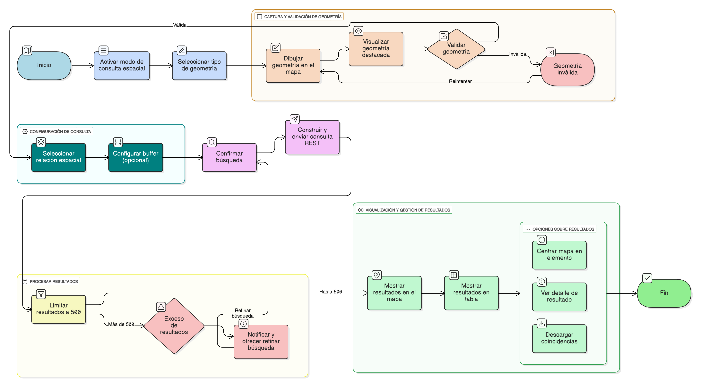

## HU-IDEAM-SNIF-REST-012

> **Identificador Historia de Usuario:** hu-ideam-snif-rest-012 \
> **Nombre Historia de Usuario:** Módulo de restauración - Avatar de usuario autenticado

> **Área Proyecto:** Subdirección de Ecosistemas e Información Ambiental \
> **Nombre proyecto:** Realizar la construcción temática, mejoras informáticas y optimización del Módulo de restauración del SNIF del IDEAM. \
> **Líder funcional:** Wilmer Espitia Muñoz\
> **Analista de requerimiento de TI:** Sergio Alonso Anaya Estévez

## DESCRIPCIÓN HISTORIA DE USUARIO

> **Como:** usuario autenticado. \
> **Quiero:** visualizar un avatar en la barra superior. \
> **Para:** acceder a opciones relacionadas con mi cuenta.

## CRITERIOS DE ACEPTACIÓN

1. **Visualización del avatar**  
   1.1 El sistema debe mostrar en la barra superior un avatar circular correspondiente al usuario autenticado.  
   1.2 En ausencia de foto de perfil, se debe generar automáticamente un avatar con la inicial del nombre del usuario.  
   1.3 El avatar debe mantenerse visible de forma permanente durante toda la sesión activa.  

2. **Funcionalidad del menú de usuario**  
   2.1 Al hacer clic sobre el avatar, debe desplegarse un menú contextual con las siguientes opciones mínimas:

   - Ver perfil.
   - Cerrar sesión.

   2.2 El menú debe mostrarse mediante animación o transición suave, sin bloquear la navegación del visor.  
   2.3 La opción “Cerrar sesión” debe dirigir al proceso de cierre de autenticación (ver componente AUTENTICACIÓN).

3. **Actualización dinámica del avatar**  
   3.1 El avatar debe actualizarse automáticamente cuando el usuario modifique su foto de perfil desde la configuración.  
   3.2 Los cambios deben reflejarse inmediatamente sin requerir recarga completa del módulo.  
   3.3 Debe conservar proporciones y calidad independientemente del tamaño o resolución del archivo de imagen.

4. **Indicadores de estado de autenticación**  
   4.1 El componente debe incluir un indicador visual del estado del usuario (ej. color, icono o halo).  
   4.2 En caso de sesión inactiva o expirada, el avatar debe cambiar su apariencia (grisado, ícono de advertencia, etc.).  
   4.3 La interacción con el avatar debe deshabilitarse automáticamente cuando la sesión finalice.

   
## DIAGRAMA DE SECUENCIA

## DIAGRAMA DE FLUJO DEL PROCESO

## PROTOTIPO PRELIMINAR

## ANEXOS

- Wireframe: Círculo con inicial o foto del usuario en el header.
- Referencias técnicas: Lineamientos de interfaz IDEAM WebGIS.
- Observaciones: Actualización automática tras cambio de foto.