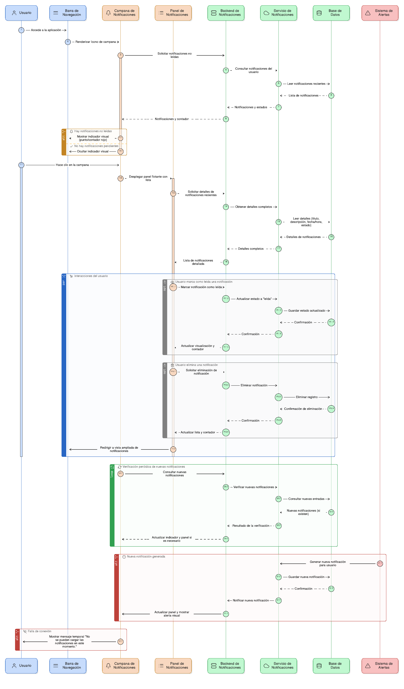
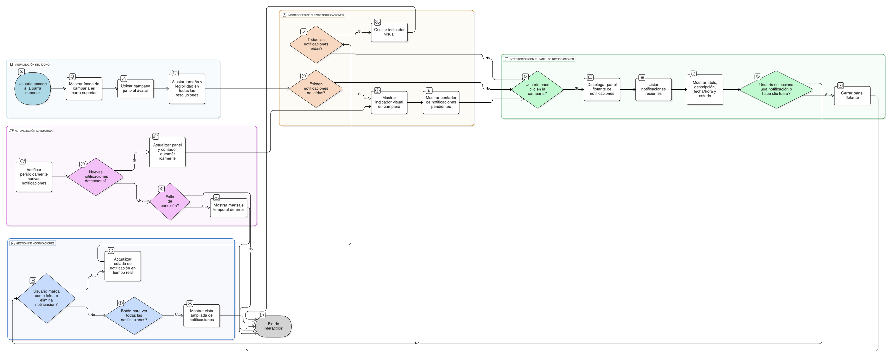

## HU-IDEAM-SNIF-REST-013

> **Identificador Historia de Usuario:** hu-ideam-snif-rest-013 \
> **Nombre Historia de Usuario:** Módulo de restauración - Campana de notificaciones

> **Área Proyecto:** Subdirección de Ecosistemas e Información Ambiental \
> **Nombre proyecto:** Realizar la construcción temática, mejoras informáticas y optimización del Módulo de restauración del SNIF del IDEAM. \
> **Líder funcional:** Wilmer Espitia Muñoz\
> **Analista de requerimiento de TI:** Sergio Alonso Anaya Estévez

## DESCRIPCIÓN HISTORIA DE USUARIO

> **Como:** usuario. \
> **Quiero:** visualizar una campana de notificaciones en la barra superior. \
> **Para:** recibir alertas o recordatorios del sistema.

## CRITERIOS DE ACEPTACIÓN

1. **Visualización del ícono de notificaciones**  
   1.1 El sistema debe mostrar un ícono de campana visible permanentemente en la barra de navegación superior.  
   1.2 La campana debe ubicarse preferiblemente en el extremo derecho, junto al avatar del usuario.  
   1.3 El ícono debe mantener proporciones y legibilidad en distintas resoluciones o tamaños de pantalla.

2. **Indicadores de nuevas notificaciones**  
   2.1 Cuando existan notificaciones no leídas, el ícono de campana debe mostrar un indicador visual (punto o número rojo).  
   2.2 El contador debe reflejar el número exacto de notificaciones pendientes.  
   2.3 Al marcar todas las notificaciones como leídas, el indicador debe desaparecer automáticamente.

3. **Interacción con el panel de notificaciones**  
   3.1 Al hacer clic sobre el ícono, debe desplegarse un panel flotante con la lista de notificaciones recientes.  
   3.2 Cada notificación debe incluir: título, descripción breve, fecha/hora de generación y estado (leída/no leída).  
   3.3 El panel debe cerrarse automáticamente al hacer clic fuera de él o al seleccionar una notificación.

4. **Gestión de notificaciones**  
   4.1 El usuario podrá marcar como leídas o eliminar notificaciones individualmente.  
   4.2 El sistema debe actualizar el estado de la notificación en tiempo real.  
   4.3 Debe existir un botón o enlace para “ver todas” las notificaciones en una vista ampliada del módulo.

5. **Actualización automática**  
   5.1 El sistema debe verificar periódicamente si existen nuevas notificaciones sin necesidad de recargar la página.  
   5.2 Al generarse una nueva notificación, el panel debe actualizarse automáticamente.  
   5.3 En caso de falla en la conexión, el sistema debe mostrar un mensaje temporal: “No se pueden cargar las notificaciones en este momento.”

   
## DIAGRAMA DE SECUENCIA

## DIAGRAMA DE FLUJO DEL PROCESO

## PROTOTIPO PRELIMINAR

## ANEXOS

- Wireframe: Ícono de campana junto al avatar del usuario.
- Observaciones: Actualización automática de nuevas alertas.