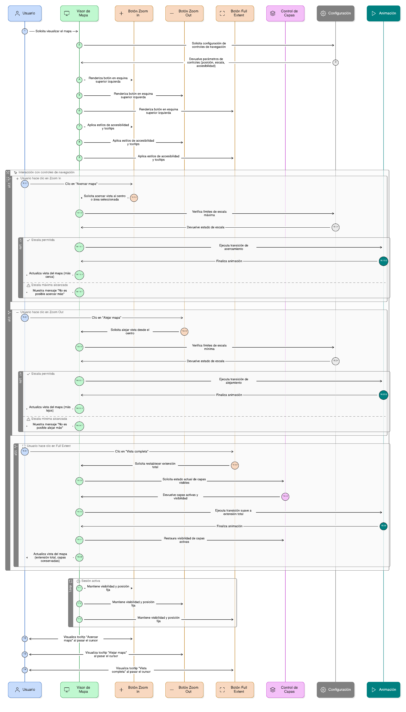
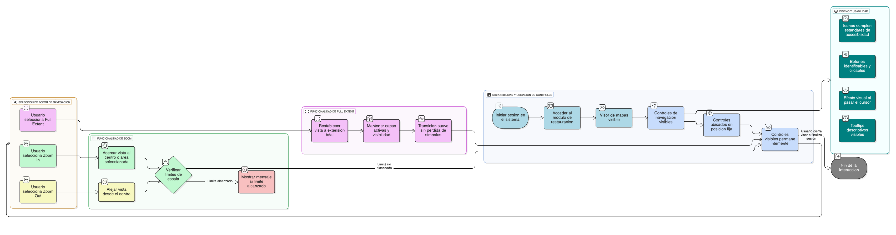
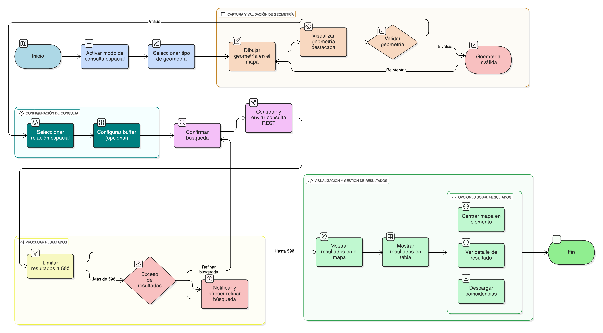

## HU-IDEAM-SNIF-REST-014

> **Identificador Historia de Usuario:** hu-ideam-snif-rest-014 \
> **Nombre Historia de Usuario:** Módulo de restauración - Botones de navegación (Zoom In / Zoom Out / Full Extent)

> **Área Proyecto:** Subdirección de Ecosistemas e Información Ambiental \
> **Nombre proyecto:** Realizar la construcción temática, mejoras informáticas y optimización del Módulo de restauración del SNIF del IDEAM. \
> **Líder funcional:** Wilmer Espitia Muñoz\
> **Analista de requerimiento de TI:** Sergio Alonso Anaya Estévez

## DESCRIPCIÓN HISTORIA DE USUARIO

> **Como:** usuario solicitante. \
> **Quiero:** disponer de botones de navegación. \
> **Para:** controlar manualmente la vista del mapa.

## CRITERIOS DE ACEPTACIÓN

1. **Disponibilidad y ubicación de los controles de navegación**  
   1.1 El visor debe incluir tres botones principales:

   - Zoom In (+) para acercar la vista.
   - Zoom Out (−) para alejar la vista.
   - Full Extent para restablecer la extensión completa del proyecto o territorio definido.

   1.2 Los botones deben ubicarse en una posición fija dentro del visor (preferiblemente en la esquina superior izquierda del mapa).  
   1.3 Los controles deben mantenerse visibles de forma permanente durante la sesión.

2. **Funcionalidad de los botones de zoom**  
   2.1 El botón Zoom In (+) debe acercar la vista al centro del mapa o al área seleccionada por el usuario.  
   2.2 El botón Zoom Out (−) debe alejar la vista desde el centro del mapa de manera progresiva.  
   2.3 Ambos botones deben respetar los límites mínimo y máximo de escala definidos por la configuración del visor.

3. **Funcionalidad del botón Full Extent**  
   3.1 El botón Full Extent debe restablecer la vista a la extensión total del proyecto o del territorio nacional configurado en el sistema.  
   3.2 La acción debe ejecutarse con una transición suave y sin pérdida de capas o símbolos visibles.  
   3.3 El sistema debe conservar las capas activas y su estado de visibilidad al aplicar el “Full Extent”.

4. **Diseño y usabilidad de los controles**  
   4.1 Los íconos deben cumplir con los estándares de accesibilidad y diseño institucional del IDEAM (colores, tamaño, contraste).  
   4.2 Deben ser fácilmente identificables y clicables, con efecto visual al pasar el cursor (hover).  
   4.3 Los botones deben tener tooltips o etiquetas emergentes descriptivas: “Acercar mapa”, “Alejar mapa” y “Vista completa”.

   
## DIAGRAMA DE SECUENCIA

## DIAGRAMA DE FLUJO DEL PROCESO

## PROTOTIPO PRELIMINAR

## ANEXOS

- Wireframe: Botones +, − y casa (Full Extent) en lateral del mapa.
- Especificaciones visuales: Íconos blancos sobre fondo azul institucional.
- Dependencias funcionales: HU-008 (Escala), HU-010 (Mapa general).