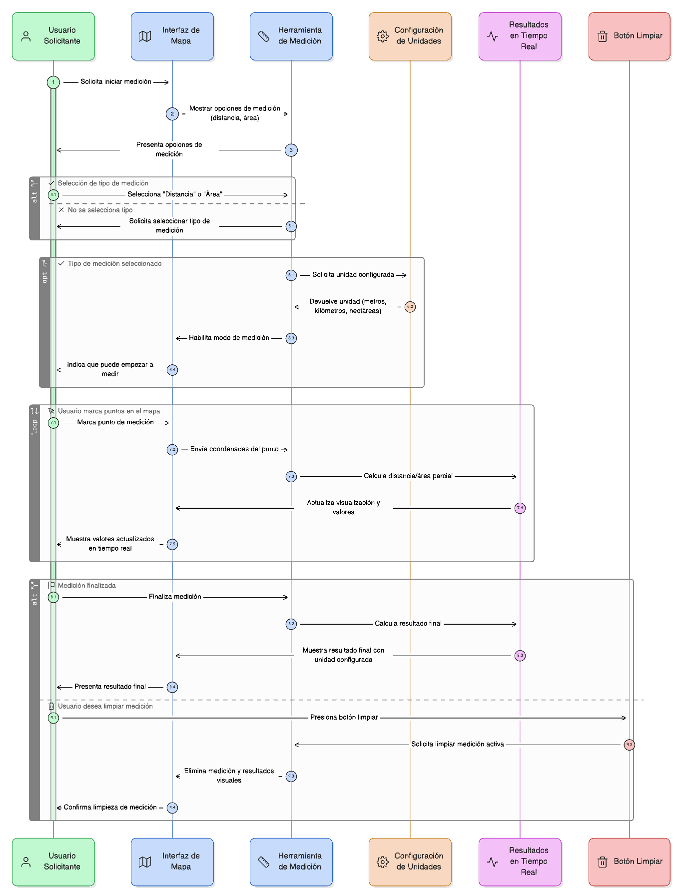
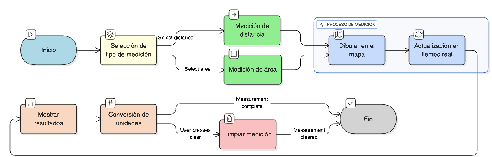

## HU-IDEAM-SNIF-REST-015

> **Identificador Historia de Usuario:** hu-ideam-snif-rest-015 \
> **Nombre Historia de Usuario:** Módulo de restauración - Herramientas de medición

> **Área Proyecto:** Subdirección de Ecosistemas e Información Ambiental \
> **Nombre proyecto:** Realizar la construcción temática, mejoras informáticas y optimización del Módulo de restauración del SNIF del IDEAM. \
> **Líder funcional:** Wilmer Espitia Muñoz\
> **Analista de requerimiento de TI:** Sergio Alonso Anaya Estévez

## DESCRIPCIÓN HISTORIA DE USUARIO

> **Como:** usuario solicitante. \
> **Quiero:** medir distancias lineales y áreas sobre el mapa. \
> **Para:** análisis rápidos.

## CRITERIOS DE ACEPTACIÓN

1. Permitir seleccionar tipo de medición: distancia o área. 
2. Mostrar resultados en metros, kilómetros o hectáreas según unidad configurada.
3. Actualizar los valores en tiempo real durante la medición.
4. Incluir botón para limpiar las mediciones activas.

## DIAGRAMA DE SECUENCIA

## DIAGRAMA DE FLUJO DEL PROCESO

## PROTOTIPO PRELIMINAR

## ANEXOS

- Ejemplo de herramientas de medición..
- Ejemplo de respuesta de valor en tiempo real

