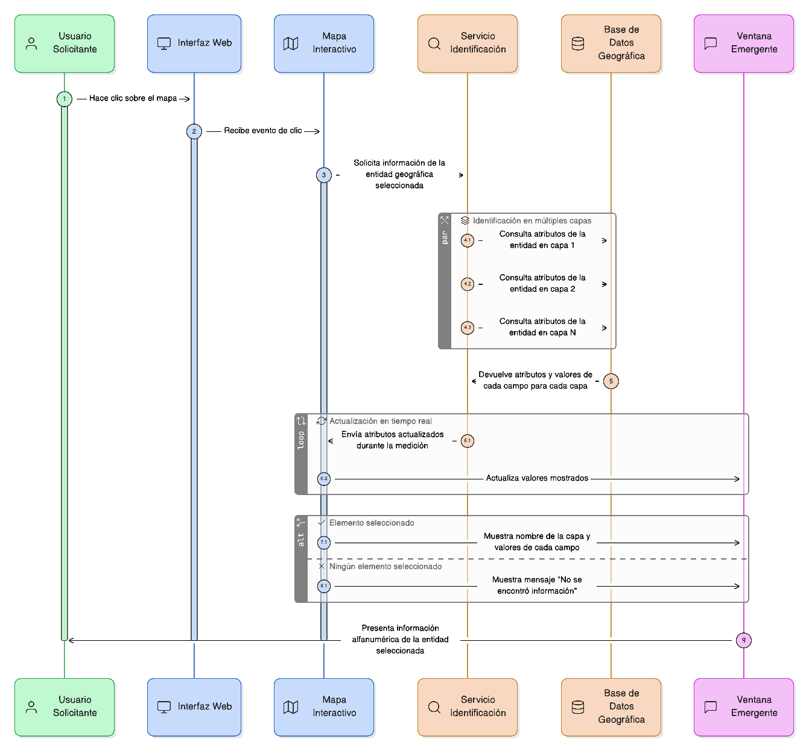
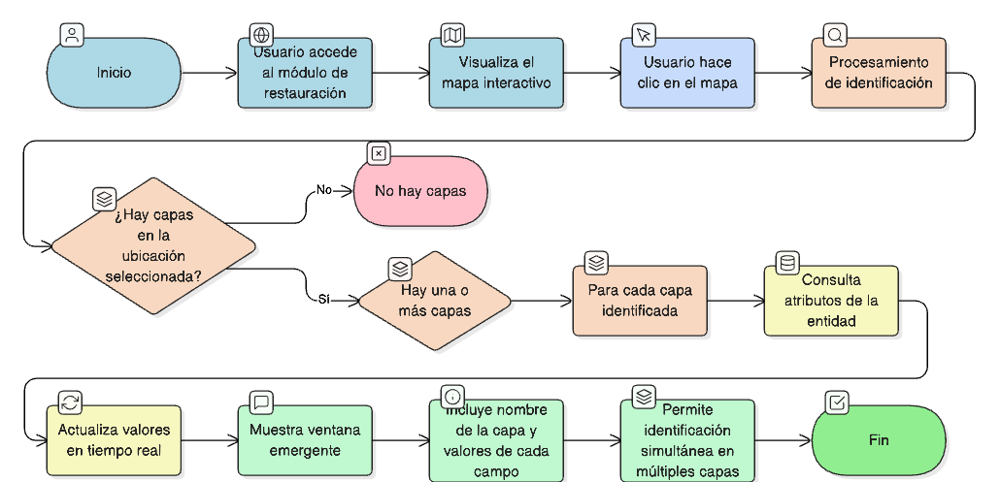
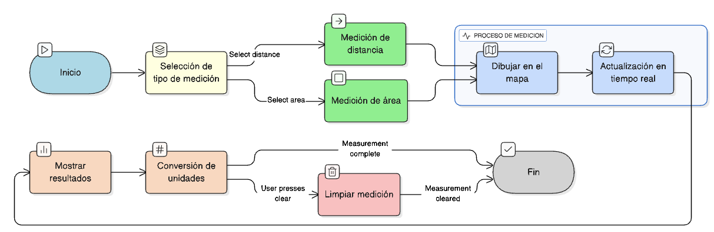

## HU-IDEAM-SNIF-REST-016

> **Identificador Historia de Usuario:** hu-ideam-snif-rest-016 \
> **Nombre Historia de Usuario:** Módulo de restauración - Herramienta de identificación (Identify)

> **Área Proyecto:** Subdirección de Ecosistemas e Información Ambiental \
> **Nombre proyecto:** Realizar la construcción temática, mejoras informáticas y optimización del Módulo de restauración del SNIF del IDEAM. \
> **Líder funcional:** Wilmer Espitia Muñoz\
> **Analista de requerimiento de TI:** Sergio Alonso Anaya Estévez

## DESCRIPCIÓN HISTORIA DE USUARIO

> **Como:** usuario solicitante. \
> **Quiero:** hacer clic sobre el mapa. \
> **Para:** consultar la información alfanumérica de una entidad geográfica.

## CRITERIOS DE ACEPTACIÓN

1. **Mostrar atributos del elemento seleccionado en ventana emergente.**  
2. **Incluir nombre de la capa y valores de cada campo.**  
3. **Actualizar los valores en tiempo real durante la medición.**  
4. **Permitir identificación simultánea en múltiples capas.**  

## DIAGRAMA DE SECUENCIA

## DIAGRAMA DE FLUJO DEL PROCESO

## PROTOTIPO PRELIMINAR

## ANEXOS

- Ejemplo de ventanas emergentes con la información.
- Ejemplo de información disponible por capa.

