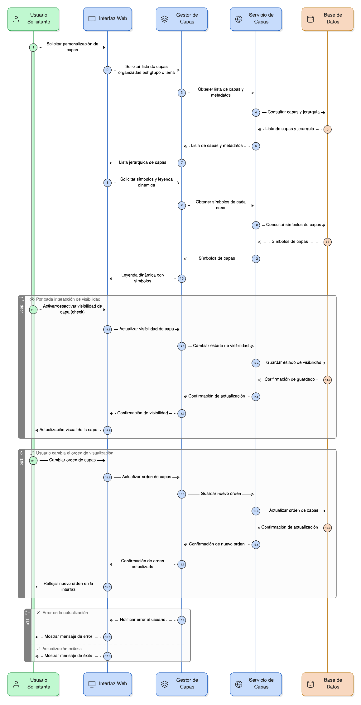
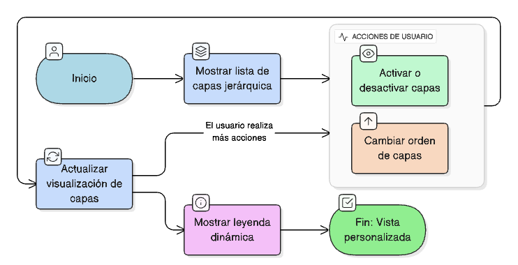

## HU-IDEAM-SNIF-REST-017

> **Identificador Historia de Usuario:** hu-ideam-snif-rest-017 \
> **Nombre Historia de Usuario:** Módulo de restauración - Control de capas

> **Área Proyecto:** Subdirección de Ecosistemas e Información Ambiental \
> **Nombre proyecto:** Realizar la construcción temática, mejoras informáticas y optimización del Módulo de restauración del SNIF del IDEAM. \
> **Líder funcional:** Wilmer Espitia Muñoz\
> **Analista de requerimiento de TI:** Sergio Alonso Anaya Estévez

## DESCRIPCIÓN HISTORIA DE USUARIO

> **Como:** usuario solicitante. \
> **Quiero:** activar o desactivar la visualización de capas geográficas. \
> **Para:** personalizar mi vista y controlar lo que quiero visualizar.

## CRITERIOS DE ACEPTACIÓN

1. Mostrar lista de capas organizadas jerárquicamente por grupo o tema.
2. Incluir casillas de visibilidad (check) para cada capa.
3. Permitir cambiar el orden de visualización de las capas.
4. Mostrar leyenda dinámica con símbolos de cada capa.

## DIAGRAMA DE SECUENCIA

## DIAGRAMA DE FLUJO DEL PROCESO

## PROTOTIPO PRELIMINAR

## ANEXOS

- Ejemplo de herramienta de control de capas.
- Ejemplo de manejo de las opciones de activación/desactivación de capas.

