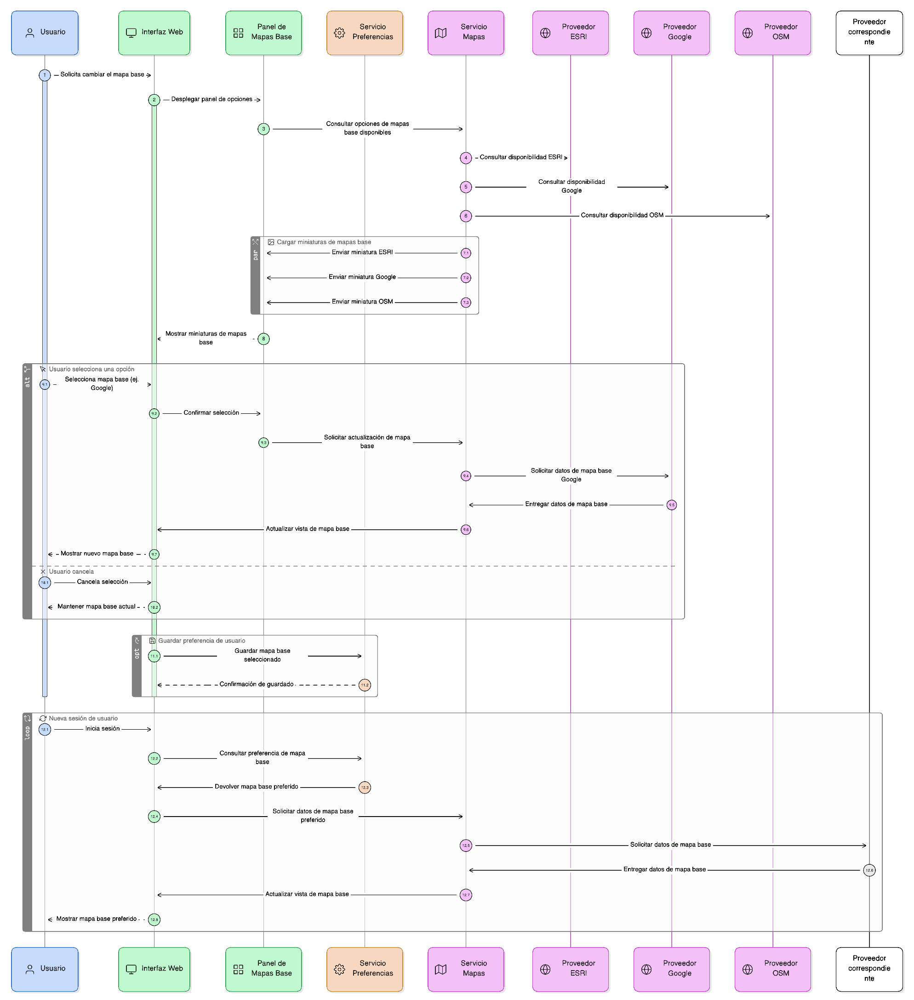
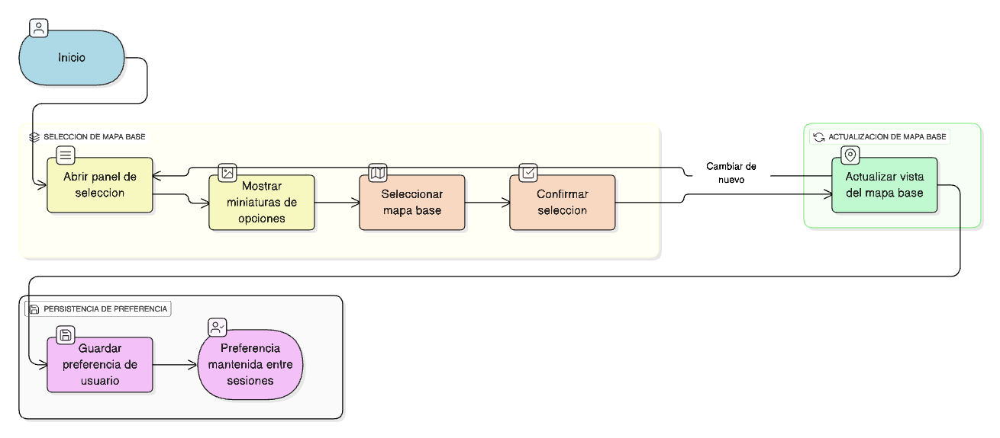

## HU-IDEAM-SNIF-REST-018

> **Identificador Historia de Usuario:** hu-ideam-snif-rest-018 \
> **Nombre Historia de Usuario:** Módulo de restauración - Cambiar mapa base

> **Área Proyecto:** Subdirección de Ecosistemas e Información Ambiental \
> **Nombre proyecto:** Realizar la construcción temática, mejoras informáticas y optimización del Módulo de restauración del SNIF del IDEAM. \
> **Líder funcional:** Wilmer Espitia Muñoz\
> **Analista de requerimiento de TI:** Sergio Alonso Anaya Estévez

## DESCRIPCIÓN HISTORIA DE USUARIO

> **Como:** usuario solicitante. \
> **Quiero:**  seleccionar diferentes mapas base. \
> **Para:** adaptar la vista a mis necesidades de análisis.

## CRITERIOS DE ACEPTACIÓN

1. Desplegar panel con miniaturas de opciones disponibles (ESRI, Google, OSM, etc.).
2. Actualizar el mapa base automáticamente al confirmar la selección.
3. Mantener la preferencia del usuario entre sesiones.

## DIAGRAMA DE SECUENCIA

## DIAGRAMA DE FLUJO DEL PROCESO

## PROTOTIPO PRELIMINAR

## ANEXOS

- Ejemplo de diferentes mapas base disponibles.
- listado de mapas base.

