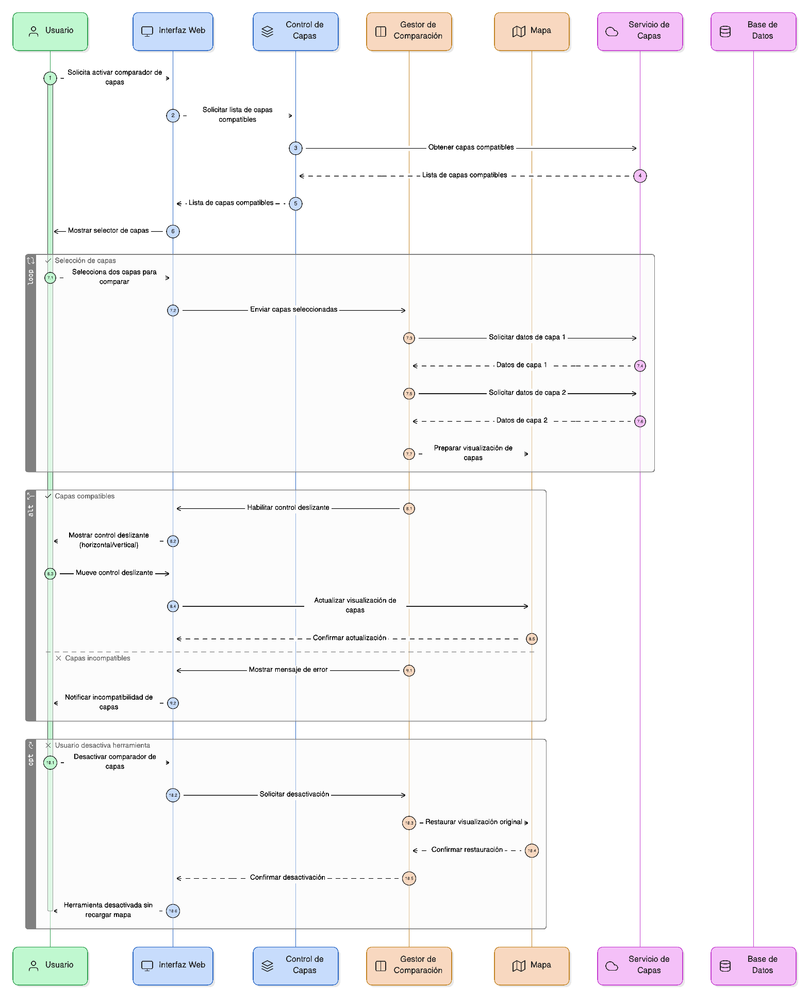
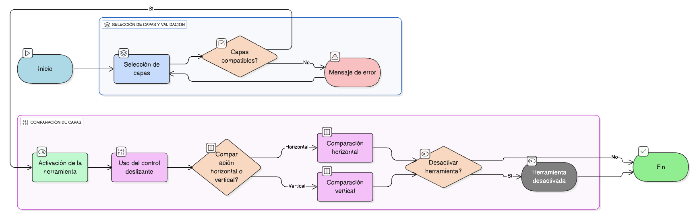

## HU-IDEAM-SNIF-REST-019

> **Identificador Historia de Usuario:** hu-ideam-snif-rest-019 \
> **Nombre Historia de Usuario:** Módulo de restauración - Comparador de capas (Swipe)

> **Área Proyecto:** Subdirección de Ecosistemas e Información Ambiental \
> **Nombre proyecto:** Realizar la construcción temática, mejoras informáticas y optimización del Módulo de restauración del SNIF del IDEAM. \
> **Líder funcional:** Wilmer Espitia Muñoz\
> **Analista de requerimiento de TI:** Sergio Alonso Anaya Estévez

## DESCRIPCIÓN HISTORIA DE USUARIO

> **Como:** usuario solicitante. \
> **Quiero:**  comparar visualmente dos capas mediante un control deslizante. \
> **Para:** analizar cambios espaciales en una misma ventana/panel.

## CRITERIOS DE ACEPTACIÓN

1. **Permitir seleccionar dos capas compatibles para la comparación.**
2. **Incluir control deslizante horizontal o vertical para revelar una capa sobre otra.**
3. **Permitir activar o desactivar la herramienta sin recargar el mapa.**

## DIAGRAMA DE SECUENCIA

## DIAGRAMA DE FLUJO DEL PROCESO

## PROTOTIPO PRELIMINAR

## ANEXOS

- Ejemplo de visualización entre dos capas usando el swipe.
- Ejemplo de utilidad de la herramienta (cambio espacial)

