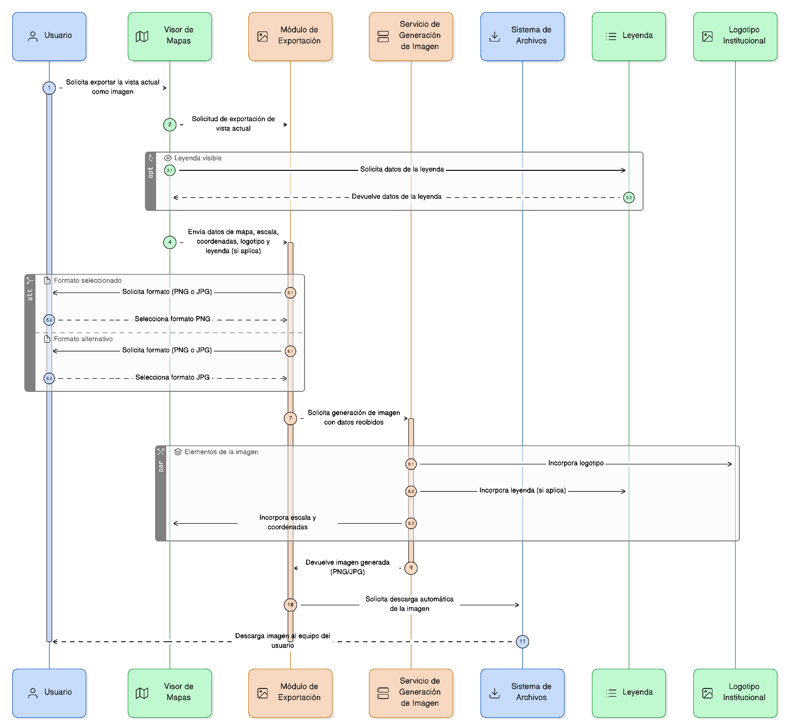
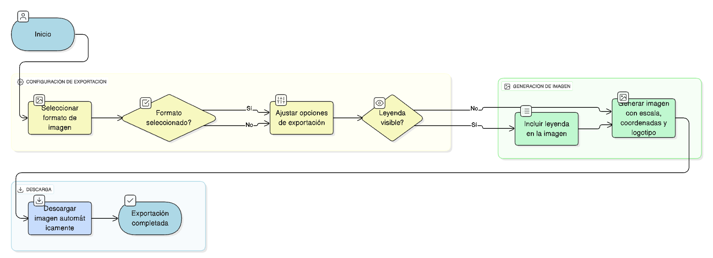

## HU-IDEAM-SNIF-REST-020

> **Identificador Historia de Usuario:** hu-ideam-snif-rest-020 \
> **Nombre Historia de Usuario:** Módulo de restauración -  Exportar la vista actual como imagen

> **Área Proyecto:** Subdirección de Ecosistemas e Información Ambiental \
> **Nombre proyecto:** Realizar la construcción temática, mejoras informáticas y optimización del Módulo de restauración del SNIF del IDEAM. \
> **Líder funcional:** Wilmer Espitia Muñoz\
> **Analista de requerimiento de TI:** Sergio Alonso Anaya Estévez

## DESCRIPCIÓN HISTORIA DE USUARIO

> **Como:** usuario solicitante. \
> **Quiero:**  exportar la vista actual del mapa como imagen. \
> **Para:** Incluirla en informes o presentaciones.

## CRITERIOS DE ACEPTACIÓN

1. **Generar imagen en formato PNG o JPG con escala, coordenadas y logotipo institucional.**
2. **Incluir leyenda si está visible en el visor.**
3. **Descargar automáticamente el archivo generado al equipo del usuario.**

## DIAGRAMA DE SECUENCIA

## DIAGRAMA DE FLUJO DEL PROCESO

## PROTOTIPO PRELIMINAR

## ANEXOS

- Ejemplo de salida gráfica en PNG o JPG.
- Referencia a numeral **Descargar capas** del visor geográfico.

