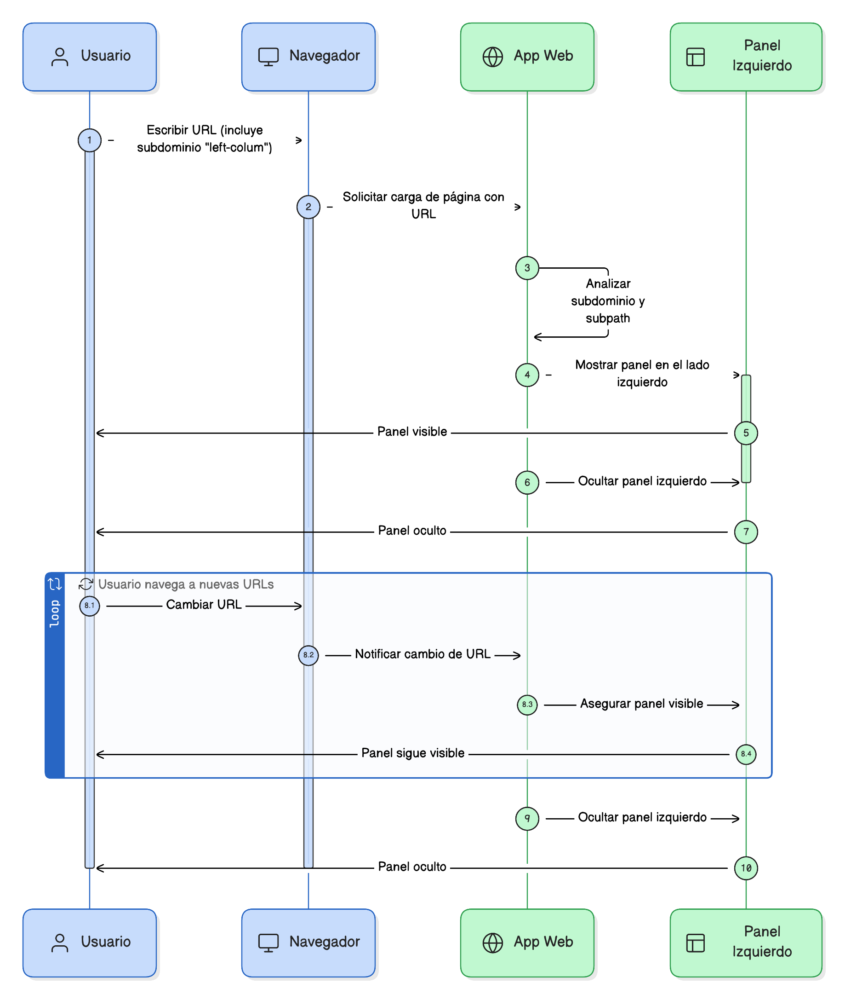
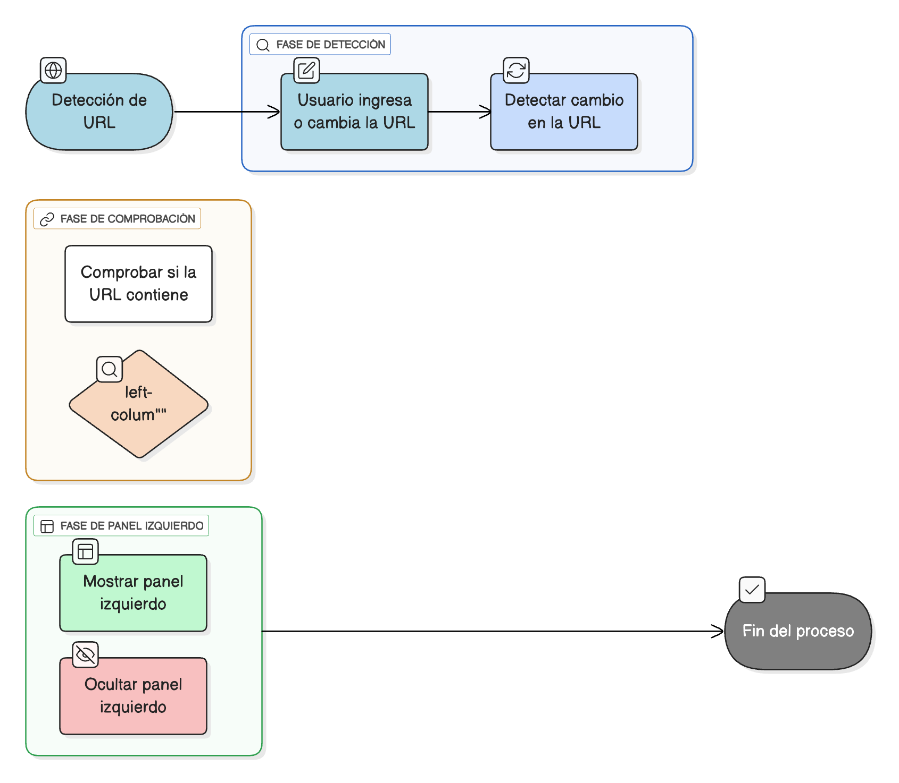

## HU-IDEAM-SNIF-REST-022
> **Identificador Historia de Usuario:** HU-IDEAM-SNIF-REST-022 \
> **Nombre Historia de Usuario:** Módulo de restauración - Sidebar de gestión de operaciones

> **Área Proyecto:** Subdirección de Ecosistemas e Información Ambiental \
> **Nombre proyecto:** Realizar la construcción temática, mejoras informáticas y optimización del Módulo de restauración del SNIF del IDEAM. \
> **Líder funcional:** Wilmer Espitia Muñoz\
> **Analista de requerimiento de TI:** Sergio Alonso Anaya Estévez

## DESCRIPCIÓN HISTORIA DE USUARIO

> **Como:** usuario solicitante. \
> **Quiero:** Que el sistema conste de unun sidebar lateral izquierdo. \
> **Para:** que permita la gestión de las principales operaciones del visor geográfico, ofreciendo acceso estructurado a los catálogos temáticos, los procesos disponibles, y las consultas del sistema (ver SIDEBAR DE GESTIÓN DE OPERACIONES).

## CRITERIOS DE ACEPTACIÓN

1. **El panel se mostrará solo cuando el subdominio relacionado esté en la URL (/left-panel)**
2. **Deberá cumplir las características dadas por el diseño**
3. **En caso de que el contenido supere el alto del panel, este deberá mostrar opción de scroll (solo en vertical)**

## DIAGRAMA DE SECUENCIA

## DIAGRAMA DE FLUJO DEL PROCESO

## PROTOTIPO PRELIMINAR

