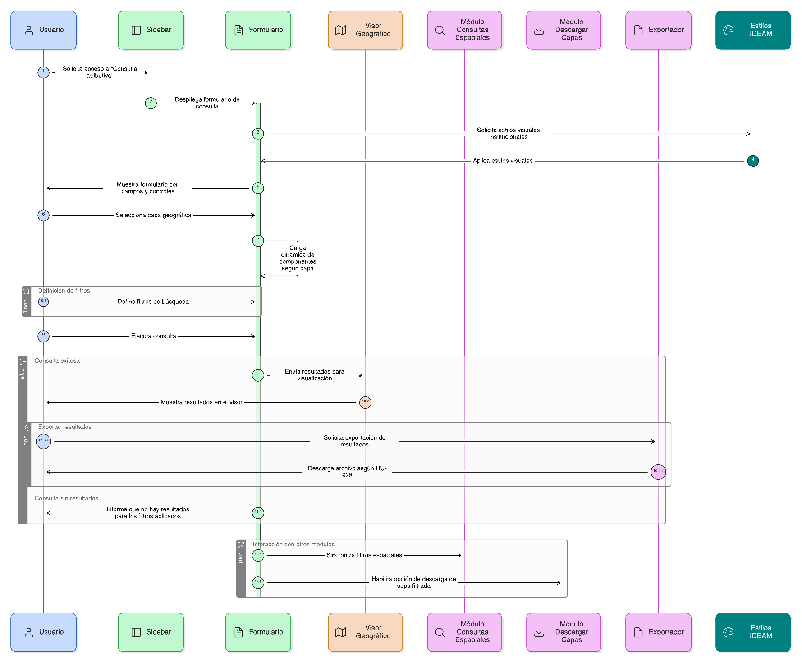
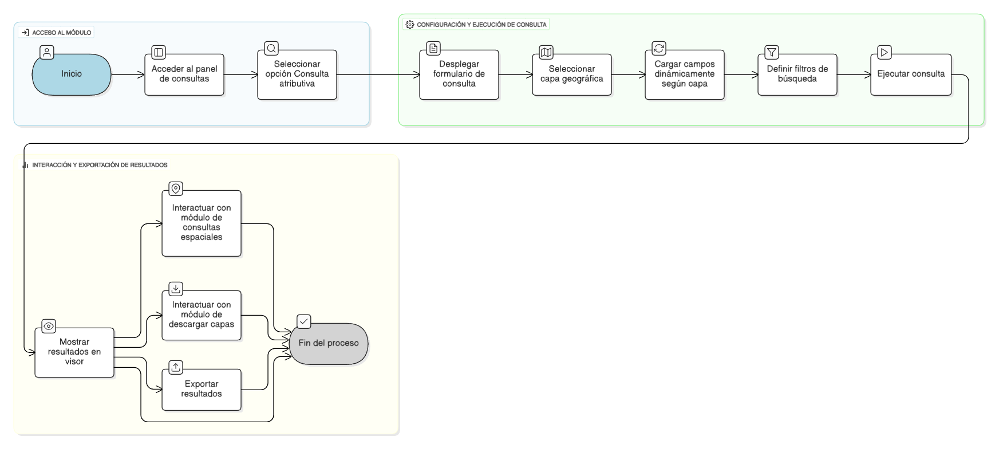

## HU-IDEAM-SNIF-REST-024

> **Identificador Historia de Usuario:** hu-ideam-snif-rest-024 \
> **Nombre Historia de Usuario:** Módulo de restauración - Consulta Atributiva

> **Área Proyecto:** Subdirección de Ecosistemas e Información Ambiental \
> **Nombre proyecto:** Realizar la construcción temática, mejoras informáticas y optimización del Módulo de restauración del SNIF del IDEAM. \
> **Líder funcional:** Wilmer Espitia Muñoz\
> **Analista de requerimiento de TI:** Sergio Alonso Anaya Estévez

## DESCRIPCIÓN HISTORIA DE USUARIO

> **Como:** usuario solicitante. \
> **Quiero:** acceder al módulo de consulta atributiva. \
> **Para:** realizar búsquedas por atributos sobre capas geográficas y analizar los resultados directamente en el visor.

## CRITERIOS DE ACEPTACIÓN

1. **Acceso al módulo**  
1.1 El sistema debe incluir la opción Consulta atributiva dentro del panel de consultas del sidebar.  
1.2 Al seleccionarla, se desplegará un formulario con los campos y controles necesarios para ejecutar la búsqueda.

2. **Estructura general del formulario**  
2.1 El formulario debe permitir seleccionar capa, definir filtros y ejecutar consulta.  
2.2 Los componentes deben cargarse dinámicamente según la capa seleccionada.  
2.3 El diseño debe ser compatible con el estilo visual institucional del IDEAM.

3. **Dependencias funcionales**  
3.1 El módulo debe interactuar con los componentes de Consultas espaciales y Descargar capas.  
3.2 Los resultados deben poder exportarse según las condiciones definidas en HU-028.

   
## DIAGRAMA DE SECUENCIA

## DIAGRAMA DE FLUJO DEL PROCESO

## PROTOTIPO PRELIMINAR

## ANEXOS

- Wireframe: Vista general del formulario de consulta atributiva.
- Especificaciones visuales: Panel lateral izquierdo con pestaña “Consultas”.
- Dependencias funcionales: HU-025 a HU-028.
- Observaciones: Cargar dinámicamente las capas y filtros según permisos del usuario.