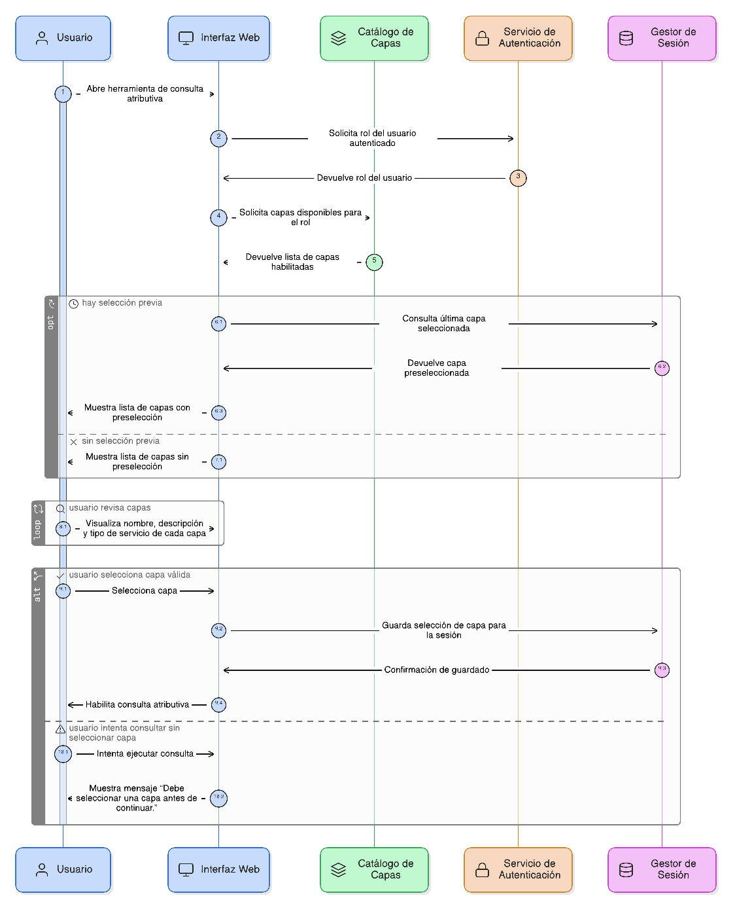
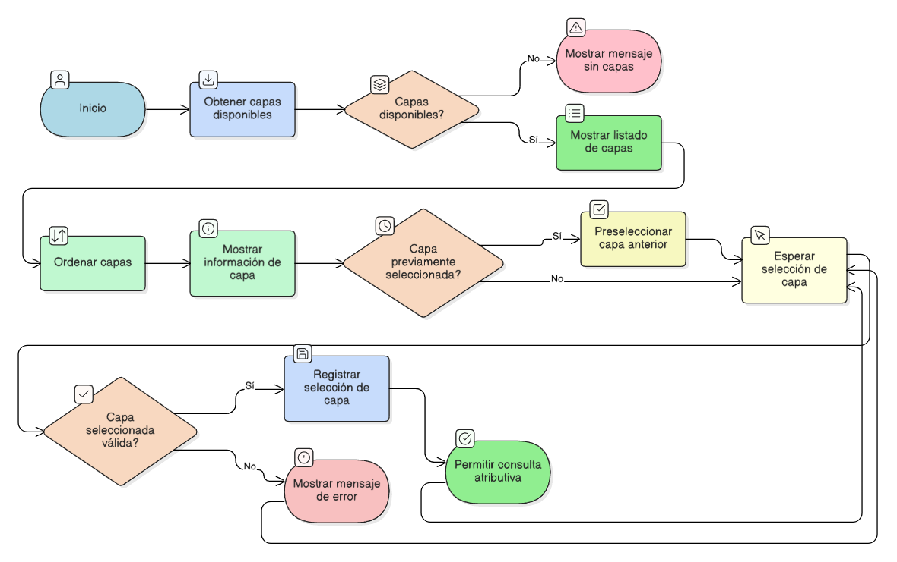

## HU-IDEAM-SNIF-REST-025

> **Identificador Historia de Usuario:** hu-ideam-snif-rest-025 \
> **Nombre Historia de Usuario:** Módulo de restauración - Selección de elemento o capa

> **Área Proyecto:** Subdirección de Ecosistemas e Información Ambiental \
> **Nombre proyecto:** Realizar la construcción temática, mejoras informáticas y optimización del Módulo de restauración del SNIF del IDEAM. \
> **Líder funcional:** Wilmer Espitia Muñoz\
> **Analista de requerimiento de TI:** Sergio Alonso Anaya Estévez

## DESCRIPCIÓN HISTORIA DE USUARIO

> **Como:** usuario solicitante. \
> **Quiero:** seleccionar la capa o elemento geográfico sobre el cual ejecutar la consulta atributiva. \
> **Para:** filtrar información solo sobre capas disponibles y autorizadas según mi rol.

## CRITERIOS DE ACEPTACIÓN

1. **Listado de capas disponibles**  
    1.1 El sistema debe listar únicamente las capas habilitadas para consulta pública o de acuerdo con el rol del usuario autenticado.  
    1.2 La lista debe cargarse dinámicamente desde el catálogo del sistema al abrir la herramienta de consulta atributiva.

2. **Información de capa**  
    2.1 Cada registro de la lista debe mostrar el nombre, descripción y tipo de servicio correspondiente (WMS, WFS, REST, etc.).  
    2.2 Las capas deben ordenarse alfabéticamente o por grupo temático, según la configuración del catálogo.

3. **Validaciones funcionales**  
    3.1 No se debe permitir ejecutar consultas si no se ha seleccionado una capa válida.  
    3.2 En caso contrario, el sistema mostrará el mensaje: “Debe seleccionar una capa antes de continuar.”

4. **Persistencia de la selección**  
    4.1 El sistema debe recordar la última capa seleccionada durante la sesión activa del usuario.  
    4.2 Al volver a abrir la consulta atributiva, la capa previamente elegida debe aparecer preseleccionada.

   
## DIAGRAMA DE SECUENCIA

## DIAGRAMA DE FLUJO DEL PROCESO

## PROTOTIPO PRELIMINAR

## ANEXOS

- Wireframe: Lista desplegable de capas con nombre y tipo de servicio.
- Referencias técnicas: Catálogo de capas IDEAM / servicio WMS-WFS.
- Dependencias funcionales: HU-024 (Consulta atributiva), HU-026 (Filtros).
