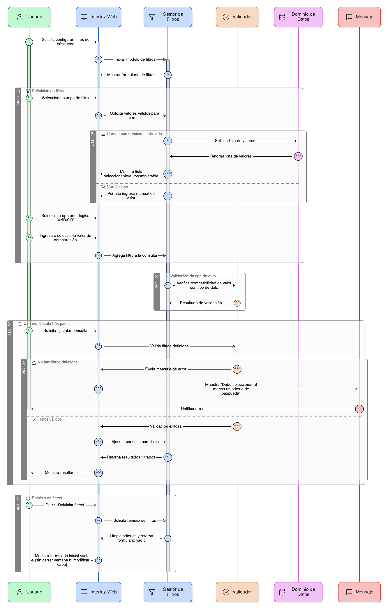
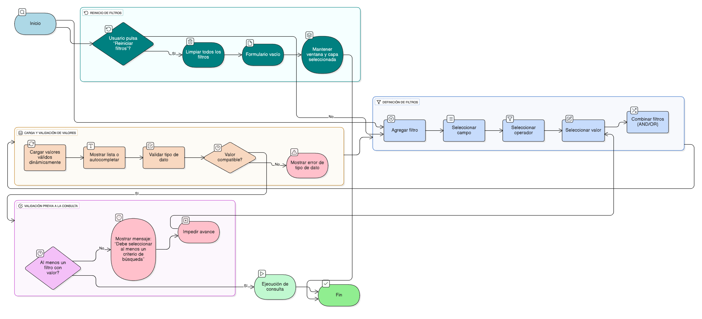

## HU-IDEAM-SNIF-REST-026

> **Identificador Historia de Usuario:** hu-ideam-snif-rest-026 \
> **Nombre Historia de Usuario:** Módulo de restauración - Filtros de búsqueda atributiva

> **Área Proyecto:** Subdirección de Ecosistemas e Información Ambiental \
> **Nombre proyecto:** Realizar la construcción temática, mejoras informáticas y optimización del Módulo de restauración del SNIF del IDEAM. \
> **Líder funcional:** Wilmer Espitia Muñoz\
> **Analista de requerimiento de TI:** Sergio Alonso Anaya Estévez

## DESCRIPCIÓN HISTORIA DE USUARIO

> **Como:** usuario solicitante. \
> **Quiero:** configurar filtros de búsqueda combinando uno o varios criterios. \
> **Para:** delimitar los registros que cumplan las condiciones específicas de mi consulta.

## CRITERIOS DE ACEPTACIÓN

1. **Definición y combinación de filtros**  
    1.1 El sistema debe permitir definir uno o varios filtros combinables entre sí.  
    1.2 Debe ofrecer operadores lógicos AND y OR para construir condiciones complejas.  
    1.3 Cada filtro debe permitir seleccionar campo, operador y valor de comparación.

2. **Carga dinámica de valores**  
    2.1 Los valores válidos deben cargarse dinámicamente según el campo seleccionado.  
    2.2 Los campos con dominio controlado deben desplegar listas seleccionables o valores autocompletables.  
    2.3 El sistema debe impedir ingresar valores incompatibles con el tipo de dato (texto, numérico, fecha, etc.).

3. **Validaciones previas a la ejecución**  
    3.1 Antes de ejecutar la consulta, el sistema debe validar que al menos un filtro contenga valor asignado.  
    3.2 Si no hay filtros definidos, debe mostrar el mensaje: “Debe seleccionar al menos un criterio de búsqueda”.  
    3.3 No se debe permitir continuar mientras la validación no se cumpla.

4. **Limpieza y reinicio de filtros**  
    4.1 El sistema debe incluir un botón “Reiniciar filtros” que borre todos los criterios configurados.  
    4.2 Al usar esta opción, el formulario debe regresar a su estado inicial vacío.  
    4.3 El reinicio no debe cerrar la ventana ni modificar la capa seleccionada.

   
## DIAGRAMA DE SECUENCIA

## DIAGRAMA DE FLUJO DEL PROCESO

## PROTOTIPO PRELIMINAR

## ANEXOS

- Wireframe: Formulario con campos, operadores y valores.
- Dependencias funcionales: HU-025 (Selección de capa), HU-027 (Ejecución).
