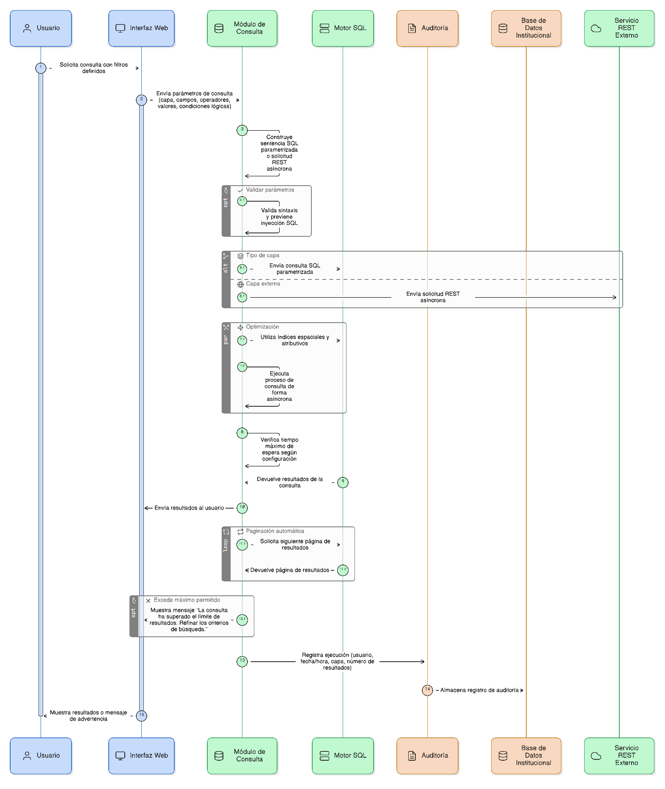
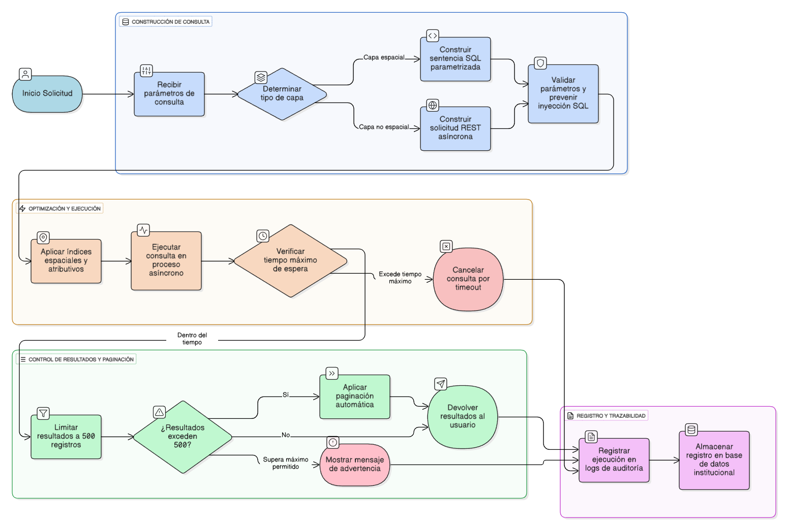

## HU-IDEAM-SNIF-REST-027

> **Identificador Historia de Usuario:** hu-ideam-snif-rest-027 \
> **Nombre Historia de Usuario:** Módulo de restauración - Ejecución de la consulta atributiva

> **Área Proyecto:** Subdirección de Ecosistemas e Información Ambiental \
> **Nombre proyecto:** Realizar la construcción temática, mejoras informáticas y optimización del Módulo de restauración del SNIF del IDEAM. \
> **Líder funcional:** Wilmer Espitia Muñoz\
> **Analista de requerimiento de TI:** Sergio Alonso Anaya Estévez

## DESCRIPCIÓN HISTORIA DE USUARIO

> **Como:** usuario solicitante. \
> **Quiero:** ejecutar una consulta sobre la base de datos espacial. \
> **Para:** obtener resultados optimizados en tiempo y rendimiento de acuerdo con los filtros definidos.

## CRITERIOS DE ACEPTACIÓN

1. **Construcción de la consulta**  
    1.1 El sistema debe construir internamente una sentencia SQL parametrizada o una solicitud REST asíncrona según el tipo de capa consultada.  
    1.2 Los parámetros deben incluir capa, campos, operadores, valores y condiciones lógicas aplicadas.  
    1.3 La estructura de la consulta debe prevenir inyecciones SQL y errores de sintaxis.

2. **Optimización del rendimiento**  
    2.1 El sistema debe utilizar índices espaciales y atributivos disponibles en la base de datos para mejorar el tiempo de respuesta.  
    2.2 La ejecución debe realizarse en procesos asincrónicos para evitar bloqueos de interfaz.  
    2.3 Se debe garantizar que el tiempo máximo de espera no supere los valores definidos en la configuración del servidor.

3. **Control de resultados y paginación**  
    3.1 Cada consulta debe limitar los resultados a un máximo de 500 registros por solicitud.  
    3.2 En caso de superarse este límite, el sistema debe aplicar paginación automática.  
    3.3 Si la cantidad de resultados excede el máximo permitido, se debe mostrar el mensaje: “La consulta ha superado el límite de resultados. Refinar los criterios de búsqueda”.

4. **Registro de ejecución y trazabilidad**  
    4.1 El sistema debe registrar cada ejecución en los logs de auditoría, incluyendo:
    - Usuario autenticado.
    - Fecha y hora de ejecución.
    - Capa consultada.
    - Número de resultados obtenidos.  

    4.2 Los registros deben almacenarse en la base de datos institucional para fines de trazabilidad y análisis de uso.

   
## DIAGRAMA DE SECUENCIA

## DIAGRAMA DE FLUJO DEL PROCESO

## PROTOTIPO PRELIMINAR

## ANEXOS

- Wireframe: Botón “Ejecutar consulta” y mensaje de progreso.
- Dependencias funcionales: HU-026 (Filtros), HU-028 (Resultados).
- Observaciones: Registrar cada ejecución en logs con usuario y fecha.