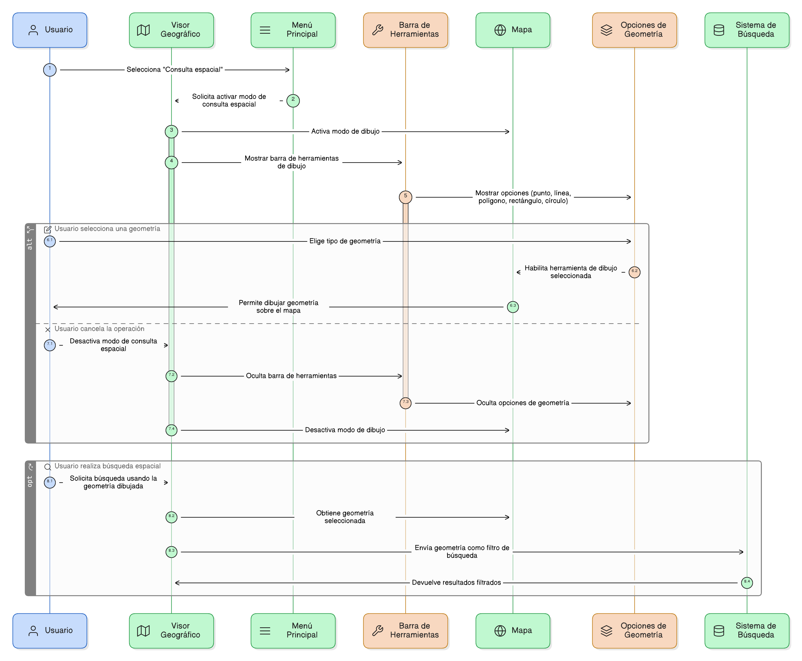
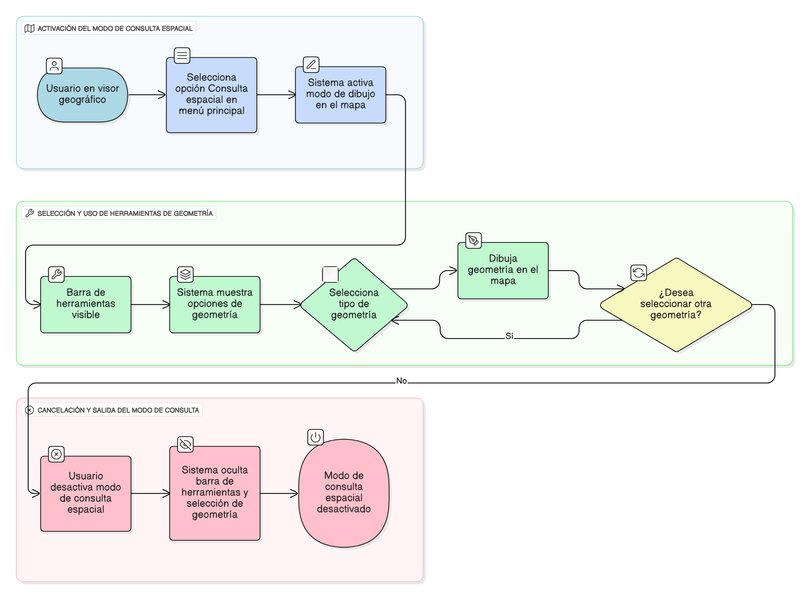

## HU-IDEAM-SNIF-REST-029

> **Identificador Historia de Usuario:** hu-ideam-snif-rest-028 \
> **Nombre Historia de Usuario:** Módulo de restauración - Activación del modo de consulta espacial

> **Área Proyecto:** Subdirección de Ecosistemas e Información Ambiental \
> **Nombre proyecto:** Realizar la construcción temática, mejoras informáticas y optimización del Módulo de restauración del SNIF del IDEAM. \
> **Líder funcional:** Wilmer Espitia Muñoz\
> **Analista de requerimiento de TI:** Sergio Alonso Anaya Estévez

## DESCRIPCIÓN HISTORIA DE USUARIO

> **Como:** usuario solicitante. \
> **Quiero:** activar un modo de consulta espacial desde el menú principal. \
> **Para:** para poder dibujar una geometría sobre el mapa y usarla como filtro de búsqueda.

## CRITERIOS DE ACEPTACIÓN

1. **Activación modo de dibujo**  
    1.1 Dado que el usuario se encuentra en el visor geográfico, cuando selecciona la opción “Consulta espacial” en el menú, entonces el sistema debe activar el modo de dibujo en el mapa. \
    1.2 Dado que el modo de dibujo está activo, cuando el usuario accede a la barra de herramientas, entonces el sistema debe mostrar las opciones de geometría disponibles: punto, línea, polígono, rectángulo y círculo. \
    1.3 Dado que el usuario desea cancelar la operación, cuando desactiva el modo de consulta espacial, entonces la barra de herramientas y la selección de geometría deben ocultarse.
   
## DIAGRAMA DE SECUENCIA

## DIAGRAMA DE FLUJO DEL PROCESO

## PROTOTIPO PRELIMINAR

## ANEXOS

- Wireframe: Mapa con resultados resaltados y tabla de atributos.
- Dependencias funcionales: HU-027 (Ejecución), HU-045 (Descarga de capas).
- Observaciones: Permitir reiniciar resultados sin recargar el visor.