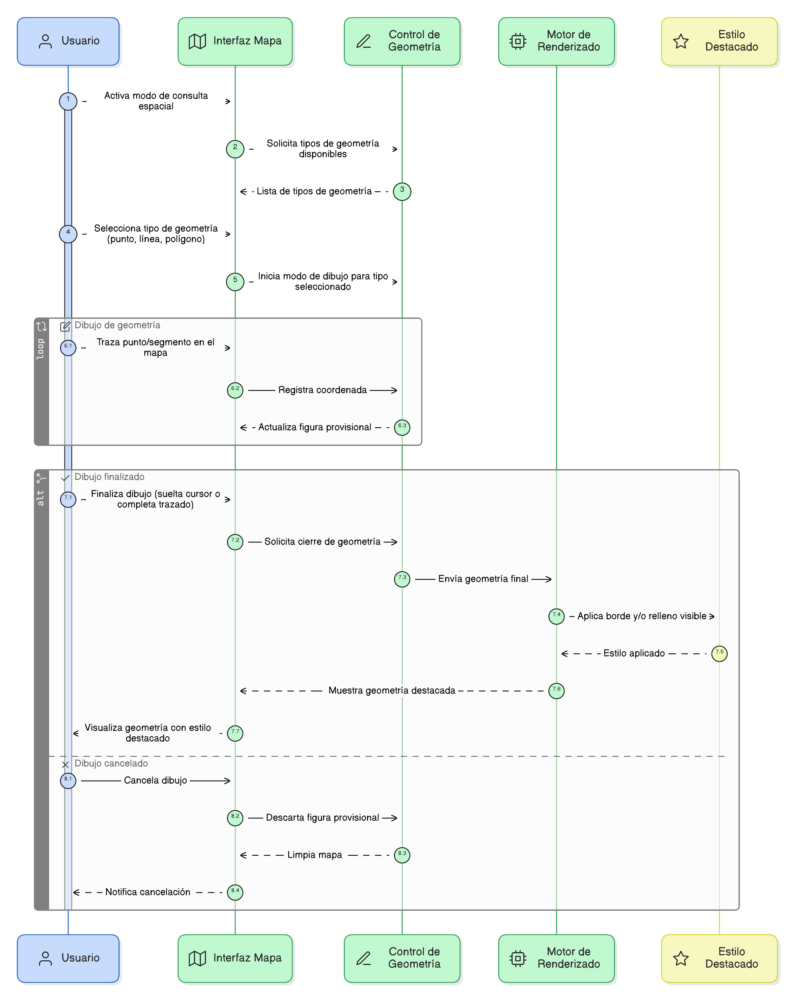

## HU-IDEAM-SNIF-REST-030

> **Identificador Historia de Usuario:** hu-ideam-snif-rest-030 \
> **Nombre Historia de Usuario:** Módulo de restauración - Dibujar la geometría en el mapa

> **Área Proyecto:** Subdirección de Ecosistemas e Información Ambiental \
> **Nombre proyecto:** Realizar la construcción temática, mejoras informáticas y optimización del Módulo de restauración del SNIF del IDEAM. \
> **Líder funcional:** Wilmer Espitia Muñoz\
> **Analista de requerimiento de TI:** Sergio Alonso Anaya Estévez

## DESCRIPCIÓN HISTORIA DE USUARIO

> **Como:** usuario solicitante. \
> **Quiero:** dibujar una geometría directamente sobre el mapa. \
> **Para:** definir el área o forma espacial sobre la cual realizaré la consulta.

## CRITERIOS DE ACEPTACIÓN

1. **Dibujar figura en el mapa**  
    1.1 Dado que el modo de consulta espacial está activo, cuando el usuario selecciona un tipo de geometría, entonces el sistema debe permitir dibujar la figura sobre el mapa. 

2. **Representación visual en el mapa**  
    2.1 Dado que el dibujo ha finalizado, cuando el usuario suelta el cursor o completa el trazado, entonces el sistema debe mostrar la geometría con un estilo destacado (borde o relleno visible).

   
## DIAGRAMA DE SECUENCIA

## DIAGRAMA DE FLUJO DEL PROCESO

## PROTOTIPO PRELIMINAR

## ANEXOS
