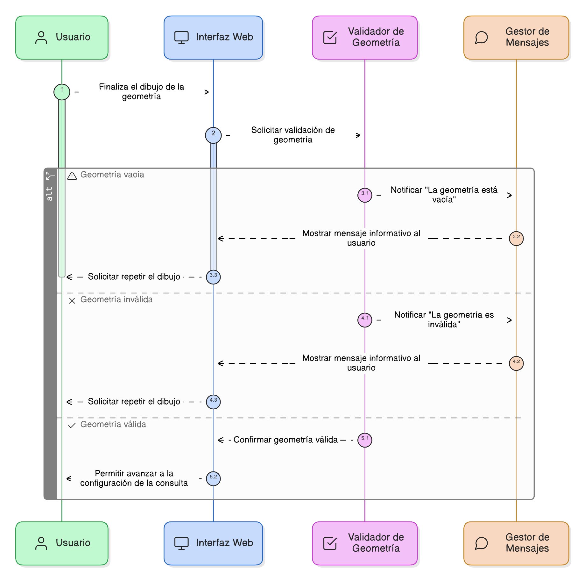
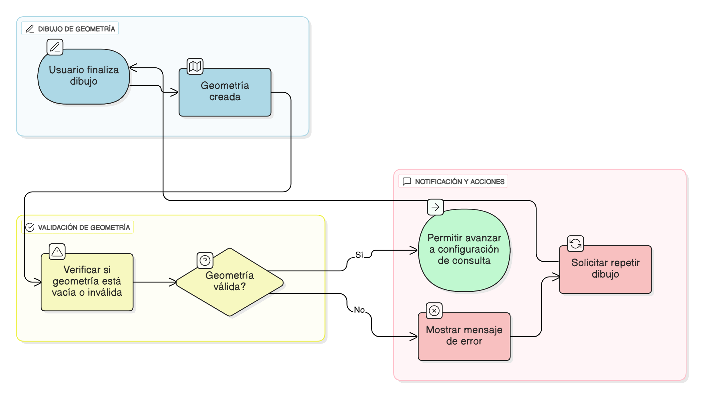

## HU-IDEAM-SNIF-REST-031

> **Identificador Historia de Usuario:** hu-ideam-snif-rest-031 \
> **Nombre Historia de Usuario:** Módulo de restauración - Validar la geometría dibujada

> **Área Proyecto:** Subdirección de Ecosistemas e Información Ambiental \
> **Nombre proyecto:** Realizar la construcción temática, mejoras informáticas y optimización del Módulo de restauración del SNIF del IDEAM. \
> **Líder funcional:** Wilmer Espitia Muñoz\
> **Analista de requerimiento de TI:** Sergio Alonso Anaya Estévez

## DESCRIPCIÓN HISTORIA DE USUARIO

> **Como:** usuario solicitante. \
> **Quiero:** que el sistema valide automáticamente la geometría dibujada. \
> **Para:** asegurar que sea válida antes de ejecutar la consulta.

## CRITERIOS DE ACEPTACIÓN

1. **Validación de geometría**  
    1.1 Dado que el usuario finaliza el dibujo, cuando la geometría se crea, entonces el sistema debe verificar que no esté vacía ni sea inválida.

2. **Notificación de error**  
    2.1 Dado que la geometría es inválida, cuando el sistema detecta el error, entonces debe mostrar un mensaje informativo indicando la causa y solicitar repetir el dibujo.
    2.2 Dado que la geometría es válida, cuando pasa la validación, entonces el sistema debe permitir avanzar a la configuración de la consulta.

   
## DIAGRAMA DE SECUENCIA

## DIAGRAMA DE FLUJO DEL PROCESO

## PROTOTIPO PRELIMINAR

## ANEXOS
