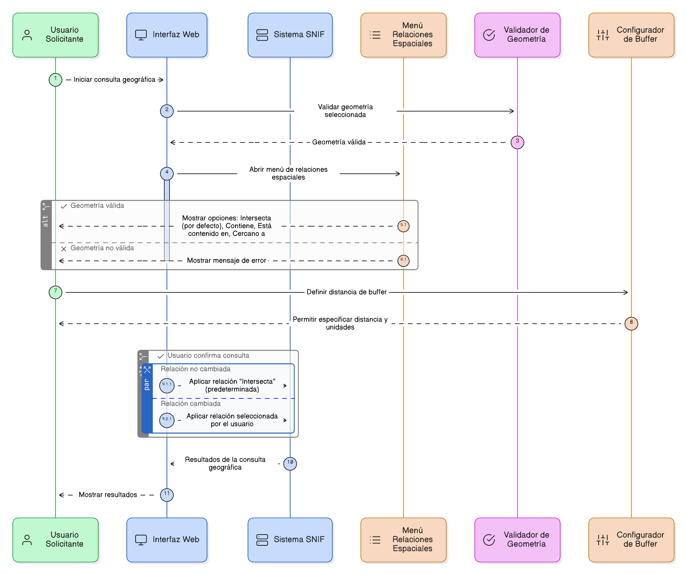
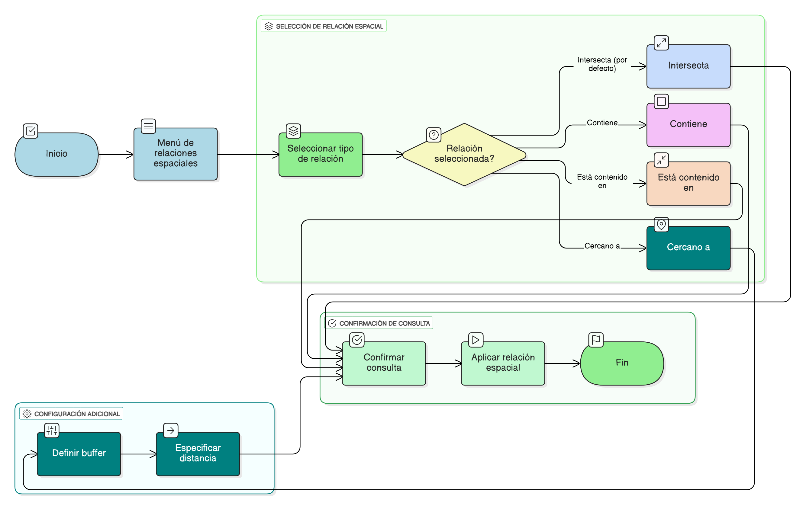

## HU-IDEAM-SNIF-REST-032

> **Identificador Historia de Usuario:** hu-ideam-snif-rest-032 \
> **Nombre Historia de Usuario:** Módulo de restauración - Configurar el tipo de relación espacial

> **Área Proyecto:** Subdirección de Ecosistemas e Información Ambiental \
> **Nombre proyecto:** Realizar la construcción temática, mejoras informáticas y optimización del Módulo de restauración del SNIF del IDEAM. \
> **Líder funcional:** Wilmer Espitia Muñoz\
> **Analista de requerimiento de TI:** Sergio Alonso Anaya Estévez

## DESCRIPCIÓN HISTORIA DE USUARIO

> **Como:** usuario solicitante. \
> **Quiero:** seleccionar el tipo de relación espacial (intersecta, contiene, está contenido en, cercano a). \
> **Para:** definir la forma en que se buscarán los elementos geográficos.

## CRITERIOS DE ACEPTACIÓN

1. **Selección de tipo de relación**  
    1.1 Dado que la geometría ha sido validada, cuando el usuario abre el menú de relaciones espaciales, entonces el sistema debe mostrar las opciones: Intersecta (por defecto), Contiene, Está contenido en y Cercano a. \
    1.2 Dado que el usuario selecciona “Cercano a”, cuando define un buffer, entonces el sistema debe permitir especificar la distancia en unidades configurables. \
    1.3 Dado que el usuario no cambia la relación, cuando confirma la consulta, entonces el sistema debe aplicar “Intersecta” como opción predeterminada.

   
## DIAGRAMA DE SECUENCIA

## DIAGRAMA DE FLUJO DEL PROCESO

## PROTOTIPO PRELIMINAR

## ANEXOS
