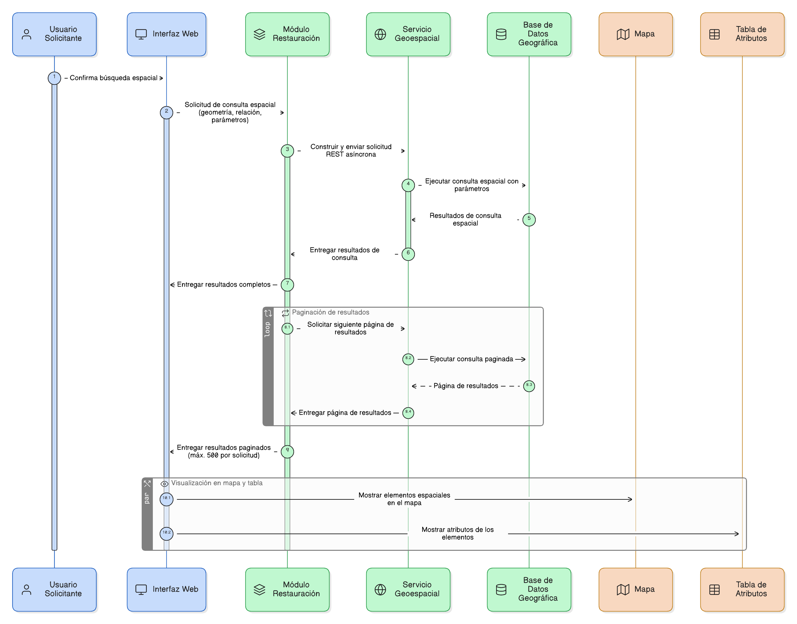

## HU-IDEAM-SNIF-REST-033

> **Identificador Historia de Usuario:** hu-ideam-snif-rest-033 \
> **Nombre Historia de Usuario:** Módulo de restauración - Ejecutar la consulta espacial

> **Área Proyecto:** Subdirección de Ecosistemas e Información Ambiental \
> **Nombre proyecto:** Realizar la construcción temática, mejoras informáticas y optimización del Módulo de restauración del SNIF del IDEAM. \
> **Líder funcional:** Wilmer Espitia Muñoz\
> **Analista de requerimiento de TI:** Sergio Alonso Anaya Estévez

## DESCRIPCIÓN HISTORIA DE USUARIO

> **Como:** usuario solicitante. \
> **Quiero:** ejecutar la búsqueda espacial en la base de datos geográfica. \
> **Para:** obtener los elementos que cumplen la relación seleccionada con la geometría dibujada.

## CRITERIOS DE ACEPTACIÓN

1. **Ejecución de consulta**  
    1.1 Dado que el usuario confirma la búsqueda, cuando el sistema ejecuta la consulta, entonces debe construir una solicitud asíncrona (REST) al servicio geoespacial con los parámetros definidos. \
    1.2 Dado que el sistema procesa los resultados, cuando los datos superan el límite configurado, entonces debe aplicar paginación o restringir la respuesta a 500 registros por solicitud. \
    1.3 Dado que la consulta se completa correctamente, cuando se reciben los resultados, entonces deben ser enviados al mapa y a la tabla de atributos para su visualización.

   
## DIAGRAMA DE SECUENCIA

## DIAGRAMA DE FLUJO DEL PROCESO

## PROTOTIPO PRELIMINAR

## ANEXOS
