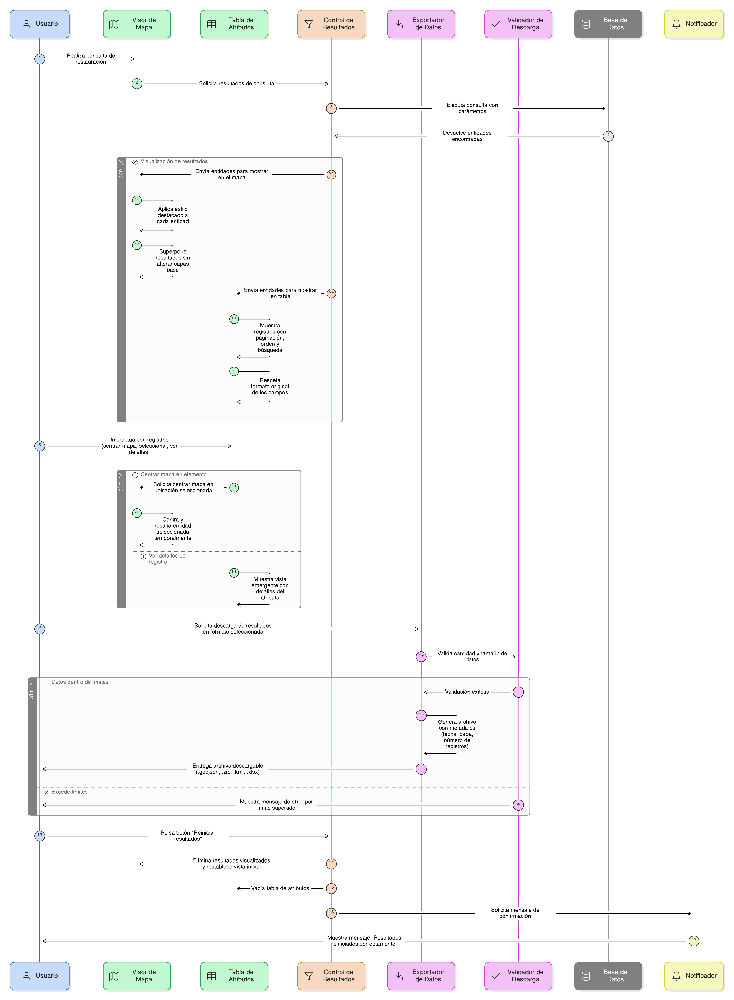
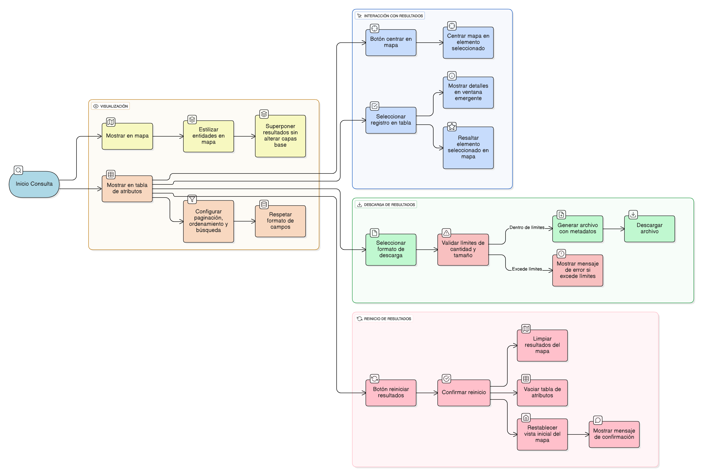

## HU-IDEAM-SNIF-REST-034

> **Identificador Historia de Usuario:** hu-ideam-snif-rest-034 \
> **Nombre Historia de Usuario:** Módulo de restauración - Visualizar y exportar los resultados

> **Área Proyecto:** Subdirección de Ecosistemas e Información Ambiental \
> **Nombre proyecto:** Realizar la construcción temática, mejoras informáticas y optimización del Módulo de restauración del SNIF del IDEAM. \
> **Líder funcional:** Wilmer Espitia Muñoz\
> **Analista de requerimiento de TI:** Sergio Alonso Anaya Estévez

## DESCRIPCIÓN HISTORIA DE USUARIO

> **Como:** usuario solicitante. \
> **Quiero:** visualizar los resultados de la consulta en el mapa y en una tabla de atributos. \
> **Para:** descargarlos en distintos formatos, para analizarlos o almacenarlos.

## CRITERIOS DE ACEPTACIÓN

1. **Representación visual en el mapa**  
    1.1 El sistema debe mostrar los resultados de la consulta directamente sobre el mapa principal.  
    1.2 Cada entidad resultante debe representarse con un estilo destacado (color, borde o transparencia diferenciada).  
    1.3 Los resultados deben superponerse sin alterar las capas base o temáticas activas.  

2. **Visualización en tabla de atributos**  
    2.1 Los mismos registros deben mostrarse en una tabla de atributos ubicada debajo o al costado del visor.  
    2.2 La tabla debe contar con paginación, ordenamiento por columna y barra de búsqueda interna.  
    2.3 Los valores de los campos deben respetar el formato original de la base de datos (texto, número, fecha, etc.).

3. **Interacción con los resultados**  
    3.1 Cada registro de la tabla debe incluir un botón para centrar el mapa en la ubicación del elemento seleccionado.  
    3.2 Al seleccionar un registro, debe abrirse una vista emergente con los detalles principales del atributo.  
    3.3 Los elementos seleccionados deben resaltarse en el mapa con un estilo temporal (por ejemplo, borde azul).

4. **Descarga de resultados**  
    4.1 El sistema debe permitir descargar los resultados obtenidos en los siguientes formatos:
    - GeoJSON (.geojson)
    - Shapefile (.zip)
    - KML (.kml)
    - Excel (.xlsx)

    4.2 Antes de descargar, el sistema debe validar que la cantidad y tamaño de los datos no supere los límites definidos (máximo 10 000 registros o 10 MB).  
    4.3 Los archivos generados deben incluir metadatos básicos (fecha, capa, número de registros).

5. **Reinicio de resultados**  
    5.1 El sistema debe incluir un botón “Reiniciar resultados” para limpiar la consulta y restablecer la vista inicial del mapa.  
    5.2 Al ejecutar esta acción, se deben eliminar los resultados visualizados y vaciar la tabla de atributos.  
    5.3 El sistema debe mostrar un mensaje de confirmación: “Resultados reiniciados correctamente”.

   
## DIAGRAMA DE SECUENCIA

## DIAGRAMA DE FLUJO DEL PROCESO

## PROTOTIPO PRELIMINAR

## ANEXOS

- Wireframe: Mapa con resultados resaltados y tabla de atributos.
- Dependencias funcionales: HU-027 (Ejecución), HU-045 (Descarga de capas).
- Observaciones: Permitir reiniciar resultados sin recargar el visor.