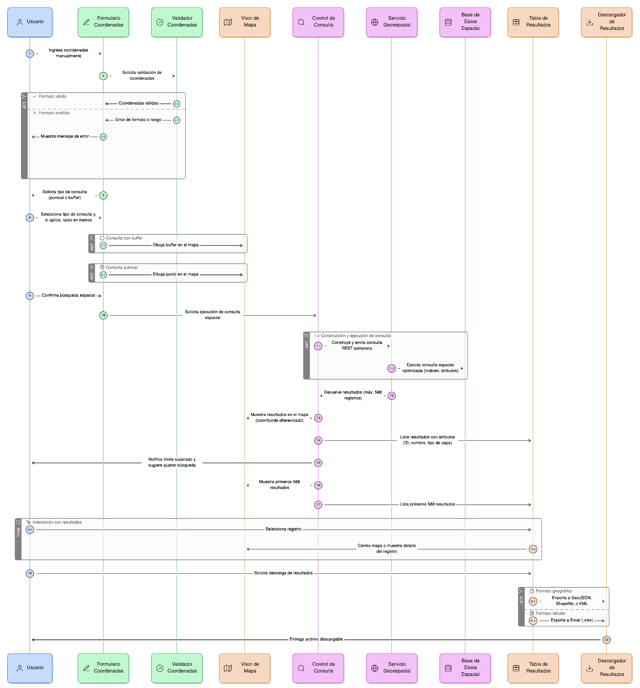
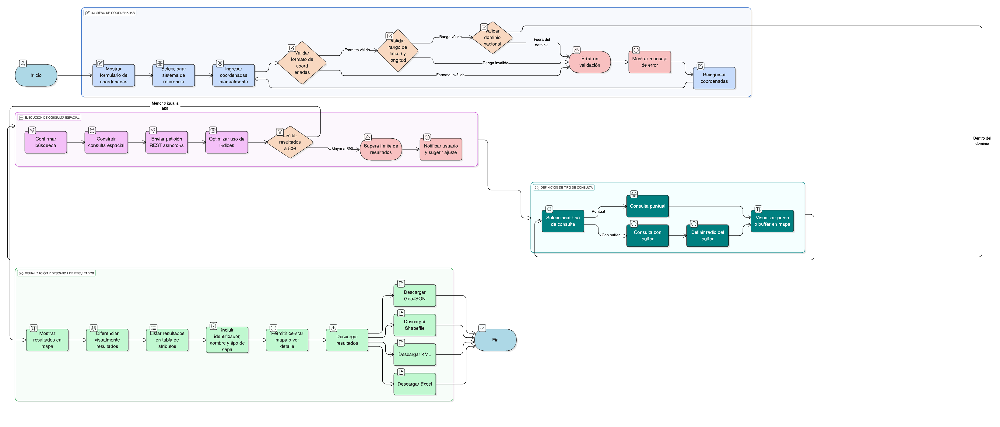
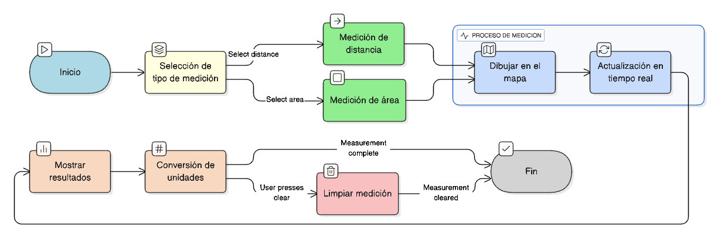

## HU-IDEAM-SNIF-REST-035

> **Identificador Historia de Usuario:** hu-ideam-snif-rest-035 \
> **Nombre Historia de Usuario:** Módulo de restauración -  Consulta por Coordenadas

> **Área Proyecto:** Subdirección de Ecosistemas e Información Ambiental \
> **Nombre proyecto:** Realizar la construcción temática, mejoras informáticas y optimización del Módulo de restauración del SNIF del IDEAM. \
> **Líder funcional:** Wilmer Espitia Muñoz\
> **Analista de requerimiento de TI:** Sergio Alonso Anaya Estévez

## DESCRIPCIÓN HISTORIA DE USUARIO

> **Como:** usuario solicitante. \
> **Quiero:**  realizar una búsqueda espacial a partir de coordenadas digitadas manualmente (punto o buffer). \
> **Para:** identificar los elementos geográficos que intersecten el punto o el área definida, visualizarlos en el mapa y consultar sus atributos principales.

## CRITERIOS DE ACEPTACIÓN

1. **Ingreso de coordenadas**

    1.1 El sistema debe contar con un formulario para ingresar coordenadas manualmente.  
    1.2 Se deben aceptar coordenadas en los siguientes sistemas de referencia:  
    - **Por defecto:** MAGNA SIRGAS 2018 / Origen Nacional (EPSG:9377)  
    - **Opcional:** WGS84 (EPSG:4326)   

    1.3 El sistema debe validar:  
   - Formato de las coordenadas (decimal o grados-minutos-segundos)  
   - Rango permitido de latitud y longitud  
   - Que las coordenadas estén dentro del dominio del país  

    1.4 En caso de error, el sistema debe mostrar un mensaje indicando el tipo de error.  

2. **Definición del tipo de consulta**

    2.1 El usuario podrá seleccionar el tipo de consulta:  
   - **Puntual:** búsqueda exacta en el punto ingresado  
   - **Con buffer:** búsqueda dentro de un radio definido  

    2.2 Si se selecciona “con buffer”, el sistema debe permitir definir el radio en metros (entre 10 m y 10.000 m).  
    2.3 El sistema debe mostrar visualmente en el mapa el punto o buffer definido.  

3. **Ejecución de la consulta espacial**

    3.1 Al confirmar la búsqueda, el sistema debe construir una consulta espacial sobre la base de datos.  
    3.2 La consulta se debe ejecutar mediante una petición asíncrona (REST) al servicio geoespacial.  
    3.3 Debe optimizar el uso de índices espaciales y atributivos.  
    3.4 Se debe limitar la cantidad de resultados a un máximo de 500 registros.  
    3.5 Si se supera el límite, el sistema debe notificar al usuario y sugerir ajustar la búsqueda.  

4. **Visualización de resultados**

    4.1 Los resultados deben mostrarse en el mapa con un color o borde diferenciado.  
    4.2 También deben listarse en una tabla de atributos junto al visor.  
    4.3 Cada resultado debe incluir información básica como identificador, nombre y tipo de capa.  
    4.4 Cada registro debe permitir centrar el mapa o ver su detalle.  
    4.5 El usuario debe poder descargar los resultados en los siguientes formatos:  
   - **Geográficos:** GeoJSON, Shapefile, KML  
   - **Tabular:** Excel (.xlsx)

## DIAGRAMA DE SECUENCIA

## DIAGRAMA DE FLUJO DEL PROCESO

## PROTOTIPO PRELIMINAR

## ANEXOS

- Ejemplo de salida gráfica en PNG o JPG.
- Referencia a numeral **Descargar capas** del visor geográfico.

