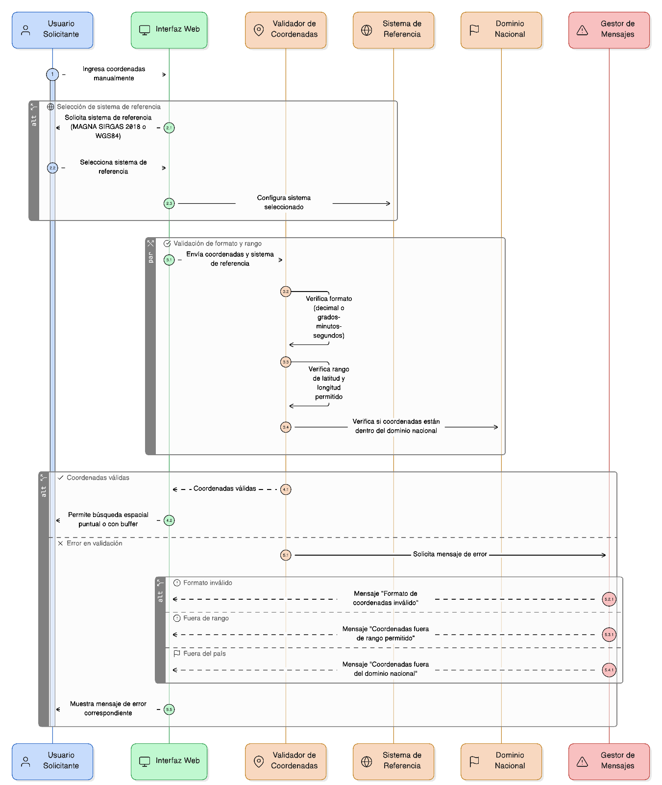
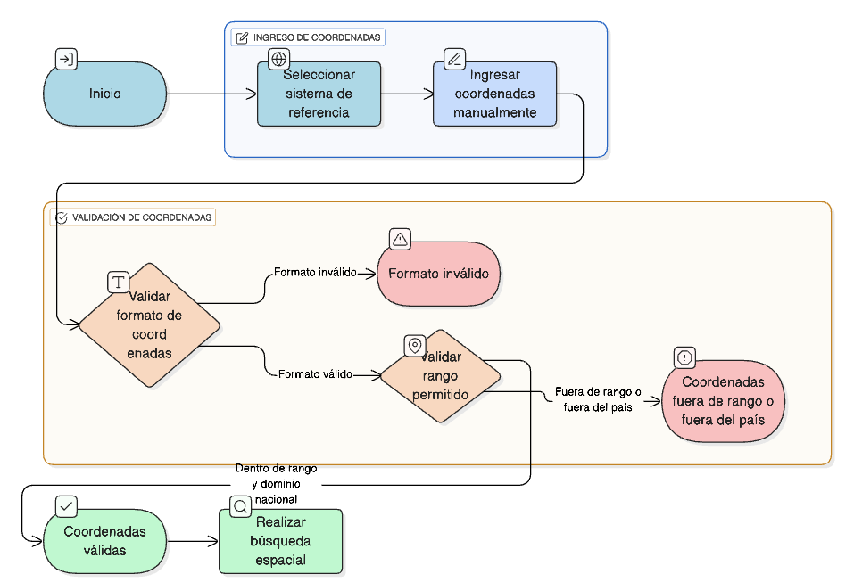

## HU-IDEAM-SNIF-REST-036

> **Identificador Historia de Usuario:** hu-ideam-snif-rest-036 \
> **Nombre Historia de Usuario:** Módulo de restauración -  Ingreso y validación de coordenadas

> **Área Proyecto:** Subdirección de Ecosistemas e Información Ambiental \
> **Nombre proyecto:** Realizar la construcción temática, mejoras informáticas y optimización del Módulo de restauración del SNIF del IDEAM. \
> **Líder funcional:** Wilmer Espitia Muñoz\
> **Analista de requerimiento de TI:** Sergio Alonso Anaya Estévez

## DESCRIPCIÓN HISTORIA DE USUARIO

> **Como:** usuario solicitante. \
> **Quiero:**  ingresar coordenadas manualmente en distintos sistemas de referencia. \
> **Para:** realizar una búsqueda espacial puntual o con buffer.

## CRITERIOS DE ACEPTACIÓN

1. El sistema debe permitir ingresar coordenadas manualmente en **MAGNA SIRGAS 2018 (EPSG:9377)** y **WGS84 (EPSG:4326)**.  
2. Se debe validar el **formato** de las coordenadas (decimal o grados-minutos-segundos).  
3. Se debe validar que las coordenadas estén dentro del **rango permitido de latitud y longitud** y dentro del dominio nacional.  
4. En caso de error, se debe mostrar un **mensaje claro** indicando el tipo de error (formato inválido, coordenadas fuera de rango o fuera del país).  

## DIAGRAMA DE SECUENCIA

## DIAGRAMA DE FLUJO DEL PROCESO

## PROTOTIPO PRELIMINAR

## ANEXOS

- Ejemplo de ingreso de coordenadas en diferentes sistemas de referencia.  
- Ejemplo de validación de formato decimal y grados-minutos-segundos.  
- Esquema de campos del formulario de coordenadas.

