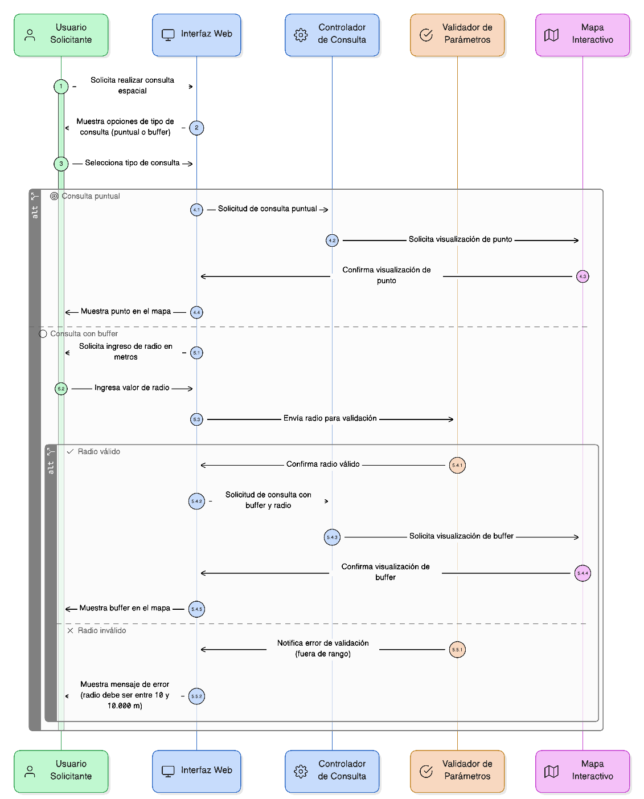
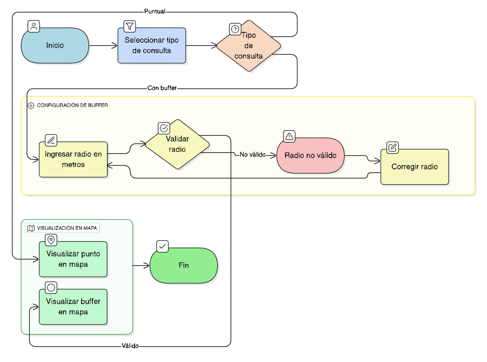

## HU-IDEAM-SNIF-REST-037

> **Identificador Historia de Usuario:** hu-ideam-snif-rest-037 \
> **Nombre Historia de Usuario:** Módulo de restauración -  Configuración del tipo de consulta (puntual o con buffer)  

> **Área Proyecto:** Subdirección de Ecosistemas e Información Ambiental \
> **Nombre proyecto:** Realizar la construcción temática, mejoras informáticas y optimización del Módulo de restauración del SNIF del IDEAM. \
> **Líder funcional:** Wilmer Espitia Muñoz\
> **Analista de requerimiento de TI:** Sergio Alonso Anaya Estévez

## DESCRIPCIÓN HISTORIA DE USUARIO

> **Como:** usuario solicitante. \
> **Quiero:**  seleccionar el tipo de consulta (puntual o con buffer) y definir su radio. \
> **Para:** delimitar el área sobre la cual se realizará la búsqueda espacial.

## CRITERIOS DE ACEPTACIÓN

1. El sistema debe permitir seleccionar entre **consulta puntual** o **con buffer**.  
2. Si se elige **buffer**, se debe permitir ingresar un **radio en metros**, con validación de rango (por ejemplo, mínimo 10 m, máximo 10.000 m).  
3. El sistema debe representar visualmente el punto o el buffer en el mapa. 

## DIAGRAMA DE SECUENCIA

## DIAGRAMA DE FLUJO DEL PROCESO

## PROTOTIPO PRELIMINAR

## ANEXOS

- Ejemplo de configuración de consulta puntual y con buffer.  
- Ilustración del buffer en el visor geográfico.  

