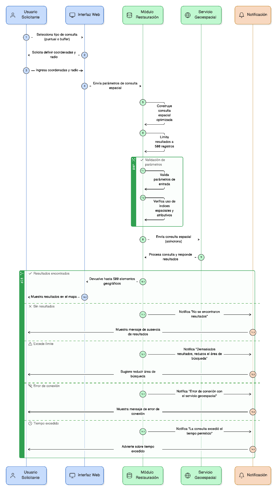
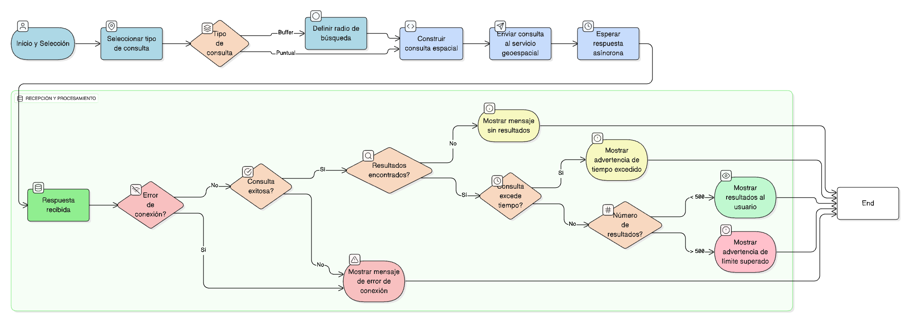
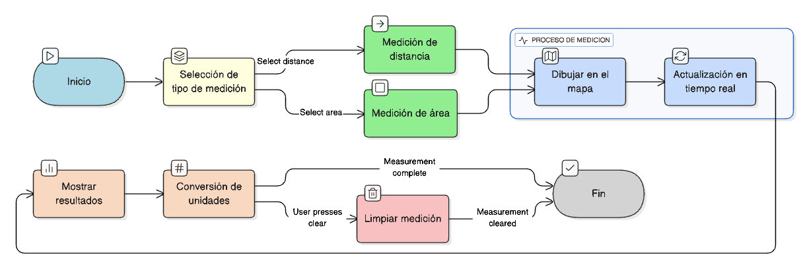

## HU-IDEAM-SNIF-REST-038

> **Identificador Historia de Usuario:** hu-ideam-snif-rest-038 \
> **Nombre Historia de Usuario:** Módulo de restauración -  Ejecución de la consulta por coordenadas

> **Área Proyecto:** Subdirección de Ecosistemas e Información Ambiental \
> **Nombre proyecto:** Realizar la construcción temática, mejoras informáticas y optimización del Módulo de restauración del SNIF del IDEAM. \
> **Líder funcional:** Wilmer Espitia Muñoz\
> **Analista de requerimiento de TI:** Sergio Alonso Anaya Estévez

## DESCRIPCIÓN HISTORIA DE USUARIO

> **Como:** usuario solicitante. \
> **Quiero:**  ejecutar la consulta espacial a partir de las coordenadas ingresadas. \
> **Para:** obtener los elementos geográficos que intersecten el punto o el buffer definido.

## CRITERIOS DE ACEPTACIÓN

1. El sistema debe construir la **consulta espacial** y enviarla mediante una **petición asíncrona (REST)** al servicio geoespacial.  
2. La consulta debe optimizar el uso de **índices espaciales y atributivos**.  
3. El número de resultados por solicitud debe estar limitado a **máximo 500 registros**.  
4. Si se supera el límite, el sistema debe notificar al usuario y sugerir **reducir el área de búsqueda**. 
5. **Validaciones y manejo de errores**

    5.1 Mostrar mensaje si **no se encuentran resultados**.  
    5.2  Mostrar mensaje si ocurre un **error de conexión** con el servicio geoespacial.  
    5.3 Mostrar advertencia si la consulta **excede el tiempo o el límite de resultados**.  

## DIAGRAMA DE SECUENCIA

## DIAGRAMA DE FLUJO DEL PROCESO

## PROTOTIPO PRELIMINAR

## ANEXOS

- Ejemplo de **petición REST** para la consulta espacial.  
- Ejemplo de **respuesta en formato GeoJSON**.  
- Referencia técnica del servicio geoespacial. 

