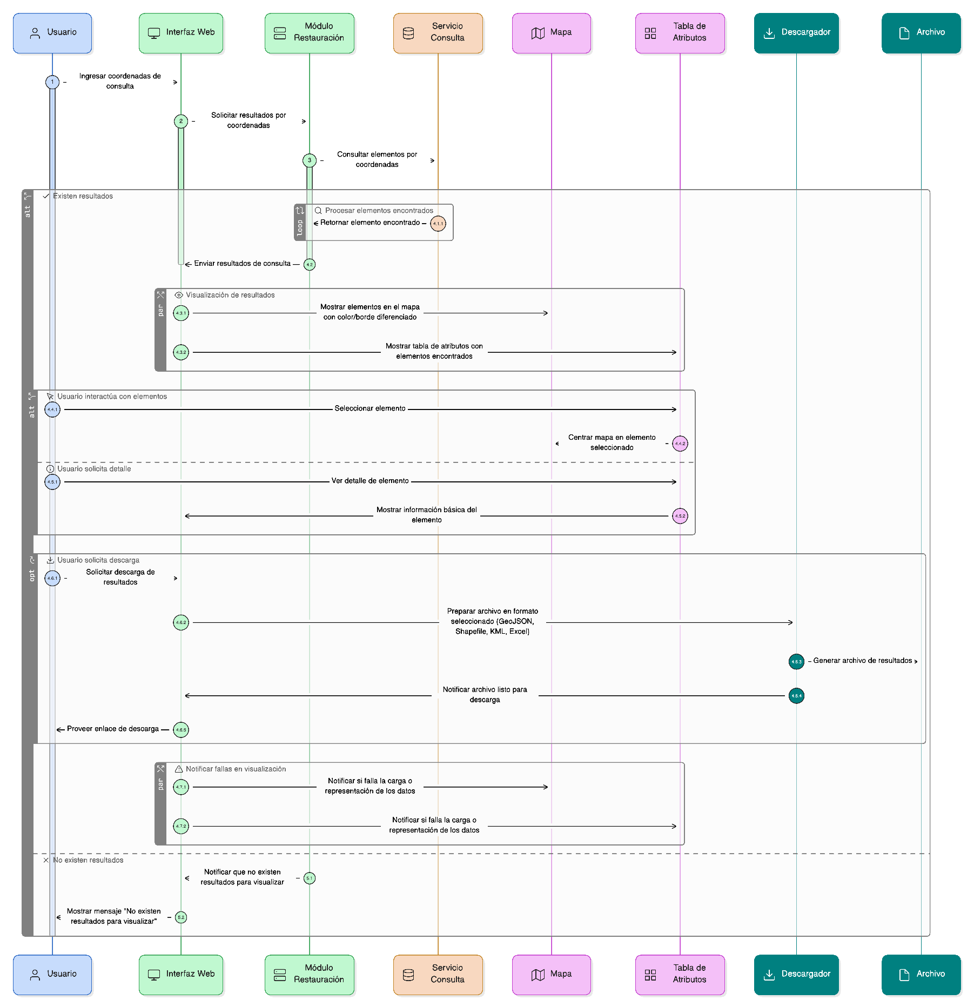
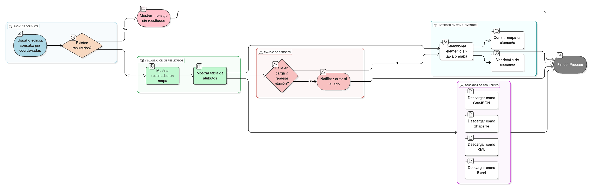

## HU-IDEAM-SNIF-REST-039

> **Identificador Historia de Usuario:** hu-ideam-snif-rest-039 \
> **Nombre Historia de Usuario:** Módulo de restauración -  Visualización y descarga los resultados de la consulta por coordenadas 

> **Área Proyecto:** Subdirección de Ecosistemas e Información Ambiental \
> **Nombre proyecto:** Realizar la construcción temática, mejoras informáticas y optimización del Módulo de restauración del SNIF del IDEAM. \
> **Líder funcional:** Wilmer Espitia Muñoz\
> **Analista de requerimiento de TI:** Sergio Alonso Anaya Estévez

## DESCRIPCIÓN HISTORIA DE USUARIO

> **Como:** usuario solicitante. \
> **Quiero:**  visualizar/descargar los resultados obtenidos en el mapa y en una tabla. \
> **Para:** identificar los elementos encontrados y acceder a su información básica.

## CRITERIOS DE ACEPTACIÓN

1. Los resultados deben mostrarse en el **mapa** con un color o borde diferenciado, debajo o al costado..  
2. Se debe mostrar una **tabla de atributos** con los elementos encontrados.  
3. Cada elemento debe permitir **centrar el mapa** o **ver su detalle**.  
4. El sistema debe permitir **descargar los resultados** en formatos **GeoJSON, Shapefile, KML y Excel**. 
5. Mostrar mensaje si **no existen resultados** para visualizar.  
6. Notificar si **falla la carga o representación** de los datos en el mapa o la tabla.  

## DIAGRAMA DE SECUENCIA

## DIAGRAMA DE FLUJO DEL PROCESO

## PROTOTIPO PRELIMINAR

## ANEXOS

- Ejemplo de visualización en el visor geográfico.  
- Ejemplo de tabla de atributos con acciones disponibles.  
- Referencia al numeral **Descargar capas** del visor geográfico.  

