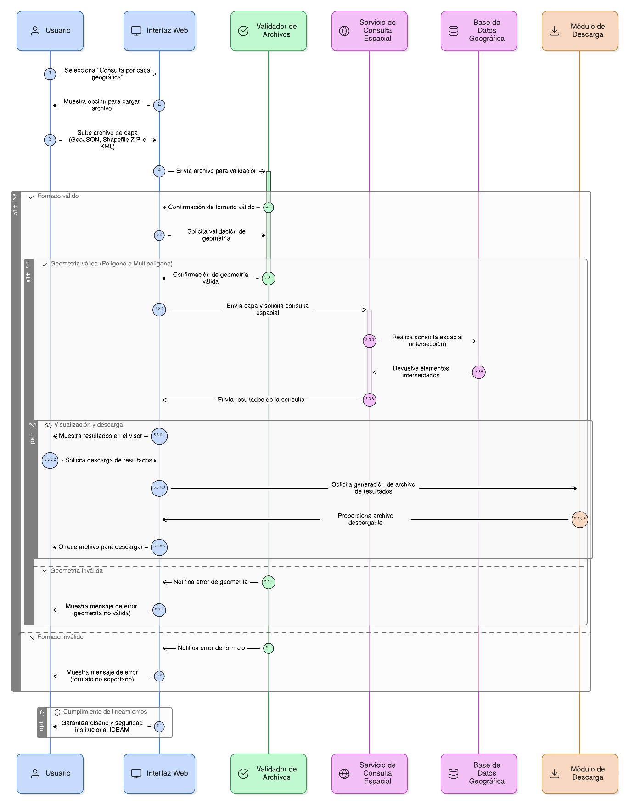
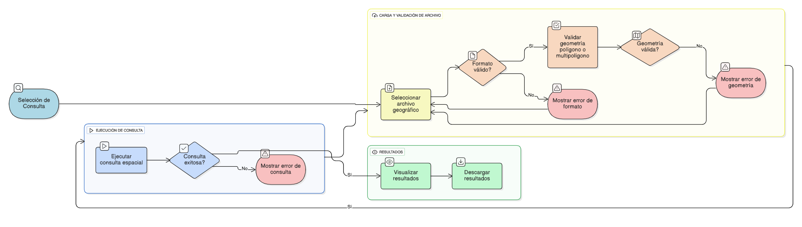

## HU-IDEAM-SNIF-REST-040

> **Identificador Historia de Usuario:** hu-ideam-snif-rest-040 \
> **Nombre Historia de Usuario:** Módulo de restauración - Consulta por Capa Geográfica

> **Área Proyecto:** Subdirección de Ecosistemas e Información Ambiental \
> **Nombre proyecto:** Realizar la construcción temática, mejoras informáticas y optimización del Módulo de restauración del SNIF del IDEAM. \
> **Líder funcional:** Wilmer Espitia Muñoz\
> **Analista de requerimiento de TI:** Sergio Alonso Anaya Estévez

## DESCRIPCIÓN HISTORIA DE USUARIO

> **Como:** usuario solicitante. \
> **Quiero:** realizar una consulta espacial importando una capa vectorial en formato polígono. \
> **Para:** usarla como delimitador geográfico y obtener los elementos que intersecten su área.

## CRITERIOS DE ACEPTACIÓN

1.  Incluir la opción 'Consulta por capa geográfica' en la pestaña Consultas.
2.  Permitir cargar archivos en formatos GeoJSON, Shapefile (ZIP) o KML.
3.  Validar que contengan geometrías tipo polígono o multipolígono.
4.  Permitir ejecutar, visualizar y descargar los resultados (ver HU 037–040).
5.  Cumplir lineamientos de diseño y seguridad institucional IDEAM.

## DIAGRAMA DE SECUENCIA

## DIAGRAMA DE FLUJO DEL PROCESO

## PROTOTIPO PRELIMINAR

## ANEXOS

- Ejemplo de consulta espacial mediante API REST.
- Ejemplo de respuesta en formato GeoJSON.
- Referencia a numeral **Consulta por Capa Geográfica** del visor geográfico.
