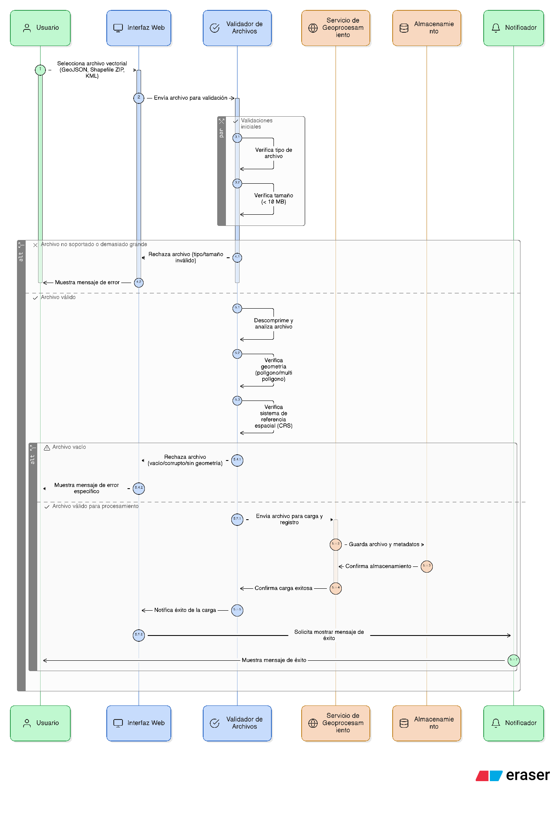
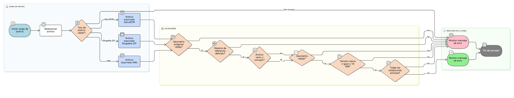

## HU-IDEAM-SNIF-REST-041

> **Identificador Historia de Usuario:** hu-ideam-snif-rest-041 \
> **Nombre Historia de Usuario:** Módulo de restauración - Carga y validación del archivo geográfico

> **Área Proyecto:** Subdirección de Ecosistemas e Información Ambiental \
> **Nombre proyecto:** Realizar la construcción temática, mejoras informáticas y optimización del Módulo de restauración del SNIF del IDEAM. \
> **Líder funcional:** Wilmer Espitia Muñoz\
> **Analista de requerimiento de TI:** Sergio Alonso Anaya Estévez

## DESCRIPCIÓN HISTORIA DE USUARIO

> **Como:** usuario solicitante. \
> **Quiero:** cargar una capa vectorial en formato polígono. \
> **Para:** usarla como delimitador espacial en mis consultas.

## CRITERIOS DE ACEPTACIÓN

1.  Permitir cargar formatos GeoJSON, Shapefile (ZIP) y KML.
2.  Validar que el archivo contenga geometrías poligonales o multipoligonales.
3.  Verificar que el sistema de referencia espacial esté definido.
4.  Rechazar archivos vacíos, corruptos o sin geometría válida.
5.  Limitar el tamaño máximo del archivo a 10 MB.
6.  Mostrar mensajes claros sobre el estado de la carga (éxito o error).

## DIAGRAMA DE SECUENCIA

## DIAGRAMA DE FLUJO DEL PROCESO

## PROTOTIPO PRELIMINAR

## ANEXOS

- Ejemplo de consulta espacial mediante API REST.
- Ejemplo de respuesta en formato GeoJSON.
- Referencia a numeral **Consulta por Capa Geográfica** del visor geográfico.
