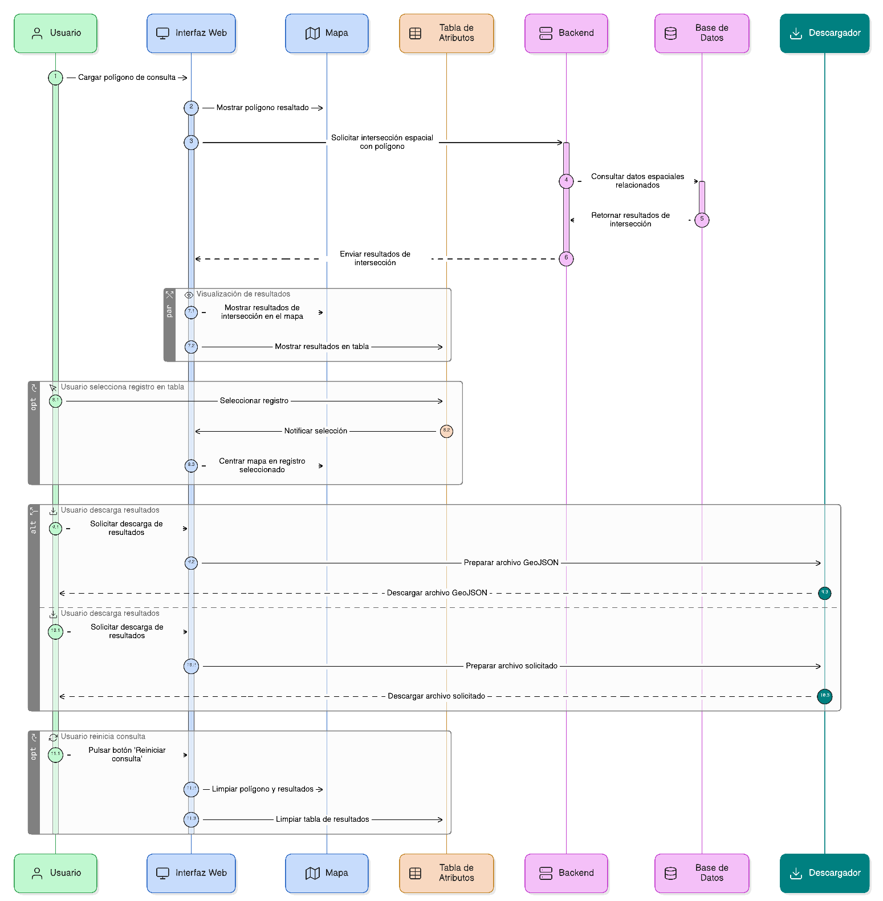
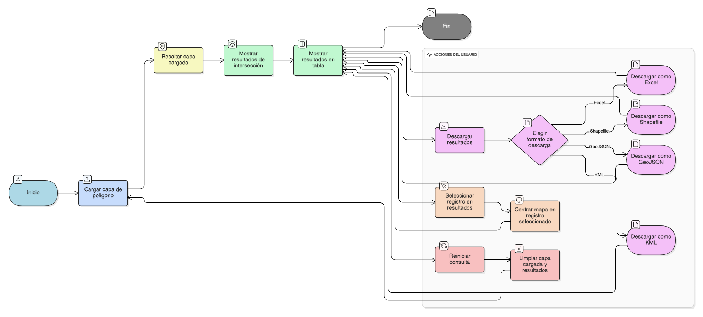

## HU-IDEAM-SNIF-REST-044

> **Identificador Historia de Usuario:** hu-ideam-snif-rest-044 \
> **Nombre Historia de Usuario:** Módulo de restauración - Visualización y descarga de resultados

> **Área Proyecto:** Subdirección de Ecosistemas e Información Ambiental \
> **Nombre proyecto:** Realizar la construcción temática, mejoras informáticas y optimización del Módulo de restauración del SNIF del IDEAM. \
> **Líder funcional:** Wilmer Espitia Muñoz\
> **Analista de requerimiento de TI:** Sergio Alonso Anaya Estévez

## DESCRIPCIÓN HISTORIA DE USUARIO

> **Como:** usuario solicitante. \
> **Quiero:**  visualizar los resultados en el mapa y en una tabla de atributos. \
> **Para:** analizar, centrar y descargar la información espacial obtenida a partir del polígono cargado.

## CRITERIOS DE ACEPTACIÓN

   1. Mostrar la capa cargada resaltada en el mapa.  
   2. Mostrar los resultados de intersección en el mapa y en una tabla.
   3. Permitir centrar el mapa en los registros seleccionados.
   4. Permitir descargar los resultados en GeoJSON, Shapefile, KML y Excel.
   5. Incluir botón 'Reiniciar consulta' para limpiar la capa cargada y resultados.

## DIAGRAMA DE SECUENCIA

## DIAGRAMA DE FLUJO DEL PROCESO

## PROTOTIPO PRELIMINAR

## ANEXOS

- Ejemplo de consulta espacial mediante API REST.
- Ejemplo de respuesta en formato GeoJSON.
- Referencia a numeral **Consulta por Capa Geográfica** del visor geográfico.
