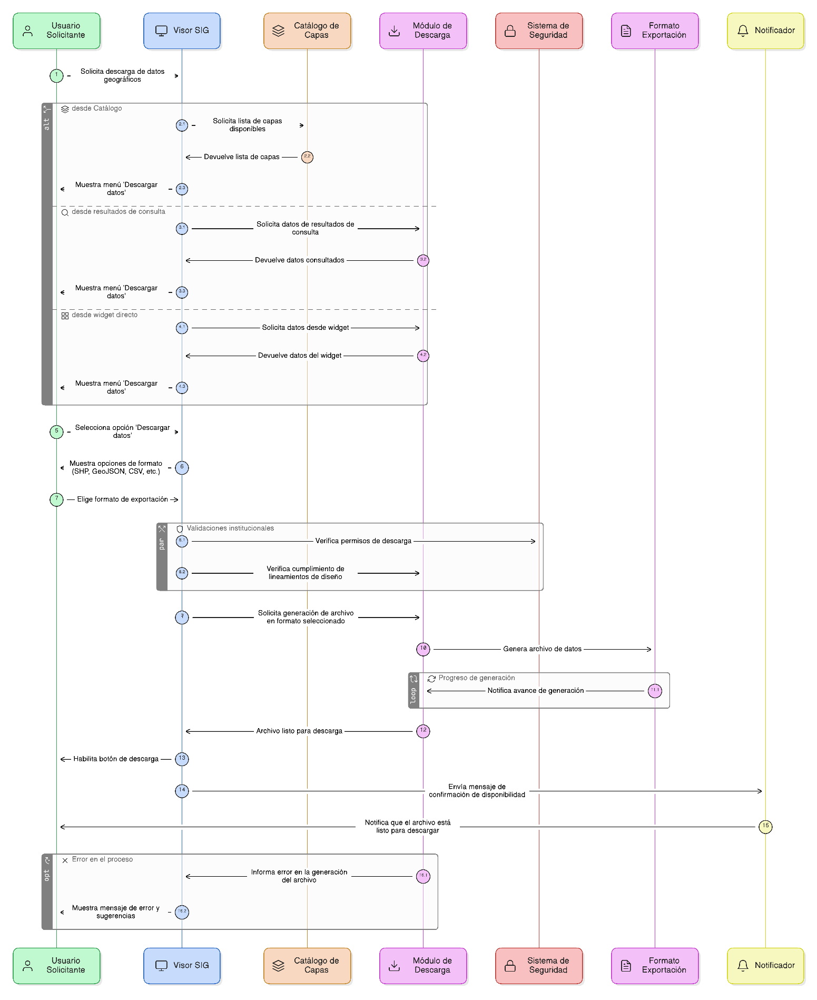
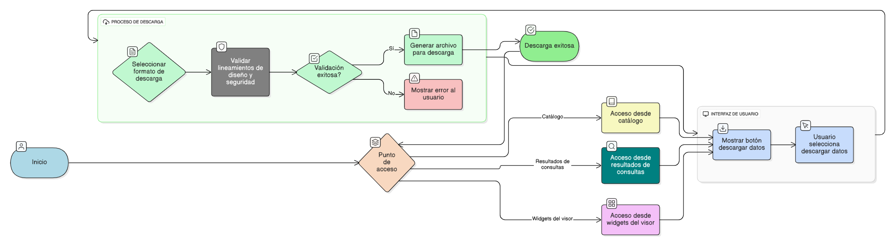

## HU-IDEAM-SNIF-REST-045

> **Identificador Historia de Usuario:** hu-ideam-snif-rest-045 \
> **Nombre Historia de Usuario:** Módulo de restauración - Descarga de capas

> **Área Proyecto:** Subdirección de Ecosistemas e Información Ambiental \
> **Nombre proyecto:** Realizar la construcción temática, mejoras informáticas y optimización del Módulo de restauración del SNIF del IDEAM. \
> **Líder funcional:** Wilmer Espitia Muñoz\
> **Analista de requerimiento de TI:** Sergio Alonso Anaya Estévez

## DESCRIPCIÓN HISTORIA DE USUARIO

> **Como:** usuario solicitante. \
> **Quiero:**  descargar elementos geográficos en distintos formatos desde los resultados de consultas o el catálogo. \
> **Para:** obtener los datos necesarios para análisis o interoperabilidad con otros sistemas SIG.

## CRITERIOS DE ACEPTACIÓN

   1. El sistema debe permitir la descarga de datos desde: Catálogo, resultados de consultas atributivas o espaciales, y widgets directos del visor.  
   2. Mostrar un botón o menú 'Descargar datos' visible y accesible en cada contexto aplicable.
   3. Garantizar consistencia y cumplimiento de los lineamientos institucionales de diseño y seguridad del IDEAM.

## DIAGRAMA DE SECUENCIA

## DIAGRAMA DE FLUJO DEL PROCESO

## PROTOTIPO PRELIMINAR

## ANEXOS

- Ejemplo de consulta espacial mediante API REST.
- Ejemplo de respuesta en formato GeoJSON.
- Referencia a numeral **Descarga de Capas** del visor geográfico.
