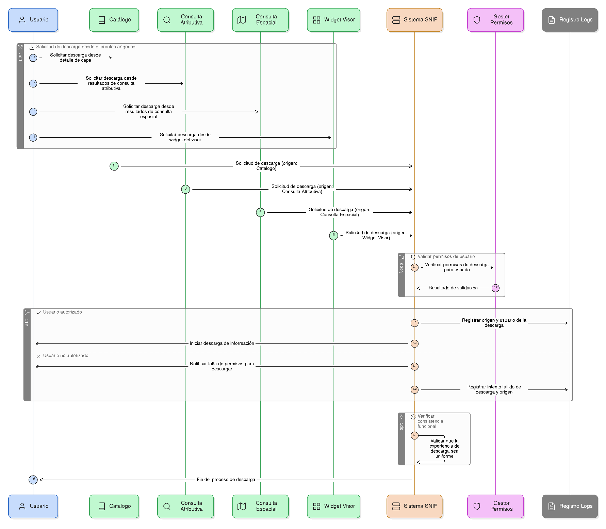
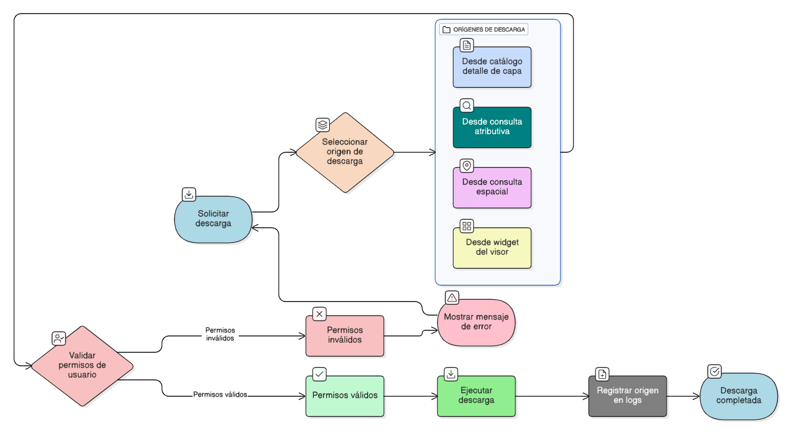

## HU-IDEAM-SNIF-REST-046

> **Identificador Historia de Usuario:** hu-ideam-snif-rest-046 \
> **Nombre Historia de Usuario:** Módulo de restauración - Origen de las descargas

> **Área Proyecto:** Subdirección de Ecosistemas e Información Ambiental \
> **Nombre proyecto:** Realizar la construcción temática, mejoras informáticas y optimización del Módulo de restauración del SNIF del IDEAM. \
> **Líder funcional:** Wilmer Espitia Muñoz\
> **Analista de requerimiento de TI:** Sergio Alonso Anaya Estévez

## DESCRIPCIÓN HISTORIA DE USUARIO

> **Como:** usuario solicitante. \
> **Quiero:**  iniciar descargas desde diferentes puntos del sistema. \
> **Para:** obtener información sin depender de un único flujo o vista.

## CRITERIOS DE ACEPTACIÓN

   1. Permitir descargas desde: pestaña Catálogo (detalle de capa), resultados de consultas atributivas o espaciales, y widgets del visor.  
   2. Asegurar consistencia funcional entre los distintos orígenes.
   3. Validar permisos de usuario antes de iniciar la descarga.
   4. Registrar el origen de cada descarga en los logs del sistema.

## DIAGRAMA DE SECUENCIA

## DIAGRAMA DE FLUJO DEL PROCESO

## PROTOTIPO PRELIMINAR

## ANEXOS

- Ejemplo de consulta espacial mediante API REST.
- Ejemplo de respuesta en formato GeoJSON.
- Referencia a numeral **Descraga de capas** del visor geográfico.
