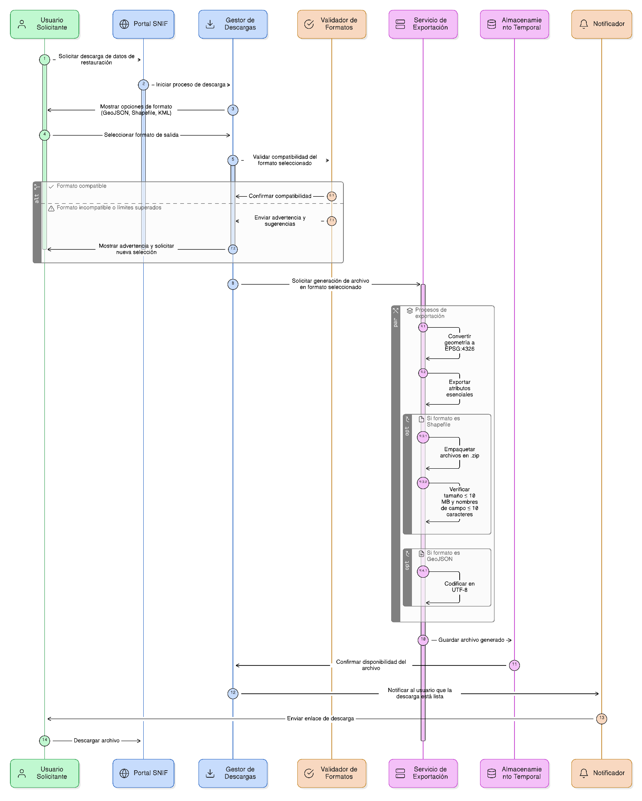
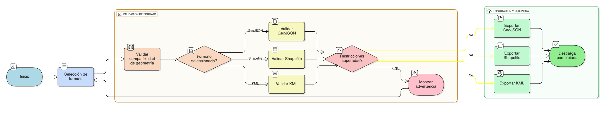

## HU-IDEAM-SNIF-REST-047

> **Identificador Historia de Usuario:** hu-ideam-snif-rest-047 \
> **Nombre Historia de Usuario:** Módulo de restauración - Formatos de descarga soportados

> **Área Proyecto:** Subdirección de Ecosistemas e Información Ambiental \
> **Nombre proyecto:** Realizar la construcción temática, mejoras informáticas y optimización del Módulo de restauración del SNIF del IDEAM. \
> **Líder funcional:** Wilmer Espitia Muñoz\
> **Analista de requerimiento de TI:** Sergio Alonso Anaya Estévez

## DESCRIPCIÓN HISTORIA DE USUARIO

> **Como:** usuario solicitante. \
> **Quiero:**  elegir el formato de salida de mis descargas. \
> **Para:** garantizar compatibilidad con distintas aplicaciones SIG.

## CRITERIOS DE ACEPTACIÓN

   1. Ofrecer formatos: GeoJSON (.geojson), Shapefile (.zip) y KML (.kml).  
   2. GeoJSON: codificación UTF-8, SRC EPSG:4326.
   3. Shapefile: empaquetado .zip, máximo 10 MB, nombres de campo ≤10 caracteres.
   4. KML: exportar atributos esenciales, SRC EPSG:4326.
   5. Validar compatibilidad del formato con el tipo de geometría y mostrar advertencias cuando se superen límites.

## DIAGRAMA DE SECUENCIA

## DIAGRAMA DE FLUJO DEL PROCESO

## PROTOTIPO PRELIMINAR

## ANEXOS

- Ejemplo de consulta espacial mediante API REST.
- Ejemplo de respuesta en formato GeoJSON.
- Referencia a numeral **Descarga de Capas** del visor geográfico.
