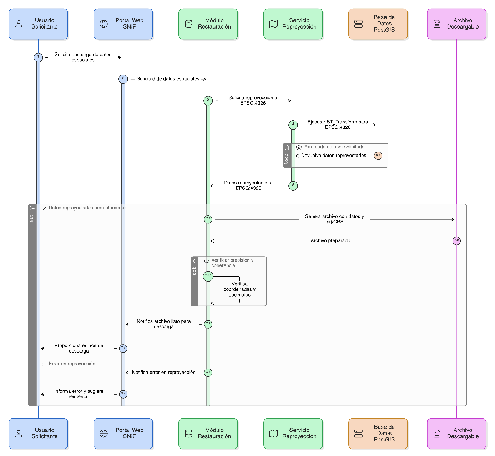
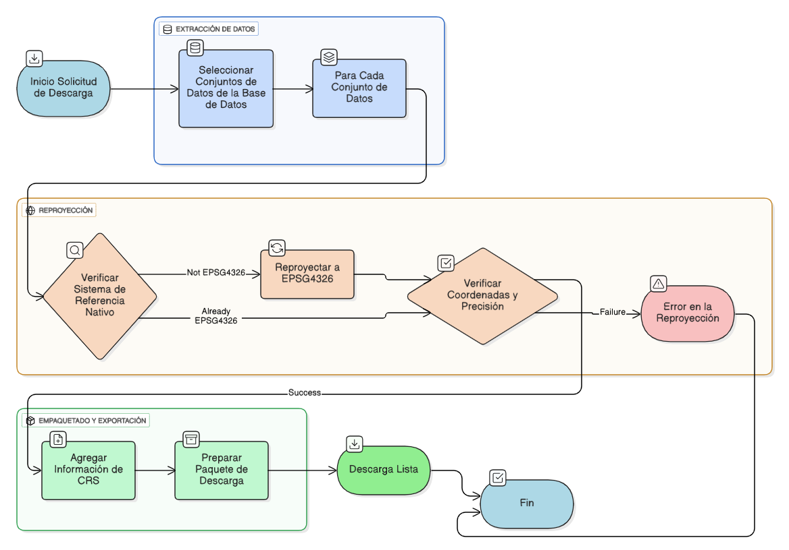

## HU-IDEAM-SNIF-REST-048

> **Identificador Historia de Usuario:** hu-ideam-snif-rest-048 \
> **Nombre Historia de Usuario:** Módulo de restauración - Sistema de referencia espacial

> **Área Proyecto:** Subdirección de Ecosistemas e Información Ambiental \
> **Nombre proyecto:** Realizar la construcción temática, mejoras informáticas y optimización del Módulo de restauración del SNIF del IDEAM. \
> **Líder funcional:** Wilmer Espitia Muñoz\
> **Analista de requerimiento de TI:** Sergio Alonso Anaya Estévez

## DESCRIPCIÓN HISTORIA DE USUARIO

> **Como:** usuario solicitante. \
> **Quiero:**  que todos los datos descargados estén reproyectados a EPSG:4326. \
> **Para:** garantizar compatibilidad con visores web y herramientas SIG externas.

## CRITERIOS DE ACEPTACIÓN

   1. Reproyectar automáticamente cualquier dataset al sistema EPSG:4326 (WGS84).  
   2. Usar funciones espaciales como ST_Transform (PostGIS) para la conversión.
   3. Incluir archivo .prj o atributo CRS en cada descarga.
   4. Verificar coherencia de coordenadas reproyectadas y mantener precisión de decimales.

## DIAGRAMA DE SECUENCIA

## DIAGRAMA DE FLUJO DEL PROCESO

## PROTOTIPO PRELIMINAR

## ANEXOS

- Ejemplo de consulta espacial mediante API REST.
- Ejemplo de respuesta en formato GeoJSON.
- Referencia a numeral **Descarga de Capas** del visor geográfico.
