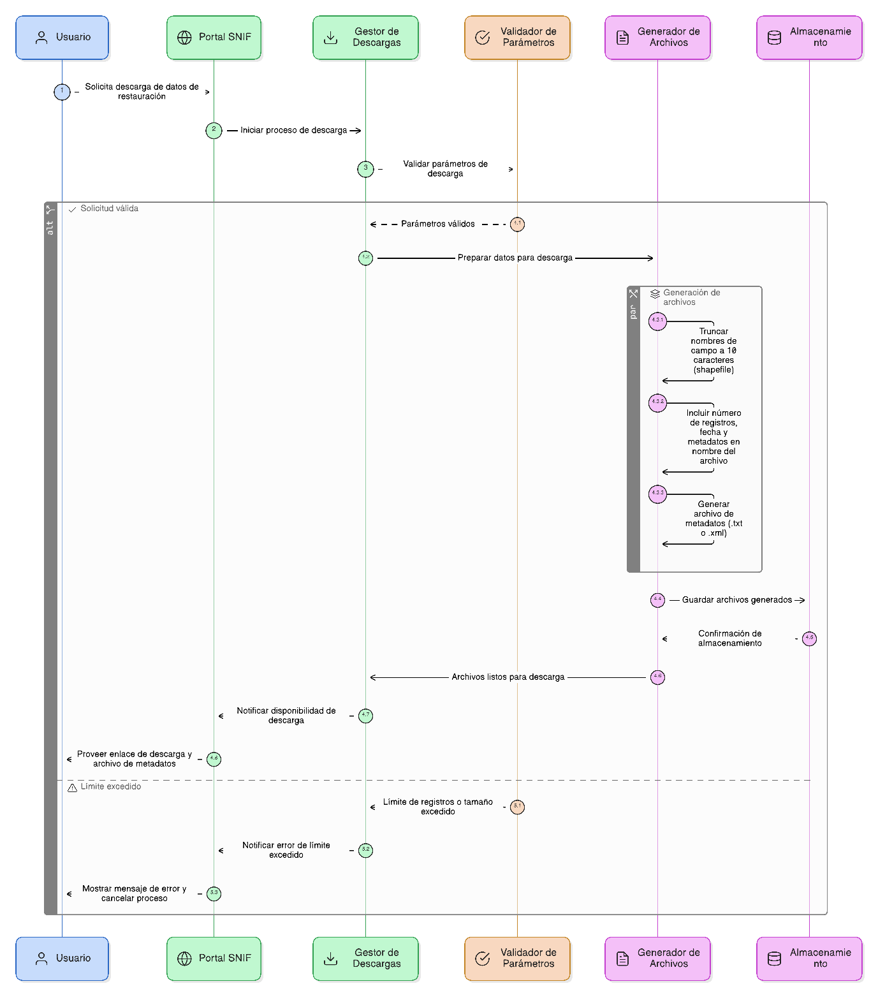
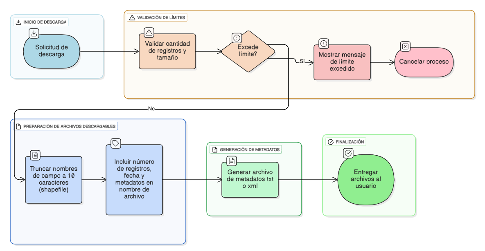

## HU-IDEAM-SNIF-REST-049

> **Identificador Historia de Usuario:** hu-ideam-snif-rest-049 \
> **Nombre Historia de Usuario:** Módulo de restauración - Parámetros y condiciones de descarga

> **Área Proyecto:** Subdirección de Ecosistemas e Información Ambiental \
> **Nombre proyecto:** Realizar la construcción temática, mejoras informáticas y optimización del Módulo de restauración del SNIF del IDEAM. \
> **Líder funcional:** Wilmer Espitia Muñoz\
> **Analista de requerimiento de TI:** Sergio Alonso Anaya Estévez

## DESCRIPCIÓN HISTORIA DE USUARIO

> **Como:** usuario solicitante. \
> **Quiero:**  que las descargas incluyan metadatos claros y cumplan con los estándares de formato. \
> **Para:** identificar fácilmente los datos descargados y evitar errores de uso.

## CRITERIOS DE ACEPTACIÓN

   1. En shapefiles, truncar nombres de campo a 10 caracteres.  
   2. Incluir número de registros, fecha y metadatos principales en el nombre del archivo.
   3. Generar archivo adicional de metadatos (.txt o .xml).
   4. Limitar descargas a 10.000 registros o 10 MB por solicitud.
   5. Mostrar mensaje si la selección excede el límite y cancelar el proceso.

## DIAGRAMA DE SECUENCIA

## DIAGRAMA DE FLUJO DEL PROCESO

## PROTOTIPO PRELIMINAR

## ANEXOS

- Ejemplo de consulta espacial mediante API REST.
- Ejemplo de respuesta en formato GeoJSON.
- Referencia a numeral **Descarga de Capas** del visor geográfico.
