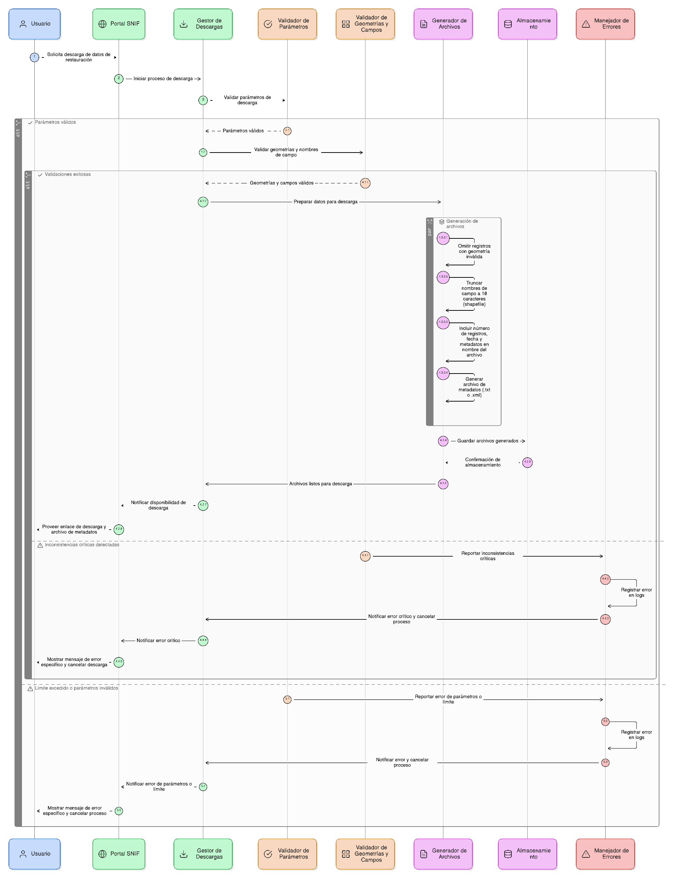
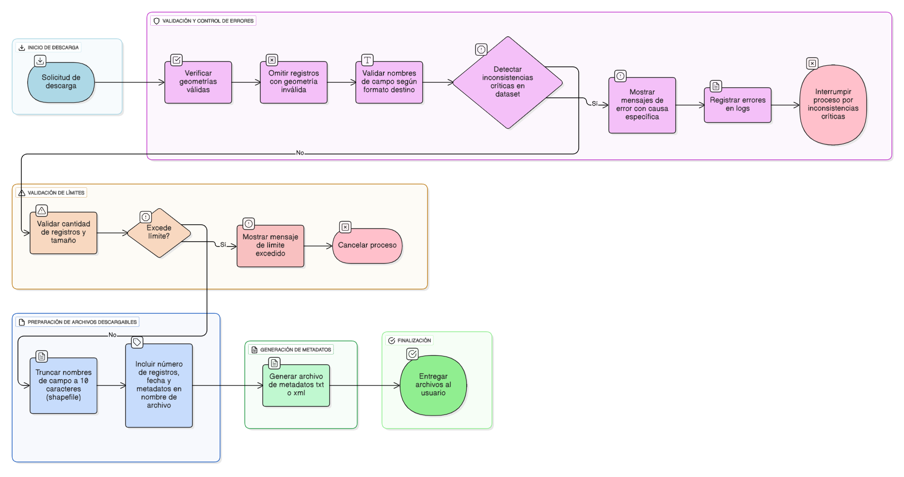

## HU-IDEAM-SNIF-REST-050

> **Identificador Historia de Usuario:** hu-ideam-snif-rest-050 \
> **Nombre Historia de Usuario:** Módulo de restauración - Validaciones y control de errores

> **Área Proyecto:** Subdirección de Ecosistemas e Información Ambiental \
> **Nombre proyecto:** Realizar la construcción temática, mejoras informáticas y optimización del Módulo de restauración del SNIF del IDEAM. \
> **Líder funcional:** Wilmer Espitia Muñoz\
> **Analista de requerimiento de TI:** Sergio Alonso Anaya Estévez

## DESCRIPCIÓN HISTORIA DE USUARIO

> **Como:** usuario solicitante. \
> **Quiero:**  validar los datos y formatos antes de exportar \
> **Para:** asegurar que los archivos sean correctos y usables.

## CRITERIOS DE ACEPTACIÓN

   1. Verificar geometrías válidas (no vacías, no nulas). 
   2. Omitir registros con geometría inválida.
   3. Validar nombres de campo según formato destino.
   4. Mostrar mensajes de error con causa específica y registrar los errores en logs.
   5. Interrumpir el proceso si se detectan inconsistencias críticas en el dataset.

## DIAGRAMA DE SECUENCIA

## DIAGRAMA DE FLUJO DEL PROCESO

## PROTOTIPO PRELIMINAR

## ANEXOS

- Ejemplo de consulta espacial mediante API REST.
- Ejemplo de respuesta en formato GeoJSON.
- Referencia a numeral **Descarga de Capas** del visor geográfico.
