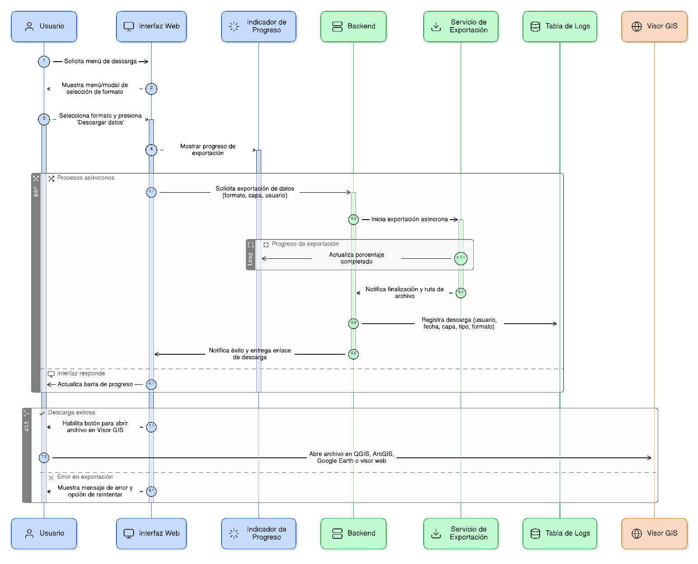
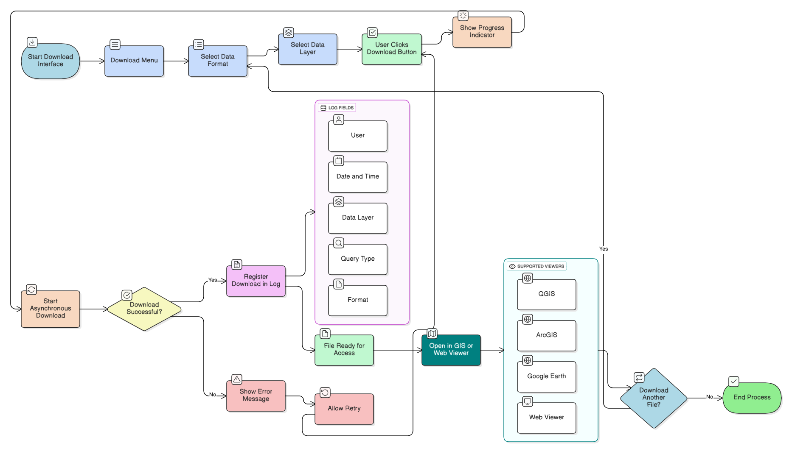

## HU-IDEAM-SNIF-REST-051

> **Identificador Historia de Usuario:** hu-ideam-snif-rest-051 \
> **Nombre Historia de Usuario:** Módulo de restauración - Interfaz de usuario y registro de descargas

> **Área Proyecto:** Subdirección de Ecosistemas e Información Ambiental \
> **Nombre proyecto:** Realizar la construcción temática, mejoras informáticas y optimización del Módulo de restauración del SNIF del IDEAM. \
> **Líder funcional:** Wilmer Espitia Muñoz\
> **Analista de requerimiento de TI:** Sergio Alonso Anaya Estévez

## DESCRIPCIÓN HISTORIA DE USUARIO

> **Como:** usuario solicitante. \
> **Quiero:**  disponer de una interfaz clara para gestionar descargas y verificar su registro.  \
> **Para:** monitorear el proceso y disponer de trazabilidad completa.

## CRITERIOS DE ACEPTACIÓN

   1. Ofrecer menú o modal con selección de formato y botón único 'Descargar datos'.
   2. Mostrar indicador de progreso durante la exportación.
   3. Ejecutar descargas en hilo independiente (asíncrono).
   4. Registrar cada descarga en tabla de logs con: usuario, fecha, capa, tipo de consulta y formato.
   5. Permitir abrir los archivos generados en QGIS, ArcGIS, Google Earth y visores web.

## DIAGRAMA DE SECUENCIA

## DIAGRAMA DE FLUJO DEL PROCESO

## PROTOTIPO PRELIMINAR

## ANEXOS

- Ejemplo de consulta espacial mediante API REST.
- Ejemplo de respuesta en formato GeoJSON.
- Referencia a numeral **Descarga de Capas** del visor geográfico.
