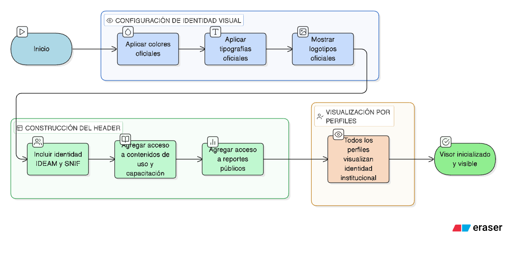

# HU-IDEAM-SNIF-REST-002

> **Identificador Historia de Usuario:** hu-ideam-snif-rest-002\
> **Nombre Historia de Usuario:** Inicializar visor con configuración institucional IDEAM–SNIF

> **Sistema de información:** Sistema Nacional de Información Forestal\
> **Módulo / subsistema:** Módulo de restauración\
> **Validador temático(s):** Raymond Alexander Jiménez Arteaga

## DESCRIPCIÓN HISTORIA DE USUARIO

> **Como:** usuario del SNIF.\
> **Quiero:** que el visor se inicialice respetando los lineamientos de identidad visual del IDEAM y del SNIF.\
> **Para:** garantizar coherencia institucional en toda la experiencia.

## CRITERIOS DE ACEPTACIÓN

1. **Identidad visual**  
   1.1 Uso de colores, tipografías y logotipos oficiales.

2. **Header del visor**  
   2.1 El header del visor debe incluir:  
   - Identidad IDEAM y SNIF.  
   - Acceso a Apropiación (contenidos de uso y capacitación).  
   - Acceso a Reportes públicos.

## ROLES

- **Todos los perfiles:** Visualizan la identidad institucional.

## RESTRICCIONES Y LÍMITES

- Debe respetarse estrictamente la identidad visual institucional.
- Los lineamientos de marca IDEAM y SNIF son obligatorios.

## DIAGRAMA DE FLUJO DEL PROCESO

