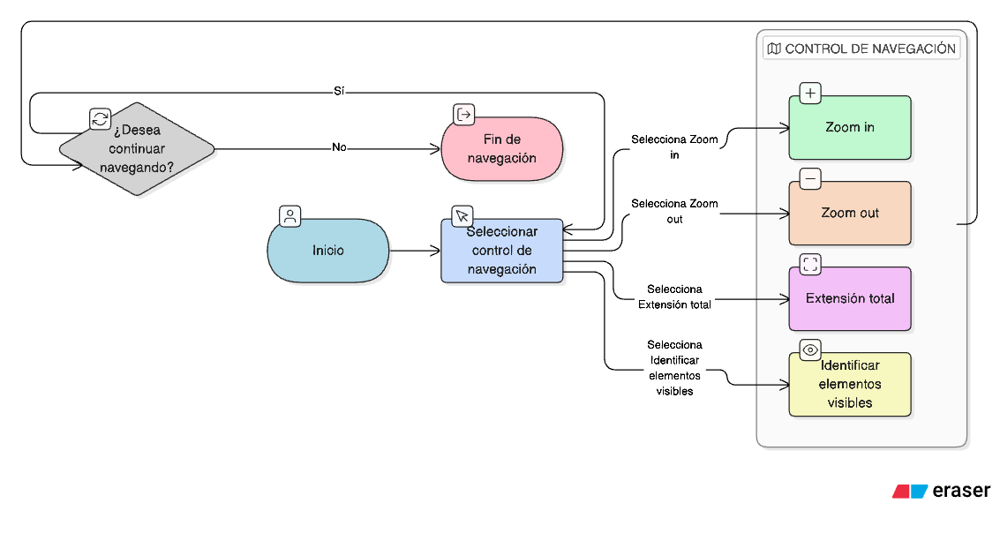

# HU-IDEAM-SNIF-REST-003

> **Identificador Historia de Usuario:** hu-ideam-snif-rest-003\
> **Nombre Historia de Usuario:** Mostrar coordenadas del cursor

> **Sistema de información:** Sistema Nacional de Información Forestal\
> **Módulo / subsistema:** Módulo de restauración\
> **Validador temático(s):** Raymond Alexander Jiménez Arteaga

## DESCRIPCIÓN HISTORIA DE USUARIO

> **Como:** usuario del SNIF.\
> **Quiero:** visualizar las coordenadas del cursor en tiempo real en la parte inferior del visor.\
> **Para:** tener apoyo en la navegación y referencia espacial.

## CRITERIOS DE ACEPTACIÓN

1. **Actualización en tiempo real**  
   1.1 Las coordenadas se actualizan al mover el cursor sobre el mapa.

2. **Visibilidad permanente**  
   2.1 Se mantienen visibles independientemente de las capas activas.

## ROLES

- **Todos los perfiles:** Pueden ver coordenadas.

## RESTRICCIONES Y LÍMITES

- Las coordenadas se muestran en la parte inferior del visor.
- La visualización es continua y automática.

## DIAGRAMA DE FLUJO DEL PROCESO

