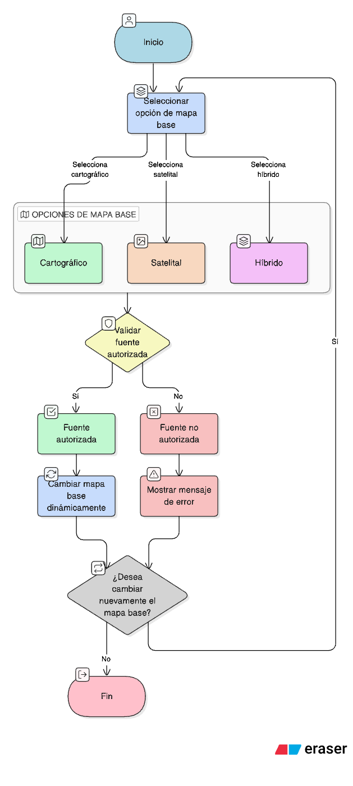

# HU-IDEAM-SNIF-REST-004

> **Identificador Historia de Usuario:** hu-ideam-snif-rest-004\
> **Nombre Historia de Usuario:** Controles básicos de navegación

> **Sistema de información:** Sistema Nacional de Información Forestal\
> **Módulo / subsistema:** Módulo de restauración\
> **Validador temático(s):** Raymond Alexander Jiménez Arteaga

## DESCRIPCIÓN HISTORIA DE USUARIO

> **Como:** usuario del SNIF.\
> **Quiero:** utilizar controles básicos de navegación.\
> **Para:** recorrer el territorio nacional.

## CRITERIOS DE ACEPTACIÓN

1. **Controles incluidos**  
   1.1 El sistema debe proporcionar los siguientes controles:  
   - Zoom in.  
   - Zoom out.  
   - Extensión total.  
   - Identificar elementos visibles.

## ROLES

- **Todos los perfiles:** Pueden usar los controles.

## RESTRICCIONES Y LÍMITES

- Los controles son de uso libre para todos los perfiles.
- Permiten navegación básica sobre el territorio nacional.

## DIAGRAMA DE FLUJO DEL PROCESO

